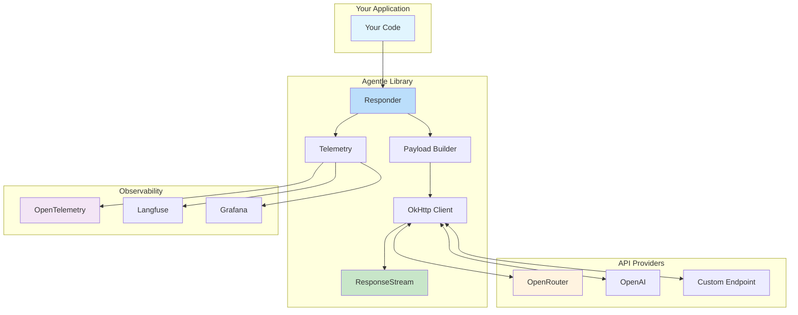

<div align="center">

# 🤖 Agentle

**The Modern Java Library for OpenAI Responses API**

[](https://openjdk.org/)
[](LICENSE)
[](https://maven.apache.org/)
[](https://opentelemetry.io/)

*Type-safe, streaming-enabled, production-ready AI integration for Java 25+*

</div>

---

## ✨ Key Features

| Feature | Description |
|---------|-------------|
| 🤖 **Agent Framework** | Complete agent system with tools, guardrails, memory, and handoffs |
| 🎯 **Type-safe API** | Full OpenAI Responses API with Java records |
| 🌊 **Real-time Streaming** | Virtual thread-based streaming with callbacks |
| 📦 **Structured Outputs** | Strongly-typed JSON responses |
| 🛠️ **Function Calling** | Auto-generated JSON schemas from Java classes |
| 🔭 **OpenTelemetry** | Built-in observability with spans/metrics |
| 🖼️ **Vision Support** | Image analysis with GPT-4o and compatible models |
| ⚡ **Async by Default** | Non-blocking `CompletableFuture` operations |
| 👥 **Multi-Agent** | Parallel agents, handoffs, and orchestration |

---

## ⚡ Performance

Agentle is designed for extreme efficiency — **6x faster than AGNO**, the fastest Python alternative:

```text
╔═══════════════════════════════════════════════════════════════════╗
║                 AGENTLE PERFORMANCE BENCHMARK                     ║
╚═══════════════════════════════════════════════════════════════════╝

Framework        │       Time (μs) │    Memory (KiB) │   Speed vs AGNO
──────────────────────────────────────────────────────────────────────
🚀 AGENTLE       │            0.50 │          0.3906 │            6.0×
AGNO             │            3.00 │          6.6000 │   1× (baseline)
PydanticAI       │          170.00 │         28.7120 │      57× slower
CrewAI           │          210.00 │         65.6520 │      70× slower
LangGraph        │         1587.00 │        161.4350 │     529× slower
──────────────────────────────────────────────────────────────────────
```

---

## 📥 Installation

```xml
<dependency>
    <groupId>com.paragon</groupId>
    <artifactId>agentle</artifactId>
    <version>1.0.0</version>
</dependency>
```

> **Requirements:** Java 25+ with preview features enabled

---

## 🏗️ Architecture



### Core Components

| Component | Description |
|-----------|-------------|
| **Responder** | Main entry point - handles all API communication |
| **Agent** | Stateless, reusable AI agent with tools, guardrails, and memory |
| **AgentContext** | Per-conversation state (history, turn count, custom data) |
| **CreateResponsePayload** | Fluent builder for request construction |
| **ResponseStream** | Virtual thread-based streaming with callbacks |
| **FunctionToolStore** | Registry for callable tools |

---

## 📖 Core Concepts

### What is a Responder?

**Responder** is the low-level HTTP client for the OpenAI Responses API. It handles:
- API communication (request/response)
- Streaming with virtual threads
- Telemetry and observability
- Provider configuration (OpenAI, OpenRouter, Groq, etc.)

```java
Responder responder = Responder.builder()
    .openRouter()
    .apiKey("your-key")
    .build();

// Use directly for simple requests
Response response = responder.respond(payload).join();
```

> **When to use Responder directly**: Simple one-shot requests without tool loops, custom low-level integrations, or when you need maximum control.

---

### What is an Agent?

**Agent** is a higher-level abstraction that wraps a Responder with:
- **Instructions** (system prompt)
- **Tools** (functions the AI can call)
- **Guardrails** (input/output validation)
- **Memory** (cross-conversation persistence)
- **Handoffs** (routing to other agents)

```java
Agent agent = Agent.builder()
    .name("Assistant")
    .model("openai/gpt-4o")
    .instructions("You are a helpful assistant.")
    .responder(responder)
    .addTool(weatherTool)
    .addInputGuardrail(myGuardrail)
    .build();
```

**Agentle's Agent is stateless and thread-safe**. The same Agent instance can handle multiple concurrent conversations—state is isolated in `AgentContext`.

---

### What is AgentContext?

**AgentContext** is the per-conversation state container. It holds:

| Field | Purpose |
|-------|---------|
| **History** | All messages exchanged (user, assistant, tool results) |
| **Turn Count** | Number of LLM calls in this run |
| **Custom State** | Key-value store for your data (e.g., `userId`, `sessionId`) |

```java
// Create fresh context for each conversation
AgentContext context = AgentContext.create();

// Or pre-populate with history
AgentContext resumed = AgentContext.withHistory(previousMessages);

// Store custom state
context.setState("userId", "user-123");
context.setState("orderId", 42);

// Retrieve later
String userId = context.getState("userId", String.class);
```

**Why this design?** By separating state from the agent, Agentle ensures:
- ✅ Thread-safe concurrent conversations
- ✅ Agents are reusable without side effects
- ✅ Easy serialization for pause/resume
- ✅ Clear ownership of conversation data

---

### The Agentic Loop

When you call `agent.interact()`, Agentle runs the **agentic loop**:

```
┌─────────────────────────────────────────────────────┐
│                   AGENTIC LOOP                      │
├─────────────────────────────────────────────────────┤
│  1. Validate input (guardrails)                     │
│  2. Build payload from context                      │
│  3. Call LLM                                        │
│  4. If tool calls detected:                         │
│     • Check for handoffs → route to other agent     │
│     • Execute tools → add results to context        │
│     • Go to step 3 (multi-turn)                     │
│  5. Validate output (guardrails)                    │
│  6. Return AgentResult                              │
└─────────────────────────────────────────────────────┘
```

This loop continues until the LLM responds without tool calls (final answer) or max turns is reached.

---

### Concept Summary

| Concept | What It Is | Agentle's Approach |
|---------|------------|-------------------|
| **Responder** | HTTP client for LLM API | Async, streaming, observable |
| **Agent** | Reusable AI with tools & rules | Stateless, thread-safe, composable |
| **AgentContext** | Conversation state | Isolated, serializable, per-run |
| **Guardrails** | Input/output validation | Fail-fast, pluggable |
| **Handoffs** | Agent-to-agent routing | Automatic transfer with context |
| **RouterAgent** | Dedicated classifier | Pure routing, no noise |
| **ParallelAgents** | Concurrent orchestration | Fan-out/fan-in patterns |
| **Memory** | Cross-conversation persistence | Secure tools, user-scoped |

---

## 🚀 Quick Start


### 1. Simple Text Generation

```java
Responder responder = Responder.builder()
    .openRouter()
    .apiKey("your-api-key")
    .build();

var payload = CreateResponsePayload.builder()
    .model("openai/gpt-4o-mini")
    .addDeveloperMessage("You are a helpful assistant.")
    .addUserMessage("Hello!")
    .build();

Response response = responder.respond(payload).join();
System.out.println(response.outputText());
```

### 2. Streaming Responses 🆕

Stream responses in real-time with virtual threads:

```java
var payload = CreateResponsePayload.builder()
    .model("openai/gpt-4o")
    .addUserMessage("Write a poem about Java")
    .streaming()  // Enable streaming
    .build();

responder.respond(payload)
    .onTextDelta(delta -> {
        System.out.print(delta);  // Print as it arrives
        System.out.flush();
    })
    .onComplete(response -> {
        System.out.println("\n✅ Done! ID: " + response.id());
    })
    .onError(Throwable::printStackTrace)
    .start();
```

### 3. Structured Outputs

Get type-safe JSON using Java records:

```java
public record Person(String name, int age, String occupation) {}

var payload = CreateResponsePayload.builder()
    .model("openai/gpt-4o")
    .addUserMessage("Create a fictional software engineer")
    .withStructuredOutput(Person.class)
    .build();

ParsedResponse<Person> response = responder.respond(payload).join();
Person person = response.parsed();
System.out.println("Name: " + person.name());
```

### 4. Structured Streaming 🆕

Stream structured output as JSON characters:

```java
public record Article(String title, String content, List<String> tags) {}

// No cast needed! Type is inferred from .withStructuredOutput()
var payload = CreateResponsePayload.builder()
    .model("openai/gpt-4o")
    .addUserMessage("Write an article about AI")
    .withStructuredOutput(Article.class)
    .streaming()  // Returns StructuredStreamingBuilder<Article>
    .build();     // Returns StructuredStreaming<Article>

responder.respond(payload)
    .onTextDelta(System.out::print)  // Watch JSON being generated
    .onComplete(r -> System.out.println("\n✅ Done!"))
    .start();
```

#### Typed `onParsedComplete` Callback 🆕

Get the final parsed object with full type safety:

```java
responder.respond(structuredPayload)
    .onParsedComplete(parsed -> {
        // parsed is ParsedResponse<Article>
        Article article = parsed.outputParsed();
        System.out.println("Title: " + article.title());
        System.out.println("Tags: " + article.tags());
    })
    .start();
```

#### Real-Time Partial Parsing with `onPartialJson` 🆕

**Zero-class approach** - access fields as they stream without defining extra types:

```java
responder.respond(structuredPayload)
    .onPartialJson(fields -> {
        if (fields.containsKey("title")) {
            updateTitleUI(fields.get("title").toString());
        }
        if (fields.containsKey("content")) {
            updateContentUI(fields.get("content").toString());
        }
    })
    .start();
```

#### Typed Partial Parsing with `onPartialParsed`

For type-safe partial updates, define a nullable mirror class:

```java
// Nullable mirror class for partial parsing
record PartialArticle(
    @Nullable String title,
    @Nullable String content,
    @Nullable List<String> tags) {}

responder.respond(structuredPayload)
    .onPartialParsed(PartialArticle.class, partial -> {
        if (partial.title() != null) {
            updateTitleUI(partial.title());
        }
    })
    .start();
```

---

## 🔧 Builder Flexibility

**Yes! The builder methods can be called in any order.** The builder pattern is fully flexible:

```java
// ✅ All of these are equivalent:
CreateResponsePayload.builder()
    .model("gpt-4o")
    .addUserMessage("Hello")
    .temperature(0.7)
    .build();

CreateResponsePayload.builder()
    .temperature(0.7)
    .model("gpt-4o")
    .addUserMessage("Hello")
    .build();

CreateResponsePayload.builder()
    .addUserMessage("Hello")
    .temperature(0.7)
    .model("gpt-4o")
    .build();
```

### Terminal Methods

The only ordering requirement is that **terminal methods must come last**:

| Terminal Method | Returns | Use When |
|----------------|---------|----------|
| `.build()` | `CreateResponsePayload` | Non-streaming requests |
| `.streaming().build()` | `Streaming` | Real-time streaming |
| `.withStructuredOutput(Class).build()` | `Structured<T>` | Type-safe JSON output |
| `.withStructuredOutput(Class).stream(true).build()` | `StructuredStreaming<T>` | Streaming + typed output |

---

## 🛠️ Function Calling

Define tools the AI can invoke:

```java
// 1. Define parameters
public record WeatherParams(String location, String unit) {}

// 2. Implement the tool
@FunctionMetadata(
    name = "get_weather",
    description = "Gets current weather for a location")
public class WeatherTool extends FunctionTool<WeatherParams> {
    @Override
    public @NotNull FunctionToolCallOutput call(@Nullable WeatherParams params) {
        // Your implementation
        return FunctionToolCallOutput.success("25°C and sunny");
    }
}

// 3. Register and use
FunctionToolStore store = FunctionToolStore.create(objectMapper);
FunctionTool<WeatherParams> tool = toolFactory.create(WeatherTool.class);
store.add(tool);

var payload = CreateResponsePayload.builder()
    .model("gpt-4o")
    .addUserMessage("What's the weather in Tokyo?")
    .addTool(tool)
    .build();

Response response = responder.respond(payload).join();

// Execute tool calls
for (var toolCall : response.functionToolCalls(store)) {
    System.out.println(toolCall.call());
}
```

### Streaming Tool Calls 🆕

Handle tool calls in real-time during streaming:

```java
var payload = CreateResponsePayload.builder()
    .model("openai/gpt-4o")
    .addUserMessage("What's the weather in Tokyo?")
    .addTool(weatherTool)
    .streaming()
    .build();

responder.respond(payload)
    .onTextDelta(System.out::print)
    // Detect tool calls as they complete
    .onToolCall((toolName, argsJson) -> {
        System.out.println("🔧 Tool called: " + toolName);
        System.out.println("   Args: " + argsJson);
    })
    // Auto-execute with tool store
    .withToolStore(toolStore)
    .onToolResult((toolName, result) -> {
        System.out.println("✅ " + toolName + " returned: " + result.output());
    })
    .onError(e -> System.err.println("Error: " + e.getMessage()))
    .start();
```

---

## 🤖 Agents

Build intelligent AI agents with tools, guardrails, memory, and multi-agent orchestration.

> **All methods are async by default** - they return `CompletableFuture`. For blocking calls, use `.join()`.

### Basic Agent

```java
Agent agent = Agent.builder()
    .name("Assistant")
    .model("openai/gpt-4o")
    .instructions("You are a helpful assistant.")
    .responder(responder)
    .addTool(weatherTool)
    .build();

// Async (non-blocking)
agent.interact("What's the weather in Tokyo?")
    .thenAccept(result -> System.out.println(result.output()));

// Or blocking if needed
AgentResult result = agent.interact("Hello!").join();
System.out.println(result.output());
```

### Structured Output with `Agent.Structured<T>` 🆕

Type-safe agent responses:

```java
record Analysis(String summary, List<String> keyPoints, int sentiment) {}

Agent.Structured<Analysis> analyst = Agent.builder()
    .name("Analyst")
    .model("openai/gpt-4o")
    .instructions("Analyze text and provide structured insights.")
    .responder(responder)
    .structured(Analysis.class);  // Terminal method

AgentResult result = analyst.interact("Analyze this quarterly report...");
Analysis analysis = result.parsed(Analysis.class);
System.out.println("Sentiment: " + analysis.sentiment());
```

---

### 🛡️ Guardrails

Validate inputs and outputs with custom guardrails:


```java
Agent agent = Agent.builder()
    .name("SafeAssistant")
    .model("openai/gpt-4o")
    .instructions("You are a helpful assistant.")
    .responder(responder)
    // Input validation
    .addInputGuardrail((input, ctx) -> {
        if (input.contains("password")) {
            return GuardrailResult.reject("Cannot discuss passwords");
        }
        return GuardrailResult.pass();
    })
    // Output validation  
    .addOutputGuardrail((output, ctx) -> {
        if (output.length() > 5000) {
            return GuardrailResult.reject("Response too long");
        }
        return GuardrailResult.pass();
    })
    .build();
```

---

### 🔗 Handoffs (Multi-Agent)

Route conversations between specialized agents:


```java
Agent billingAgent = Agent.builder()
    .name("BillingSpecialist")
    .model("openai/gpt-4o")
    .instructions("You handle billing inquiries.")
    .responder(responder)
    .build();

Agent frontDesk = Agent.builder()
    .name("FrontDesk")
    .model("openai/gpt-4o")
    .instructions("Route to specialists as needed.")
    .responder(responder)
    .addHandoff(Handoff.to(billingAgent, "billing issues"))
    .build();

// Automatically routes to BillingSpecialist when needed
AgentResult result = frontDesk.interact("I have a question about my invoice");
if (result.status() == AgentResult.Status.HANDOFF) {
    System.out.println("Handled by: " + result.handoffTarget().name());
}
```

---

### 🔀 RouterAgent (Dedicated Routing) 🆕

For cleaner routing without the noise of agent instructions, use `RouterAgent`:


```java
Agent billingAgent = Agent.builder().name("Billing")...build();
Agent techSupport = Agent.builder().name("TechSupport")...build();
Agent salesAgent = Agent.builder().name("Sales")...build();

// Specialized router - focuses only on classification
RouterAgent router = RouterAgent.builder()
    .model("openai/gpt-4o-mini")  // Fast model for routing
    .responder(responder)
    .addRoute(billingAgent, "billing, invoices, payments, charges")
    .addRoute(techSupport, "technical issues, bugs, errors, crashes")
    .addRoute(salesAgent, "pricing, demos, upgrades, features")
    .fallback(techSupport)  // Default if no match
    .build();

// Route and execute
AgentResult result = router.route("I have a question about my invoice");
System.out.println("Handled by: " + result.handoffTarget().name());
// → "Handled by: Billing"

// Or just classify without executing
Agent selected = router.classify("My app keeps crashing");
// selected == techSupport
```

> **RouterAgent vs Handoffs**: Use `RouterAgent` when you want a dedicated classifier. Use handoffs when routing is part of a conversational agent's responsibilities.

---

### 🧠 Memory


Add persistent memory across conversations:


```java
Memory memory = InMemoryMemory.create();

Agent agent = Agent.builder()
    .name("RememberingAssistant")
    .model("openai/gpt-4o")
    .instructions("You remember user preferences.")
    .responder(responder)
    .addMemoryTools(memory)  // Adds store/retrieve tools
    .build();

// First conversation
agent.interact("My favorite color is blue", context);

// Later conversation (same userId in context)
agent.interact("What's my favorite color?", context);
// → "Your favorite color is blue"
```

---

### 🧑‍💻 Human-in-the-Loop

Control tool execution with approval workflows:


```java
// Streaming with approval callbacks
agent.interactStream("Send an email to John")
    .onToolCallPending((toolCall, approve) -> {
        // Synchronous approval
        boolean userApproved = askUser("Execute " + toolCall.name() + "?");
        approve.accept(userApproved);
    })
    .onToolExecuted(exec -> {
        System.out.println("✅ " + exec.toolName() + " completed");
    })
    .start();

// Async pause/resume for long approvals
agent.interactStream("Delete all records")
    .onPause(state -> {
        // Serialize and save state
        saveToDatabase(state);
        notifyApprover(state.pendingToolCall());
    })
    .start();

// Later, after approval:
AgentRunState savedState = loadFromDatabase();
savedState.approveToolCall();
AgentResult result = agent.resume(savedState);
```

---

### ⚡ Parallel Agents

Run multiple agents concurrently with the `ParallelAgents` orchestrator:


```java
Agent researcher = Agent.builder().name("Researcher")...build();
Agent analyst = Agent.builder().name("Analyst")...build();
Agent writer = Agent.builder().name("Writer")...build();

// Create orchestrator
ParallelAgents team = ParallelAgents.of(researcher, analyst);

// Run all agents in parallel on the same input
List<AgentResult> results = team.run("Analyze market trends");

// Or get the first result (for racing)
AgentResult fastest = team.runFirst("Quick analysis needed");

// Or synthesize all outputs with another agent
AgentResult combined = team.runAndSynthesize(
    "What's the outlook for tech stocks?",
    writer  // Combines researcher + analyst outputs
);

// Async version
CompletableFuture<List<AgentResult>> futureResults = team.runAsync("...");
```

---

### 🌊 AgentStream

Full agentic loop with streaming and events:

```java
agent.interactStream("Research and summarize AI trends")
    .onTurnStart(turn -> System.out.println("Turn " + turn))
    .onTextDelta(System.out::print)
    .onTurnComplete(response -> {})
    .onToolExecuted(exec -> System.out.println("🔧 " + exec.toolName()))
    .onHandoff(handoff -> System.out.println("→ " + handoff.targetAgent().name()))
    .onGuardrailFailed(failed -> System.err.println("⛔ " + failed.reason()))
    .onComplete(result -> System.out.println("\n✅ Done!"))
    .onError(Throwable::printStackTrace)
    .start();
```

---

## 🔭 Observability

### OpenTelemetry Integration 🆕

Built-in tracing and metrics:

```java
Responder responder = Responder.builder()
    .openRouter()
    .apiKey(apiKey)
    .telemetry(new OtelProcessor(tracer, meter))  // Add observability
    .build();
```

Automatically tracks:
- Request/response spans with model info
- Token usage (input/output/total)
- Cost tracking (for OpenRouter)
- Error rates and latencies

### Supported Backends

| Backend | Description |
|---------|-------------|
| OpenTelemetry | Industry-standard observability |
| Langfuse | LLM-focused analytics |
| Grafana | Dashboards and alerting |
| Custom | Implement `TelemetryProcessor` |

---

## 🖼️ Vision (Image Input)

```java
Image image = new Image(ImageDetail.AUTO, null, "https://example.com/photo.jpg");

UserMessage message = Message.builder()
    .addText("What's in this image?")
    .addContent(image)
    .asUser();

var payload = CreateResponsePayload.builder()
    .model("openai/gpt-4o")
    .addMessage(message)
    .build();
```

---

## 📊 Configuration Options

| Option | Description | Example |
|--------|-------------|---------|
| `model()` | Model identifier | `"openai/gpt-4o"` |
| `temperature()` | Creativity (0.0–2.0) | `.temperature(0.7)` |
| `maxOutputTokens()` | Limit response length | `.maxOutputTokens(1000)` |
| `toolChoice()` | Control tool usage | `.toolChoice(ToolChoiceMode.REQUIRED)` |
| `reasoning()` | Enable chain-of-thought | `.reasoning(new ReasoningConfig(...))` |

---

## 🔌 Providers

Agentle supports **any provider implementing the OpenAI Responses API** through two approaches:

```java
// OpenRouter (300+ models from OpenAI, Anthropic, Google, Meta, Mistral...)
Responder.builder().openRouter().apiKey(key).build();

// OpenAI direct
Responder.builder().openAi().apiKey(key).build();

// Any Responses API-compatible provider via baseUrl()
Responder.builder()
    .baseUrl(HttpUrl.parse("https://api.groq.com/openai/v1"))
    .apiKey(key)
    .build();

// Ollama local
Responder.builder()
    .baseUrl(HttpUrl.parse("http://localhost:11434/v1"))
    .build();
```

### Provider Strategy Comparison

| Approach | Agentle | LangChain4J / Spring AI |
|----------|---------|-------------------------|
| **Strategy** | Single API standard (Responses API) | Native integration per provider |
| **Adding providers** | Just change `baseUrl()` | Requires new module/dependency |
| **Maintenance** | Minimal | More code per provider |
| **Trade-off** | Requires Responses API support | Works with any provider API |

### Provider Access Matrix

| Provider | Agentle | LangChain4J | Spring AI | OpenAI SDK | Semantic Kernel |
|----------|---------|-------------|-----------|------------|-----------------|
| OpenAI | ✅ Native | ✅ | ✅ | ✅ | ✅ |
| Anthropic (Claude) | ✅ OpenRouter | ✅ Native | ✅ Native | ❌ | ❌ |
| Google Gemini | ✅ OpenRouter | ✅ Native | ✅ Native | ❌ | ✅ Native |
| Meta Llama | ✅ OpenRouter | ✅ Native | ✅ Native | ❌ | ❌ |
| Mistral | ✅ OpenRouter | ✅ Native | ✅ Native | ❌ | ❌ |
| Groq | ✅ Direct baseUrl | ⚠️ Via OpenAI compat | ⚠️ Via OpenAI compat | ❌ | ❌ |
| Ollama (local) | ✅ Direct baseUrl | ✅ Native | ✅ Native | ❌ | ❌ |
| Azure OpenAI | ⚠️ Compatible | ✅ Native | ✅ Native | ✅ Native | ✅ Primary |
| Amazon Bedrock | ✅ OpenRouter | ✅ Native | ✅ Native | ❌ | ❌ |
| **300+ models** | ✅ OpenRouter | ❌ Per-provider | ❌ Per-provider | ❌ | ❌ |

---

## 📊 Competitive Landscape

| Library | GitHub Stars | Java Version | Primary Focus | API Standard |
|---------|-------------|--------------|---------------|--------------|
| **LangChain4J** | ~9,500 | 17+ | Multi-provider unified API | Chat Completions |
| **Spring AI** | ~7,400 | 17+ | Spring ecosystem integration | Chat Completions |
| **OpenAI Java SDK** | ~1,200 | 8+ | Official OpenAI client | Both (Chat + Responses) |
| **JLama** | ~1,200 | 21+ | Pure Java local inference | N/A (local) |
| **Ollama4j** | ~465 | 8+ | Ollama server client | Ollama native |
| **Semantic Kernel Java** | ~236 | 8+ | Microsoft/Azure integration | Chat Completions |
| **Agentle** | New | **25+** | **Responses API focus** | **Responses API only** |

---

## 🆚 Code Comparison

### Simple Text Generation

<details>
<summary><b>Agentle (Responder API)</b></summary>

```java
Responder responder = Responder.builder()
    .openRouter()
    .apiKey("your-api-key")
    .build();

var payload = CreateResponsePayload.builder()
    .model("openai/gpt-4o-mini")
    .addDeveloperMessage("You are a helpful assistant.")
    .addUserMessage("Hello!")
    .build();

Response response = responder.respond(payload).join();
System.out.println(response.outputText());
```
</details>

<details>
<summary><b>LangChain4J (AI Services)</b></summary>

```java
interface Bot { String chat(String msg); }

ChatLanguageModel model = OpenAiChatModel.withApiKey("key");
Bot bot = AiServices.create(Bot.class, model);
String response = bot.chat("Hello!");
```
</details>

<details>
<summary><b>Spring AI (ChatClient)</b></summary>

```java
String response = chatClient.prompt()
    .system("You are a helpful assistant.")
    .user("Hello!")
    .call()
    .content();
```
</details>

<details>
<summary><b>OpenAI Java SDK</b></summary>

```java
OpenAIClient client = OpenAIOkHttpClient.builder()
    .apiKey("key")
    .build();

ResponseCreateParams params = ResponseCreateParams.builder()
    .model(ChatModel.GPT_4O_MINI)
    .input("Hello!")
    .build();

Response response = client.responses().create(params);
```
</details>

<details>
<summary><b>Semantic Kernel</b></summary>

```java
Kernel kernel = Kernel.builder()
    .withAIService(ChatCompletionService.class, chatService)
    .build();

ChatHistory history = new ChatHistory();
history.addSystemMessage("You are a helpful assistant.");
history.addUserMessage("Hello!");

List<ChatMessageContent<?>> results = chatService
    .getChatMessageContentsAsync(history, kernel, null)
    .block();
```
</details>

### Streaming Responses

<details>
<summary><b>Agentle (Virtual Thread Callbacks)</b></summary>

```java
var payload = CreateResponsePayload.builder()
    .model("openai/gpt-4o")
    .addUserMessage("Write a poem about Java")
    .streaming()
    .build();

responder.respond(payload)
    .onTextDelta(delta -> System.out.print(delta))
    .onComplete(response -> System.out.println("\n✅ Done!"))
    .onError(Throwable::printStackTrace)
    .start();
```
</details>

<details>
<summary><b>LangChain4J (TokenStream)</b></summary>

```java
interface Bot { TokenStream chat(String msg); }

Bot bot = AiServices.create(Bot.class, streamingModel);
bot.chat("Write a poem about Java")
    .onPartialResponse(System.out::print)
    .onComplete(r -> System.out.println("\n✅ Done!"))
    .onError(Throwable::printStackTrace)
    .start();
```
</details>

<details>
<summary><b>Spring AI (Project Reactor Flux)</b></summary>

```java
Flux<String> stream = chatClient.prompt()
    .user("Write a poem about Java")
    .stream()
    .content();

stream.doOnNext(System.out::print)
    .doOnComplete(() -> System.out.println("\n✅ Done!"))
    .doOnError(Throwable::printStackTrace)
    .subscribe();
```
</details>

**Streaming Comparison:**

| Library | Approach | Complexity |
|---------|----------|------------|
| Agentle | Virtual thread callbacks | Low - straightforward |
| LangChain4J | Callback-based TokenStream | Low - similar pattern |
| Spring AI | Reactive Flux | Medium - requires Reactor knowledge |
| Semantic Kernel | N/A | ❌ Not available in Java |

### Structured Output

<details>
<summary><b>Agentle (Java Records + Streaming)</b></summary>

```java
public record Person(String name, int age, String occupation) {}

var payload = CreateResponsePayload.builder()
    .model("openai/gpt-4o")
    .addUserMessage("Create a fictional software engineer")
    .withStructuredOutput(Person.class)
    .build();

ParsedResponse<Person> response = responder.respond(payload).join();
Person person = response.parsed();

// Structured Streaming (Unique!)
responder.respond(payload)
    .onPartialJson(fields -> {
        if (fields.containsKey("name")) {
            updateUI(fields.get("name").toString());
        }
    })
    .onParsedComplete(parsed -> {
        System.out.println("Title: " + parsed.outputParsed().name());
    })
    .start();
```
</details>

<details>
<summary><b>LangChain4J (Declarative Interface)</b></summary>

```java
record Person(String name, int age, String occupation) {}

interface PersonExtractor {
    @UserMessage("Create a fictional software engineer")
    Person create();
}

PersonExtractor extractor = AiServices.create(PersonExtractor.class, model);
Person person = extractor.create();
```
</details>

<details>
<summary><b>Spring AI (Entity Conversion)</b></summary>

```java
record Person(String name, int age, String occupation) {}

Person person = chatClient.prompt()
    .user("Create a fictional software engineer")
    .call()
    .entity(Person.class);
```
</details>

**Structured Output Comparison:**

| Library | Approach | Streaming Support | Partial Parsing |
|---------|----------|-------------------|-----------------|
| **Agentle** | `.withStructuredOutput(Class)` | ✅ Yes | ✅ `onPartialJson` |
| LangChain4J | Interface annotations | ❌ No | ❌ No |
| Spring AI | `.entity(Class)` | ⚠️ Limited | ❌ No |
| OpenAI SDK | JSON Schema config | ✅ Yes | ❌ Manual |

### Tool Calling

<details>
<summary><b>Agentle (Annotation-based + Streaming)</b></summary>

```java
public record WeatherParams(String location, String unit) {}

@FunctionMetadata(
    name = "get_weather",
    description = "Gets current weather for a location")
public class WeatherTool extends FunctionTool<WeatherParams> {
    @Override
    public @NotNull FunctionToolCallOutput call(@Nullable WeatherParams params) {
        return FunctionToolCallOutput.success("25°C and sunny");
    }
}

// Register and use
FunctionToolStore store = FunctionToolStore.create().add(new WeatherTool());
var payload = CreateResponsePayload.builder()
    .model("gpt-4o")
    .addUserMessage("What's the weather in Tokyo?")
    .addTool(tool)
    .build();

Response response = responder.respond(payload).join();
for (var toolCall : response.functionToolCalls(store)) {
    System.out.println(toolCall.call());
}

// Streaming Tool Calls (Unique!)
responder.respond(streamingPayload)
    .onToolCall((name, args) -> System.out.println("🔧 " + name))
    .withToolStore(store)
    .onToolResult((name, result) -> System.out.println("✅ " + result.output()))
    .start();
```
</details>

<details>
<summary><b>LangChain4J (@Tool Annotation)</b></summary>

```java
class WeatherService {
    @Tool("Gets current weather for a location")
    String getWeather(String location, String unit) {
        return "25°C and sunny";
    }
}

interface WeatherBot { String ask(String question); }

WeatherBot bot = AiServices.builder(WeatherBot.class)
    .chatLanguageModel(model)
    .tools(new WeatherService())
    .build();

String response = bot.ask("What's the weather in Tokyo?");
```
</details>

<details>
<summary><b>Spring AI (@Tool with @ToolParam)</b></summary>

```java
public class WeatherService {
    @Tool(description = "Gets current weather for a location")
    String getWeather(
        @ToolParam(description = "City name") String location,
        @ToolParam(description = "celsius or fahrenheit") String unit) {
        return "25°C and sunny";
    }
}

String response = chatClient.prompt()
    .user("What's the weather in Tokyo?")
    .tools(new WeatherService())
    .call()
    .content();
```
</details>

**Tool Calling Comparison:**

| Library | Definition Style | Auto-execution | Streaming Tools |
|---------|------------------|----------------|-----------------|
| **Agentle** | Class + @FunctionMetadata | Manual loop | ✅ `onToolCall` |
| LangChain4J | Method + @Tool | ✅ Automatic | ⚠️ Limited |
| Spring AI | Method + @Tool + @ToolParam | ✅ Automatic | ⚠️ Limited |
| Semantic Kernel | Method + @DefineKernelFunction | ✅ With prompts | ❌ No streaming |

---

## 📦 Complete Feature Matrix

| Feature | Agentle | LangChain4J | Spring AI | OpenAI SDK | Semantic Kernel | JLama |
|---------|---------|-------------|-----------|------------|-----------------|-------|
| **API Standard** | Responses API | Chat Completions | Custom abstraction | Both APIs | Chat Completions | N/A |
| **Java Version** | **25+** | 17+ | 17+ | 8+ | 8+ | 21+ |
| **Streaming** | ✅ Virtual threads | ✅ Callbacks | ✅ Reactor Flux | ✅ Both | ❌ Java | ✅ |
| **Async Default** | ✅ CompletableFuture | ⚠️ Wrapper | ✅ Reactor | ✅ Both | ✅ Reactor | ⚠️ |
| **Structured Output** | ✅ Records | ✅ POJOs | ✅ Records | ✅ JSON Schema | ⚠️ Basic | ❌ |
| **Structured Streaming** | ✅ `onPartialJson` | ❌ | ❌ | ⚠️ Manual | ❌ | ❌ |
| **Tool Calling** | ✅ FunctionTool | ✅ @Tool | ✅ @Tool | ✅ | ✅ @Define... | ✅ |
| **Streaming Tools** | ✅ `onToolCall` | ⚠️ Limited | ⚠️ Limited | ⚠️ | ❌ | ❌ |
| **OpenTelemetry** | ✅ Built-in | ✅ Module | ✅ Micrometer | ❌ | ❌ | ❌ |
| **Vision/Images** | ✅ | ✅ | ✅ | ✅ | ❌ Java | ⚠️ |
| **RAG Support** | ⚠️ Via tools | ✅ Extensive | ✅ Advisors | ❌ | ⚠️ | ❌ |
| **Chat Memory** | ⚠️ API state | ✅ Built-in | ✅ Built-in | ❌ | ❌ | ❌ |
| **Multi-provider** | ✅ 300+ OpenRouter | ✅ 20+ native | ✅ 15+ native | ❌ OpenAI only | ⚠️ 3 | ❌ |
| **Spring Starter** | ❌ | ✅ | ✅ Native | ✅ | ❌ | ✅ via LC4J |
| **Quarkus Extension** | ❌ | ✅ | ❌ | ❌ | ❌ | ✅ |

---

## 📏 Code Verbosity Summary

| Operation | Agentle | LangChain4J | Spring AI | OpenAI SDK | Semantic Kernel |
|-----------|---------|-------------|-----------|------------|-----------------|
| Simple chat | 10 lines | 4 lines | 5 lines | 7 lines | 11 lines |
| Streaming | 9 lines | 7 lines | 7 lines | 10+ lines | ❌ N/A |
| Structured output | 8 lines | 6 lines | 5 lines | 12 lines | 10+ lines |
| Tool calling | 20 lines | 12 lines | 10 lines | 15+ lines | 18 lines |

> **Note:** Agentle is more verbose for simple cases but offers unique streaming capabilities not available elsewhere.

---

## ✅ What Agentle Does Better

| Strength | Description |
|----------|-------------|
| **Modern API (Responses API)** | Only Java library focused on OpenAI's newest API with built-in conversation state and unified item design |
| **Structured Streaming** | Unique `onPartialJson` and `onParsedComplete` callbacks for real-time UI updates during structured generation |
| **Streaming Tool Calls** | First-class `onToolCall` and `onToolResult` callbacks during streaming. Competitors have limited or no support |
| **Virtual Thread Streaming** | Clean callback-based streaming without Reactor complexity. More intuitive than Flux/Mono operators |
| **Built-in OpenTelemetry** | Production-ready observability from day one, unlike OpenAI SDK |
| **Type-safe Builder Pattern** | Fluent, order-independent builder with terminal methods for different response types |
| **OpenRouter Native** | First-class support provides access to **300+ models** (Anthropic, Google, Meta, Mistral, etc.) through a single integration |
| **Responses API Standard** | As more providers adopt the Responses API (Groq, Ollama), Agentle automatically gains support without code changes |

---

## ❌ What Agentle Doesn't Support Yet

| Missing Feature | Available In | Notes |
|-----------------|--------------|-------|
| **Native RAG infrastructure** | LangChain4J, Spring AI | ⚠️ Achievable via tool calling |
| **Spring Boot Starter** | LangChain4J, Spring AI, OpenAI SDK | — |
| **Quarkus Extension** | LangChain4J, JLama | — |
| **Java 17/21 support** | All others | Java 25+ required |
| **Vector store integrations** | LangChain4J (30+), Spring AI (20+) | Use via tools |
| **Document loaders** | LangChain4J, Spring AI | — |

> **Note on RAG**: While Agentle doesn't have built-in RAG infrastructure like vector store connectors or document loaders, RAG patterns can be implemented via **tool calling**. Define tools that query your vector database and return relevant context—the LLM orchestrates retrieval naturally.

---

## ⚖️ Trade-offs to Consider

| Aspect | Agentle Advantage | Agentle Disadvantage |
|--------|-------------------|----------------------|
| **Java Version** | Modern features (records, virtual threads) | Java 25+ limits enterprise adoption |
| **API Focus** | Optimized for Responses API | No Chat Completions fallback |
| **Multi-provider** | 300+ models via OpenRouter + native Groq/Ollama | Depends on Responses API adoption |
| **RAG** | Flexible via tool calling | No built-in vector stores/loaders |
| **Maturity** | Clean, opinionated design | New, unproven at scale |
| **Verbosity** | More explicit than AI Services | More lines for simple cases |
| **Performance** | 6x faster than AGNO (Python) | Benchmark validation needed |

---

## 🎯 When to Choose Each Library

| Choose... | When you need... |
|-----------|------------------|
| **Agentle** | OpenAI Responses API, streaming structured output, Java 25+, virtual threads, OpenTelemetry built-in |
| **LangChain4J** | Multi-provider, RAG, Quarkus, declarative AI Services, production-proven |
| **Spring AI** | Spring ecosystem, Reactor/WebFlux, Micrometer, Spring Boot auto-config |
| **OpenAI SDK** | Official client, thin abstraction, both APIs support |
| **Semantic Kernel** | Azure-first, Java 8 compat, enterprise orchestration (accept no streaming) |
| **JLama** | Air-gapped deployment, pure Java local inference |

---

## 🏁 Conclusion

Agentle occupies a **forward-looking niche**: Java developers adopting OpenAI's Responses API with modern Java 25+ features. Its strengths in **structured streaming**, **streaming tool calls**, and **virtual thread-based async** are genuinely unique among Java GenAI libraries.

**Key differentiator**: While LangChain4J and Spring AI require native integrations per provider, Agentle's Responses API focus provides access to **300+ models via OpenRouter** plus growing native support (Groq, Ollama) through a single, consistent API.

**RAG without the bloat**: Instead of built-in vector stores, Agentle enables RAG via tool calling—a more flexible, LLM-orchestrated approach.

**Agentle's success factors:**
1. Java 25+ enterprise adoption (likely 2026+)
2. Responses API becoming the industry standard
3. More providers adopting Responses API natively
4. Building community and documentation

---

## 🛠️ Development

```bash
make build          # Build the project
make test           # Run all tests
make format         # Format code (Google Java Style)
make benchmark      # Run performance benchmarks
```

---

## 📄 License

MIT License — see [LICENSE](LICENSE) for details.

---

<div align="center">

**Made with ❤️ for the Java community**

[Report Bug](https://github.com/arthurbrenno/agentle-java/issues) · [Request Feature](https://github.com/arthurbrenno/agentle-java/issues)

</div>
