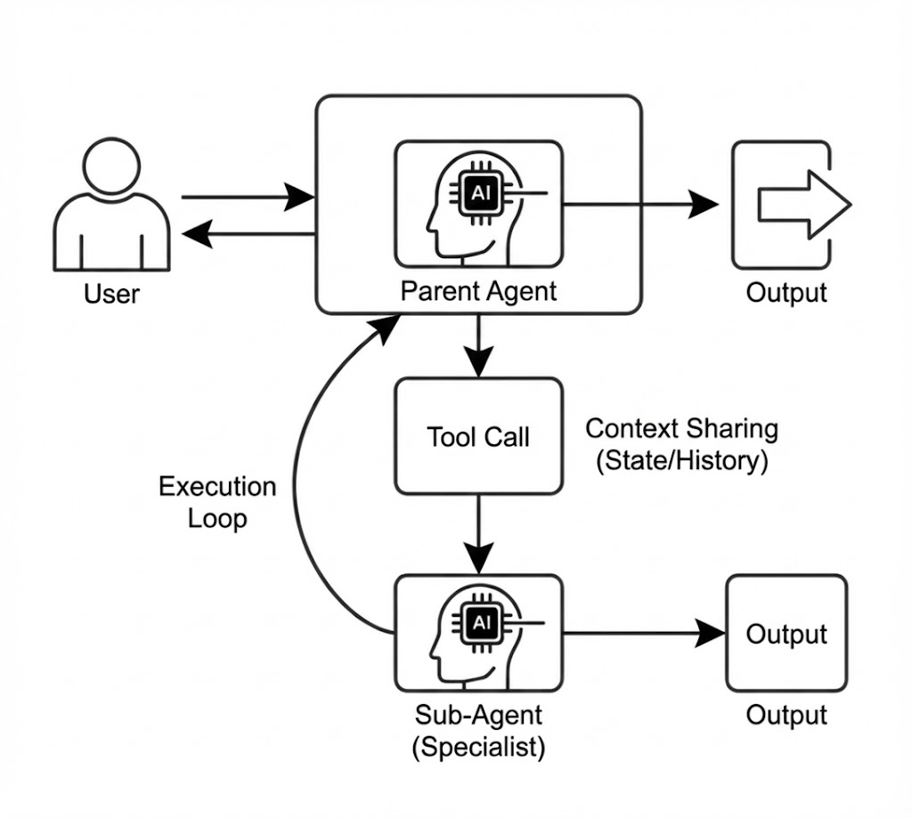
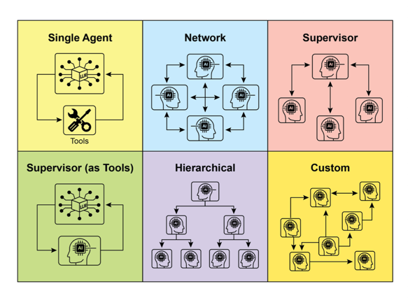

# Agentle


Building agents with the simplicity of Python, in Java!

I created this library to make it easier to build AI calls with OpenAI's Responses API. It came up that I started to create the Agent classes and realised I could build a cool library with that. So I started to build it and it's been a lot of fun!

It Requires Java 21+ because the code tries to take advantage of virtual threads.

## Installation

Maven:
```xml
<dependency>
    <groupId>io.github.paragon-intelligence</groupId>
    <artifactId>agentle4j</artifactId>
    <version>0.5.0</version>
</dependency>
```

Gradle:
```groovy
implementation 'io.github.paragon-intelligence:agentle4j:0.5.0'
```

## Why Agentle?

Most Java GenAI libraries (LangChain4J, Spring AI) are built around the Chat Completions API. Agentle focuses exclusively on OpenAI's newer [Responses API](https://platform.openai.com/docs/api-reference/responses), which has a cleaner item-based design and was designed for agentic systems.

## Quick examples

### Basic request

```java
Responder responder = Responder.builder()
    .openRouter()
    .apiKey("your-api-key")
    .build();

var payload = CreateResponsePayload.builder()
    .model("openai/gpt-4o-mini")
    .addDeveloperMessage("You are a helpful assistant.")
    .addUserMessage("Hello!")
    .build();

Response response = responder.respond(payload);
System.out.println(response.outputText());
```

### Streaming

```java
var payload = CreateResponsePayload.builder()
    .model("openai/gpt-4o")
    .addUserMessage("Write a poem about Java")
    .streaming()
    .build();

responder.respond(payload)
    .onTextDelta(System.out::print)
    .onComplete(response -> System.out.println("\nDone: " + response.id()))
    .onError(Throwable::printStackTrace)
    .start();
```

### Structured output

```java
public record Person(String name, int age, String occupation) {}

var payload = CreateResponsePayload.builder()
    .model("openai/gpt-4o")
    .addUserMessage("Create a fictional software engineer")
    .withStructuredOutput(Person.class)
    .build();

ParsedResponse<Person> response = responder.respond(payload);
Person person = response.outputParsed();
```

You can also stream structured output and get partial updates as JSON is generated:

```java
responder.respond(structuredPayload)
    .onPartialJson(fields -> {
        // fields is a Map that updates as JSON streams in
        if (fields.containsKey("name")) {
            updateUI(fields.get("name").toString());
        }
    })
    .onParsedComplete(parsed -> {
        Person p = parsed.outputParsed();
    })
    .start();
```

This is useful for real-time UIs. The parser auto-completes incomplete JSON, so you see fields populate progressively.

## Core concepts

### Responder

The low-level HTTP client. Handles API communication, streaming, retries, and telemetry. Use it directly for simple one-shot requests or when you need fine-grained control.

### Agent

A higher-level abstraction that wraps a Responder with:
- Instructions (system prompt)
- Tools (functions the AI can call)
- Guardrails (input/output validation)
- Memory (cross-conversation persistence)
- Handoffs (routing to other agents)

Agents are stateless and thread-safe. The same instance can handle concurrent conversations because state lives in `AgentContext`.

```java
Agent agent = Agent.builder()
    .name("Assistant")
    .model("openai/gpt-4o")
    .instructions("You are a helpful assistant.")
    .responder(responder)
    .addTool(weatherTool)
    .build();

AgentResult result = agent.interact("What's the weather in Tokyo?");
```

### AgentContext

`AgentContext` is the conversation state container—the agent's short-term memory:

```java
AgentContext context = AgentContext.create();

// Store custom state
context.setState("userId", "user-123");
context.setState("orderId", 42);

// Multi-turn conversation (reuse context)
context.addInput(Message.user("My name is Alice"));
agent.interact(context);

context.addInput(Message.user("What's my name?"));
agent.interact(context);  // -> "Your name is Alice"

// Retrieve state (returns Optional)
String userId = context.getState("userId", String.class).orElse(null);
```

**Key features:**
- **Conversation History** – Tracks all messages exchanged
- **Custom State** – Key-value store for user IDs, session data, etc.
- **Turn Tracking** – Counts LLM calls for loop limits
- **Trace Correlation** – Links spans for distributed tracing
- **Copy/Fork** – Isolated copies for parallel execution

```java
// Resume previous conversation
AgentContext resumed = AgentContext.withHistory(loadFromDatabase());

// Trace correlation for observability
context.withTraceContext(traceId, spanId);
context.withRequestId("session-123");
```

See the [Agents Guide](docs/guides/agents.md#agentcontext) for full API reference.

## Function calling

Define tools with a class that extends `FunctionTool`:

```java
public record WeatherParams(String location, String unit) {}

@FunctionMetadata(
    name = "get_weather",
    description = "Gets current weather for a location")
public class WeatherTool extends FunctionTool<WeatherParams> {
    @Override
    public FunctionToolCallOutput call(WeatherParams params) {
        // Your implementation
        return FunctionToolCallOutput.success("25°C and sunny");
    }
}
```

Register and use:

```java
FunctionToolStore store = FunctionToolStore.create(objectMapper);
store.add(new WeatherTool());

var payload = CreateResponsePayload.builder()
    .model("gpt-4o")
    .addUserMessage("What's the weather in Tokyo?")
    .addTool(weatherTool)
    .build();

Response response = responder.respond(payload);
for (var toolCall : response.functionToolCalls(store)) {
    System.out.println(toolCall.call());
}
```

Tool calls also work during streaming:

```java
responder.respond(streamingPayload)
    .onToolCall((toolName, argsJson) -> {
        System.out.println("Tool called: " + toolName);
    })
    .withToolStore(toolStore)
    .onToolResult((toolName, result) -> {
        System.out.println(toolName + " returned: " + result.output());
    })
    .start();
```

## Multi-agent patterns

### Handoffs


Route conversations between specialized agents:

```java
Agent billingAgent = Agent.builder()
    .name("BillingSpecialist")
    .instructions("You handle billing inquiries.")
    // ...
    .build();

Agent frontDesk = Agent.builder()
    .name("FrontDesk")
    .instructions("Route to specialists as needed.")
    .addHandoff(Handoff.to(billingAgent).description("billing issues").build())
    .build();

AgentResult result = frontDesk.interact("I have a question about my invoice");
if (result.isHandoff()) {
    System.out.println("Handled by: " + result.handoffAgent().name());
}
```

### RouterAgent


For pure classification without conversational noise:

```java
RouterAgent router = RouterAgent.builder()
    .model("openai/gpt-4o-mini")
    .responder(responder)
    .addRoute(billingAgent, "billing, invoices, payments")
    .addRoute(techSupport, "technical issues, bugs, errors")
    .addRoute(salesAgent, "pricing, demos, upgrades")
    .fallback(techSupport)
    .build();

// Classify only (doesn't execute) - returns Optional
agent selected = router.classify("My app keeps crashing")
    .orElse(techSupport);  // Use fallback if classification fails

// Route and execute
AgentResult result = router.route("I need help with billing");

// Streaming
router.routeStream("Help with my invoice")
    .onRouteSelected(agent -> System.out.println("Routed to: " + agent.name()))
    .onTextDelta(System.out::print)
    .onComplete(r -> System.out.println("\nDone!"))
    .start();
```

### Parallel execution


Run multiple agents concurrently:

```java
ParallelAgents team = ParallelAgents.of(researcher, analyst);

// Run all agents
List<AgentResult> results = team.runAll("Analyze market trends");

// Or get just the first to complete
AgentResult fastest = team.runFirst("Quick analysis needed");

// Or combine outputs with a synthesizer agent
AgentResult combined = team.runAndSynthesize("What's the outlook?", writerAgent);

// Streaming
team.runAllStream("Analyze trends")
    .onAgentTextDelta((agent, delta) -> System.out.print("[" + agent.name() + "] " + delta))
    .onComplete(r -> System.out.println("Done!"))
    .start();
```

### Sub-agents (Agent-as-Tool)



Invoke specialized agents as tools within a parent agent's loop:

```java
Agent dataAnalyst = Agent.builder()
    .name("DataAnalyst")
    .instructions("You analyze data and return statistical insights.")
    .responder(responder)
    .build();

Agent orchestrator = Agent.builder()
    .name("Orchestrator")
    .instructions("Use the data analyst when you need deep analysis.")
    .addSubAgent(dataAnalyst, "For data analysis and statistical insights")
    .responder(responder)
    .build();

// Orchestrator can call dataAnalyst like a tool, receive output, and continue
AgentResult result = orchestrator.interact("Analyze these sales figures...");
```

**Context Sharing Options**:

```java
// Default: Share state (userId, etc.) but fresh conversation
.addSubAgent(analyst, "For analysis")

// Full context fork: Include entire conversation history
.addSubAgent(analyst, SubAgentTool.Config.builder()
    .description("For analysis with full context")
    .shareHistory(true)
    .build())

// Isolated: Completely independent sub-agent
.addSubAgent(analyst, SubAgentTool.Config.builder()
    .description("Independent analysis")
    .shareState(false)
    .build())
```

| Pattern | Control Flow | Use Case |
|---------|--------------|----------|
| **Sub-agent** | Delegate → Return → Continue | Need output to continue processing |
| **Handoff** | Transfer → End | Permanently route to specialist |
| **Parallel** | Run concurrently | Get multiple perspectives |

### Interactable Interface

All agent patterns implement the `Interactable` interface, enabling polymorphic usage:

```java
// Service that works with any agent pattern
public class AgentService {
    private final Interactable agent;

    public AgentService(Interactable agent) {
        this.agent = agent;
    }

    public String process(String input) {
        AgentResult result = agent.interact(input);
        return result.output();
    }
}

// Works with any agent type
new AgentService(singleAgent);
new AgentService(supervisorAgent);
new AgentService(router);
new AgentService(network);
new AgentService(parallel);
new AgentService(hierarchy);

// For parallel execution, access all results:
AgentResult result = parallel.interact("Analyze trends");
System.out.println("Primary: " + result.output());
for (AgentResult related : result.relatedResults()) {
    System.out.println("Also: " + related.output());
}
```

## Guardrails


Validate inputs and outputs:

```java
Agent agent = Agent.builder()
    .name("SafeAssistant")
    .addInputGuardrail((input, ctx) -> {
        if (input.contains("password")) {
            return GuardrailResult.failed("Cannot discuss passwords");
        }
        return GuardrailResult.passed();
    })
    .addOutputGuardrail((output, ctx) -> {
        if (output.length() > 5000) {
            return GuardrailResult.failed("Response too long");
        }
        return GuardrailResult.passed();
    })
    .build();
```

## Human-in-the-loop


Mark sensitive tools that require approval:

```java
@FunctionMetadata(
    name = "send_email",
    description = "Sends an email",
    requiresConfirmation = true)
public class SendEmailTool extends FunctionTool<EmailParams> { ... }
```

When the agent hits this tool, it pauses:

```java
AgentResult result = agent.interact("Send an email to John");

if (result.isPaused()) {
    AgentRunState state = result.pausedState();
    FunctionToolCall pending = state.pendingToolCall();
    
    System.out.println("Approval needed: " + pending.name());
    
    if (userApproves()) {
        state.approveToolCall("User approved");
    } else {
        state.rejectToolCall("User denied");
    }
    
    result = agent.resume(state);
}
```

`AgentRunState` is serializable, so you can persist it to a database for async approval workflows that take hours or days.

## Context management

Control conversation length with pluggable strategies:

```java
Agent agent = Agent.builder()
    .contextManagement(ContextManagementConfig.builder()
        .strategy(new SlidingWindowStrategy())
        .maxTokens(4000)
        .build())
    .build();

// Or use summarization
Agent agent = Agent.builder()
    .contextManagement(ContextManagementConfig.builder()
        .strategy(SummarizationStrategy.withResponder(responder, "gpt-4o-mini"))
        .maxTokens(4000)
        .build())
    .build();
```

## Memory


Persistent memory across conversations:

```java
Memory memory = InMemoryMemory.create();

Agent agent = Agent.builder()
    .addMemoryTools(memory)  // Adds store/retrieve tools
    .build();

agent.interact("My favorite color is blue");
// Later...
agent.interact("What's my favorite color?");
// -> "Your favorite color is blue"
```

## Embeddings

Text embedding with built-in retry and fallback support:

```java
EmbeddingProvider embeddings = OpenRouterEmbeddingProvider.builder()
    .apiKey(System.getenv("OPENROUTER_API_KEY"))
    .retryPolicy(RetryPolicy.defaults())  // Retry on 429, 529, 5xx
    .allowFallbacks(true)                 // Use backup providers on overload
    .build();

List<Embedding> results = embeddings.createEmbeddings(
    List.of("Hello world", "AI is amazing"),
    "openai/text-embedding-3-small"
);
```

**Automatic retry on:**
- **429** - Rate limit exceeded (exponential backoff)
- **529** - Provider overloaded (uses fallback providers when enabled)
- **5xx** - Server errors

## Vision

Analyze images with vision-capable models:

```java
Image image = Image.fromUrl("https://example.com/photo.jpg");

UserMessage message = Message.builder()
    .addText("What's in this image?")
    .addContent(image)
    .asUser();

var payload = CreateResponsePayload.builder()
    .model("openai/gpt-4o")
    .addMessage(message)
    .build();

Response response = responder.respond(payload);
System.out.println(response.outputText());
```

Use `ImageDetail.HIGH` for OCR and detailed analysis, `ImageDetail.LOW` for faster processing. See the [Vision Guide](docs/guides/vision.md) for more.

## Web extraction

Extract structured data from web pages using Playwright and LLM:

```java
record Article(String title, String author, String summary) {}

try (Playwright playwright = Playwright.create();
     Browser browser = playwright.chromium().launch()) {
    
    WebExtractor extractor = WebExtractor.create(responder, "openai/gpt-4o");
    
    ExtractionResult.Structured<Article> result = extractor.extract(
        ExtractPayload.structuredBuilder(Article.class)
            .browser(browser)
            .url("https://example.com/article")
            .prompt("Extract the article title, author, and summary")
            .withPreferences(p -> p.onlyMainContent(true))
            .build()
    );
    
    Article article = result.requireOutput();
}
```

See the [Web Extraction Guide](docs/guides/web-extraction.md) for configuration options.

## Observability

Built-in OpenTelemetry support:

```java
Responder responder = Responder.builder()
    .openRouter()
    .apiKey(apiKey)
    .addTelemetryProcessor(LangfuseProcessor.fromEnv())
    .build();
```

Traces automatically span across agent handoffs and parallel executions.

## Provider support

Agentle works with any provider that implements the Responses API:

```java
// OpenRouter (300+ models)
Responder.builder().openRouter().apiKey(key).build();

// OpenAI direct
Responder.builder().openAi().apiKey(key).build();

// Groq
Responder.builder()
    .baseUrl(HttpUrl.parse("https://api.groq.com/openai/v1"))
    .apiKey(key)
    .build();

// Local Ollama
Responder.builder()
    .baseUrl(HttpUrl.parse("http://localhost:11434/v1"))
    .build();
```

The tradeoff vs. LangChain4J/Spring AI: they have native integrations per provider (more work to maintain, but works with any API). Agentle relies on Responses API compatibility (less maintenance, but limited to providers that support it).

## Error handling

### Responder Errors

Typed exceptions for Responder failures:

```java
try {
    Response response = responder.respond(payload);
} catch (RuntimeException e) {
    switch (e) {
        case RateLimitException ex -> System.err.println("Retry after: " + ex.retryAfter());
        case AuthenticationException ex -> System.err.println("Auth: " + ex.suggestion());
        case ServerException ex -> System.err.println("Server: " + ex.statusCode());
        default -> throw e;
    }
}
```

Built-in retry with exponential backoff for 429s and 5xx:

```java
Responder.builder().maxRetries(5).retryPolicy(RetryPolicy.builder()...build()).build();
```

### Agent Errors

Agents **never throw exceptions**. Errors are returned in `AgentResult`:

```java
AgentResult result = agent.interact("Hello");

if (result.isError()) {
    Throwable error = result.error();
    
    if (error instanceof AgentExecutionException e) {
        System.err.println("Agent '" + e.agentName() + "' failed in: " + e.phase());
        System.err.println("Suggestion: " + e.suggestion());
        if (e.isRetryable()) { /* retry */ }
    } else if (error instanceof GuardrailException e) {
        System.err.println("Guardrail: " + e.reason() + " (" + e.violationType() + ")");
    } else if (error instanceof ToolExecutionException e) {
        System.err.println("Tool '" + e.toolName() + "' failed: " + e.getMessage());
    }
}
```

| Phase | When | Retryable |
|-------|------|-----------|
| `INPUT_GUARDRAIL` | Input validation failed | No |
| `LLM_CALL` | API call failed | Yes |
| `TOOL_EXECUTION` | Tool threw exception | No |
| `OUTPUT_GUARDRAIL` | Output validation failed | No |
| `MAX_TURNS_EXCEEDED` | Turn limit hit | No |

For `LLM_CALL` errors, access the underlying API exception via `getCause()`:

```java
if (e.phase() == AgentExecutionException.Phase.LLM_CALL) {
    Throwable cause = e.getCause();
    
    if (cause instanceof RateLimitException rate) {
        System.out.println("Retry after: " + rate.retryAfter());
    } else if (cause instanceof ServerException server) {
        System.out.println("Status: " + server.statusCode());
    }
}
```

See the [Agents Guide](docs/guides/agents.md#error-handling) for comprehensive error handling patterns.

## Configuration

```java
CreateResponsePayload.builder()
    .model("openai/gpt-4o")
    .temperature(0.7)
    .maxOutputTokens(1000)
    .toolChoice(ToolChoiceMode.REQUIRED)
    .reasoning(new ReasoningConfig(...))
    .build();
```

## Comparison with alternatives

| | Agentle | LangChain4J | Spring AI |
|---|---|---|---|
| API | Responses API only | Chat Completions | Custom abstraction |
| Java version | 21+ | 17+ | 17+ |
| Streaming | Virtual thread callbacks | Callbacks | Reactor Flux |
| Structured streaming | Yes (`onPartialJson`) | No | No |
| Multi-provider | Via OpenRouter or Responses API compat | Native integrations | Native integrations |
| RAG | Via tool calling | Built-in | Built-in |
| Spring/Quarkus starters | No | Yes | Yes |

LangChain4J and Spring AI are more mature and have broader provider support. Agentle's advantages are:

1. **Responses API focus** — cleaner API design, built-in conversation state
2. **Structured streaming** — partial JSON parsing during generation
3. **Streaming tool calls** — `onToolCall` callbacks during streaming
4. **Simpler sync model** — virtual thread blocking instead of Reactor

Pick based on what matters for your use case.

## Not yet supported

- Spring Boot / Quarkus starters
- Built-in vector store integrations (use tool calling instead)
- Document loaders
- Chat Completions API fallback

## Multiagent Interaction Patterns - A wide overview



Agentle supports a comprehensive set of multi-agent collaboration patterns for building sophisticated AI systems:

| Pattern | Implementation | Description |
|---------|---------------|-------------|
| **Single Agent** | `Agent` | Autonomous agent operating independently with tools |
| **Network** | `AgentNetwork` | Decentralized peer-to-peer communication between agents |
| **Supervisor** | `SupervisorAgent` | Central coordinator delegating to worker agents |
| **Supervisor (as Tools)** | `SubAgentTool` | Sub-agents invoked as tools within a parent's loop |
| **Hierarchical** | `HierarchicalAgents` | Multi-layered structure with managers and workers |
| **Custom** | Composition | Combine patterns for domain-specific workflows |

### Single Agent

The foundational pattern - an autonomous agent with tools:

```java
Agent agent = Agent.builder()
    .name("Assistant")
    .model("openai/gpt-4o")
    .instructions("You are a helpful assistant.")
    .addTool(weatherTool)
    .responder(responder)
    .build();

AgentResult result = agent.interact("What's the weather?");
```

### Network Pattern

Peer-to-peer agents discussing and building on each other's ideas:

```java
AgentNetwork network = AgentNetwork.builder()
    .addPeer(optimist)    // Argues positive aspects
    .addPeer(pessimist)   // Argues negative aspects  
    .addPeer(moderate)    // Finds middle ground
    .maxRounds(3)
    .synthesizer(summarizer)  // Optional: combines viewpoints
    .build();

NetworkResult result = network.discuss("Should we adopt AI widely?");
result.contributions().forEach(c -> 
    System.out.println(c.agent().name() + ": " + c.output()));

// Streaming
network.discussStream("Should we adopt AI widely?")
    .onPeerTextDelta((peer, delta) -> System.out.print("[" + peer.name() + "] " + delta))
    .onRoundStart(round -> System.out.println("=== Round " + round + " ==="))
    .onComplete(r -> System.out.println("Discussion finished!"))
    .start();
```

### Supervisor Pattern

Central coordinator with explicit task delegation to workers:

```java
SupervisorAgent supervisor = SupervisorAgent.builder()
    .name("ProjectManager")
    .model("openai/gpt-4o")
    .instructions("Coordinate workers to complete projects")
    .addWorker(researcher, "research and gather facts")
    .addWorker(writer, "write and format content")
    .addWorker(reviewer, "review and suggest improvements")
    .responder(responder)
    .build();

AgentResult result = supervisor.orchestrate("Create a market analysis report");
```

### Hierarchical Pattern

Multi-level organizational structure with executives, managers, and workers:

```java
HierarchicalAgents hierarchy = HierarchicalAgents.builder()
    .executive(ceoAgent)
    .addDepartment("Engineering", techManager, developer, qaEngineer)
    .addDepartment("Sales", salesManager, salesRep)
    .build();

// Task flows: Executive → Managers → Workers
AgentResult result = hierarchy.execute("Launch new product");

// Or bypass executive and send directly to a department
hierarchy.sendToDepartment("Engineering", "Fix the bug");
```

### Pattern Selection Guide

| Use Case | Recommended Pattern |
|----------|-------------------|
| Single task with tools | Single Agent |
| Need multiple perspectives | Network |
| Complex task decomposition | Supervisor |
| Organizational workflows | Hierarchical |
| Dynamic delegation during execution | Sub-agent (as Tool) |
| Quick routing to specialists | RouterAgent + Handoffs |
| Concurrent independent work | ParallelAgents |

All patterns support **streaming**, **trace correlation**, and **context sharing** for production use.

## Development

```bash
make build      # Build
make test       # Run tests
make format     # Format code
make benchmark  # Performance benchmarks
```

## Test Coverage

**Current Coverage: 88%** | [View Full Report](target/site/jacoco/index.html)

Run tests and generate coverage report:

```bash
mvn test jacoco:report
```

Coverage report is generated at `target/site/jacoco/index.html`.

| Module | Coverage |
|--------|----------|
| `responses` | 91% |
| `prompts` | 88% |
| `http` | 89% |
| `streaming` | 80% |
| `telemetry` | 85% |
| `agents` | 75% |

## License

MIT