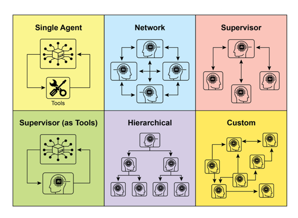

# Agentle

> This docs was updated at: 2026-03-09


The Java agent framework built on OpenAI's Responses API.


## The problem

Every Java AI framework — LangChain4j, Spring AI — is built on the Chat Completions API. That API was designed for chatbots. OpenAI replaced it with the [Responses API](https://platform.openai.com/docs/api-reference/responses): item-based conversation state, native tool calling, structured output as a first-class primitive, and a design built for agents, not chat.

Agentle is the only Java framework built exclusively on the Responses API. No wrapping the old API. No compatibility layers. One clean abstraction over the API that was designed for what you're actually building.

If LangChain4j or Spring AI work for your use case, keep using them. If you need tool planning, multi-agent orchestration, structured streaming, or human-in-the-loop workflows — read on.

## Installation

Maven:
```xml
<dependency>
    <groupId>io.github.paragon-intelligence</groupId>
    <artifactId>agentle4j</artifactId>
    <version>0.8.3</version>
</dependency>
```

Gradle:
```groovy
implementation 'io.github.paragon-intelligence:agentle4j:0.8.3'
```

Requires Java 25+ (uses preview features like `StructuredTaskScope`).

## See it in action

### An agent with tools

```java
Agent agent = Agent.builder()
    .name("Assistant")
    .model("openai/gpt-4o")
    .instructions("You are a helpful assistant.")
    .responder(Responder.builder().openRouter().apiKey(key).build())
    .addTool(new GetWeatherTool())
    .build();

AgentResult result = agent.interact("What's the weather in Tokyo?");
System.out.println(result.output());

// Agents never throw. Errors live in the result.
if (result.isError()) {
    System.err.println(result.error().getMessage());
}
```

### Structured streaming with partial JSON

Stream structured output and watch fields populate in real-time. The parser auto-completes incomplete JSON as it arrives, so your UI updates progressively. No other Java framework does this.

```java
record Person(String name, int age, String occupation) {}

var payload = CreateResponsePayload.builder()
    .model("openai/gpt-4o")
    .addUserMessage("Create a fictional software engineer")
    .withStructuredOutput(Person.class)
    .streaming()
    .build();

responder.respond(payload)
    .onPartialJson(fields -> {
        // Fields arrive as they generate: first "name", then "age", then "occupation"
        if (fields.containsKey("name"))
            updateUI(fields.get("name").toString());
    })
    .onParsedComplete(parsed -> {
        Person p = parsed.outputParsed();  // Fully typed
    })
    .start();
```

### Tool planning with parallel execution

One line enables tool planning. The LLM batches tool calls into a dependency graph, the framework topologically sorts and executes them in parallel waves, and `$ref` references resolve between steps. One LLM round-trip instead of five.

```java
Agent agent = Agent.builder()
    .name("Researcher")
    .model("openai/gpt-4o")
    .instructions("You gather and compare data from multiple sources.")
    .responder(responder)
    .addTool(new GetWeatherTool())
    .addTool(new GetNewsTool())
    .addTool(new CompareDataTool())
    .enableToolPlanning()
    .build();

// LLM plans: getWeather("Tokyo") || getWeather("London") -> compareData(results)
// Framework executes in parallel, resolves references, returns final output
AgentResult result = agent.interact("Compare weather in Tokyo vs London");
```

### Human-in-the-loop

Agents pause at sensitive tools. State is serializable — save it to any database, resume hours or days later.

```java
@FunctionMetadata(name = "send_email", description = "Sends an email",
    requiresConfirmation = true)
public class SendEmailTool extends FunctionTool<EmailParams> { ... }

AgentResult result = agent.interact("Send the quarterly report to the team");

if (result.isPaused()) {
    AgentRunState state = result.pausedState();
    saveToDatabase(state);  // Serializable — persist anywhere
}

// Hours later, after approval in your web UI...
AgentRunState state = loadFromDatabase(runId);
state.approveToolCall("User approved via dashboard");
AgentResult resumed = agent.resume(state);
```

## Multi-agent patterns

Six patterns, all implementing `Interactable`. Swap any pattern without changing your service code.



| Pattern | Example | Use case |
|---------|---------|----------|
| **Router** | `RouterAgent.builder().addRoute(billing, "invoices, payments")...` | Classify and route to specialists |
| **Supervisor** | `SupervisorAgent.builder().addWorker(writer, "writes content")...` | Central coordinator with workers |
| **Parallel** | `ParallelAgents.of(researcher, analyst).runAll("analyze")` | Concurrent independent work |
| **Network** | `AgentNetwork.builder().addPeer(optimist).addPeer(pessimist)...` | Peer-to-peer multi-round debate |
| **Hierarchical** | `HierarchicalAgents.builder().executive(ceo).addDepartment(...)` | Org-chart workflows |
| **Sub-agent** | `.addSubAgent(analyst, "for deep analysis")` | Delegate, get result, continue |

```java
// Your service works with any pattern — same interface
public class AgentService {
    private final Interactable agent;

    public String process(String input) {
        return agent.interact(input).output();
    }
}

new AgentService(singleAgent);
new AgentService(router);
new AgentService(supervisor);
new AgentService(parallelTeam);
```

All patterns support streaming. See the [Agents Guide](docs/guides/agents.md) for full documentation.

## Dynamic tool selection

50 tools? 500? `ToolRegistry` sends only the relevant ones per request. No context window explosion.

```java
ToolRegistry registry = ToolRegistry.builder()
    .strategy(new BM25ToolSearchStrategy(5))     // Top 5 most relevant
    .eagerTool(helpTool)                          // Always available
    .deferredTools(List.of(tool1, tool2, ...))    // Only when relevant
    .build();

Agent agent = Agent.builder()
    .name("Assistant")
    .toolRegistry(registry)
    .responder(responder)
    .build();
```

Pluggable strategies: BM25, semantic similarity, regex, or write your own. See the [Tool Search Guide](docs/guides/tool-search.md).

## Blueprints — agents as JSON

Serialize any agent (or entire multi-agent constellation) to JSON. Store in a database, version in git, share across services, load at runtime. No recompilation.

```java
// Agent → JSON
String json = agent.toBlueprint().toJson();

// JSON → Agent (API keys auto-resolved from environment variables)
Interactable agent = new ObjectMapper()
    .readValue(json, InteractableBlueprint.class)
    .toInteractable();

agent.interact("Hello!");
```

Works with every pattern — `Agent`, `RouterAgent`, `SupervisorAgent`, `AgentNetwork`, `ParallelAgents`, `HierarchicalAgents`. Nested constellations serialize recursively: a Router containing a Supervisor containing three Agents becomes one JSON file.

### JSON-first agent definitions

Skip Java builders entirely. Write a JSON file, deserialize, run.

```json
{
  "type": "agent",
  "name": "CustomerSupport",
  "model": "openai/gpt-4o",
  "instructions": "You are a professional support agent for Acme Corp.",
  "maxTurns": 15,
  "responder": {
    "provider": "OPEN_ROUTER",
    "apiKeyEnvVar": "OPENROUTER_API_KEY"
  },
  "toolClassNames": ["com.acme.tools.SearchKnowledgeBase", "com.acme.tools.CreateTicket"],
  "handoffs": [],
  "inputGuardrails": [{ "registryId": "profanity_filter" }],
  "outputGuardrails": []
}
```

```java
String json = Files.readString(Path.of("agents/support.json"));
Interactable agent = new ObjectMapper()
    .readValue(json, InteractableBlueprint.class)
    .toInteractable();
```

### LLM-generated agents

`AgentDefinition` is designed for structured output — an LLM creates agents at runtime.

```java
Interactable.Structured<AgentDefinition> metaAgent = Agent.builder()
    .name("AgentFactory")
    .model("openai/gpt-4o")
    .instructions("You create agent definitions. Available tools: search_kb, create_ticket.")
    .structured(AgentDefinition.class)
    .responder(responder)
    .build();

AgentDefinition def = metaAgent.interactStructured(
    "Create a Spanish-speaking support agent"
).output();

// LLM decides behavior — you provide infrastructure
Interactable agent = def.toInteractable(responder, "openai/gpt-4o", availableTools);
agent.interact("¿Cómo puedo recuperar mi contraseña?");
```

See the [Blueprints Guide](docs/guides/blueprints.md) for the full JSON schema reference, multi-agent serialization examples, and Spring Boot integration.

## Harness engineering

*The bottleneck is infrastructure, not intelligence.* Agentle ships a full harness layer — constraints, verification loops, and feedback systems that let agents do reliable long-horizon work.

### Self-correction loop

When an agent fails (guardrail violation, tool error, bad output), inject the error back and retry. LangChain benchmarks show this one feature gives the largest accuracy improvement.

```java
Interactable correcting = SelfCorrectingInteractable.wrap(agent,
    SelfCorrectionConfig.builder()
        .maxRetries(3)
        .retryOn(result -> result.isError())
        .feedbackTemplate("Your attempt failed:\n{error}\nPlease fix it and try again.")
        .build());

AgentResult result = correcting.interact("Write a sorting algorithm");
```

### Lifecycle hooks

Inject logging, cost tracking, rate limiting, or circuit breakers around any agent run or tool call — without modifying the agent.

```java
HookRegistry hooks = HookRegistry.create()
    .add(new AgentHook() {
        @Override
        public void beforeToolCall(FunctionToolCall call, AgenticContext ctx) {
            System.out.println("Calling: " + call.name());
        }
        @Override
        public void afterToolCall(FunctionToolCall call, ToolExecution exec, AgenticContext ctx) {
            System.out.println("Done: " + exec.isSuccess() + " in " + exec.duration().toMillis() + "ms");
        }
    });

Agent agent = Agent.builder()
    .hookRegistry(hooks)
    .build();
```

### Shell verification tools

Give agents the ability to run their own tests and linters. The command is fixed at construction time — the agent can trigger it but cannot inject arguments.

```java
Agent agent = Agent.builder()
    .name("CodeWriter")
    .instructions("Write code, then run_tests. If tests fail, fix the code and run again.")
    .addTool(ShellVerificationTool.builder()
        .name("run_tests")
        .command("mvn", "test", "-q")
        .workingDir(Path.of("/my/project"))
        .timeoutSeconds(120)
        .build())
    .build();
```

### Durable memory

`InMemoryMemory` is fine for prototyping. For production long-running agents:

```java
// Filesystem: survives JVM restarts
Memory memory = FilesystemMemory.create(Path.of("/var/agent-data/memory"));

// JDBC: any SQL database
Memory memory = JdbcMemory.create(hikariDataSource);

// Both plug into the same interface — no agent code changes
Agent agent = Agent.builder().addMemoryTools(memory).build();
```

### Progress logs and artifact stores

For Anthropic-style long-running multi-session agents that need to track work across restarts:

```java
ProgressLog log = ProgressLog.create();
ArtifactStore store = FilesystemArtifactStore.create(Path.of("./artifacts"));

Agent agent = Agent.builder()
    .addTools(ProgressLogTool.all(log).toArray(new FunctionTool[0]))
    .addTools(ArtifactStoreTool.all(store).toArray(new FunctionTool[0]))
    .build();

// Agent can now: read_progress_log, append_progress_log, read_artifact, write_artifact, list_artifacts
```

### Harness builder — compose everything

```java
Interactable harnessedAgent = Harness.builder()
    .selfCorrection()                                          // 3 retries on error
    .addHook(new LoggingHook())
    .artifactStore(FilesystemArtifactStore.create(Path.of("./artifacts")))
    .progressLog(ProgressLog.create())
    .reportExporter(RunReportExporter.create(Path.of("./reports")))
    .wrap(myAgent);
```

See the [Harness API Reference](docs/api/com/paragon/harness/index.md) for the full package documentation.

## Everything else

Agentle ships with more than agents. Each feature has a dedicated guide.

- **[MCP Client](docs/guides/mcp-client.md)** — Connect to Model Context Protocol servers via stdio or HTTP. Tools appear as native `FunctionTool`s.
- **[Skills](docs/guides/agents.md)** — Modular expertise (SKILL.md files) injected into agent prompts. Reusable knowledge, not isolated sub-agents.
- **[Web Extraction](docs/guides/web-extraction.md)** — Playwright renders the page, LLM extracts structured data. `WebExtractor.create(responder, model)`.
- **[Guardrails](docs/guides/agents.md#guardrails)** — Input/output validation. Block dangerous prompts, enforce constraints, fail before the LLM runs.
- **[Context Management](docs/guides/context-management.md)** — Sliding window or LLM-powered summarization for long conversations. Pluggable strategies.
- **[Memory](docs/guides/agents.md)** — Persistent cross-conversation memory. `InMemoryMemory`, `FilesystemMemory`, or `JdbcMemory`. The agent stores and retrieves on its own.
- **[Prompt Builder](docs/guides/prompt-management.md)** — Fluent API with chain-of-thought, few-shot examples, templates, and multi-language support.
- **[Observability](docs/guides/observability.md)** — Built-in OpenTelemetry. Traces span across agent handoffs and parallel execution. One line: `.addTelemetryProcessor(LangfuseProcessor.fromEnv())`.
- **[Vision](docs/guides/vision.md)** — Multi-modal input with `Image.fromUrl()`, base64, or file ID. Control detail level per image.
- **[Messaging](docs/guides/messaging.md)** — WhatsApp/Telegram bots with adaptive batching, rate limiting, and conversation history.
- **[Embeddings](docs/guides/embeddings.md)** — Text embeddings with automatic retry on 429/5xx and provider fallbacks.
- **[Streaming](docs/guides/streaming.md)** — Text deltas, tool call events, structured output — all via virtual-thread callbacks.
- **[Tools](docs/guides/tools.md)** — Type-safe function tools using Java records. Auto-generated JSON schemas from generics.
- **[Tool Planning](docs/guides/tool-planning.md)** — DAG-based parallel tool execution with reference resolution between steps.
- **[Harness Engineering](docs/api/com/paragon/harness/index.md)** — Self-correction loops, lifecycle hooks, shell verification, durable memory, progress logs, artifact stores, and run reports.

## How it compares

| | **Agentle** | **LangChain4j** | **Spring AI** |
|---|---|---|---|
| API | Responses API | Chat Completions | Chat Completions |
| Java version | 25+ (virtual threads, records, sealed classes) | 17+ | 17+ |
| Multi-agent patterns | 6 built-in | Limited | Limited |
| Structured streaming | Partial JSON as it generates | No | No |
| Tool planning | DAG with parallel execution | No | No |
| Human-in-the-loop | Serializable pause/resume | No | Manual |
| Dynamic tool selection | BM25 / semantic / custom | No | No |
| Streaming model | Virtual thread callbacks | Callbacks | Reactor Flux |
| Error model | `AgentResult` (never throws) | Exceptions | Exceptions |
| MCP support | stdio + HTTP | No | Limited |
| Observability | Built-in OpenTelemetry | Plugin | Plugin |
| Self-correction loops | Built-in (`SelfCorrectingInteractable`) | No | No |
| Lifecycle hooks | Built-in (`HookRegistry`) | No | No |
| Durable memory | Filesystem + JDBC backends | No | No |
| Verification tools | `ShellVerificationTool` (injection-safe) | No | No |
| Artifact management | `ArtifactStore` + `ProgressLog` | No | No |

LangChain4j and Spring AI have broader provider support through native integrations and offer Spring Boot / Quarkus starters. Agentle requires a Responses API-compatible provider (OpenAI, OpenRouter, or any compatible endpoint). Pick based on what your project needs.

## Provider support

Works with any provider that implements the Responses API:

```java
// OpenRouter — 300+ models
Responder.builder().openRouter().apiKey(key).build();

// OpenAI direct
Responder.builder().openAi().apiKey(key).build();

// Groq
Responder.builder()
    .baseUrl(HttpUrl.parse("https://api.groq.com/openai/v1"))
    .apiKey(key).build();

// Local Ollama
Responder.builder()
    .baseUrl(HttpUrl.parse("http://localhost:11434/v1"))
    .build();
```

## Get started

```xml
<dependency>
    <groupId>io.github.paragon-intelligence</groupId>
    <artifactId>agentle4j</artifactId>
    <version>0.8.3</version>
</dependency>
```

Then explore:

- [Getting Started Guide](docs/getting-started.md) — First agent in 5 minutes
- [Full Documentation](docs/index.md) — Guides, API reference, examples
- [Code Examples](docs/examples/code-samples.md) — Copy-paste ready snippets

## Contributing

```bash
make build      # Build
make test       # Run tests
make format     # Format code
```

## License

MIT
