# Agentic Patterns Visual Guide

> This docs was updated at: 2026-03-21


This guide is the behavior-first companion to the [Agents Guide](agents.md). It focuses on how Agentle's public agentic building blocks actually run: who keeps control, how context moves, when results are delegated, and what comes back to your application.

Examples in this guide assume a `Responder` is already available:

```java
Responder responder = Responder.builder()
    .openRouter()
    .apiKey(System.getenv("OPENROUTER_API_KEY"))
    .build();
```

## Interactable At A Glance

Every orchestration pattern in this guide implements `Interactable`, so your service code can depend on one interface and swap runtime behavior later.

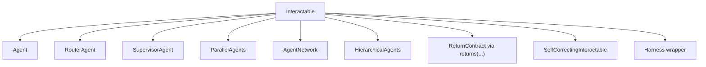

| Public type | Control shape | Best when |
| --- | --- | --- |
| `Agent` | One agent runs the agentic loop locally | A single agent should own tools, guardrails, memory, and handoffs |
| `RouterAgent` | Classify first, then delegate to one target | You want cheap routing without conversational noise |
| `SupervisorAgent` | Coordinator delegates to workers as tools | One agent should decompose work and stay in charge |
| `ParallelAgents` | Fan out to peers concurrently | Several independent perspectives or tasks can run at once |
| `AgentNetwork` | Peer discussion in rounds or broadcast | Peers should see and react to one another |
| `HierarchicalAgents` | Executive -> department supervisors -> workers | You want an org-chart style delegation tree |
| `returns(...)` | Parse the final boundary result without changing inner LLM schemas | Your backend contract is wider than the producer's local schema |
| `SelfCorrectingInteractable` | Retry by injecting feedback into the same conversation | A failed run should repair itself before returning |
| `Harness` | Wrap runs with policies and lifecycle hooks | You need cross-cutting behavior around an interactable |

## Agent And The Core Agentic Loop

### What it is

`Agent` is the core runtime unit. It owns instructions, tools, handoffs, guardrails, optional structured output, and the loop that keeps calling the model until it gets a terminal answer.

### Topology

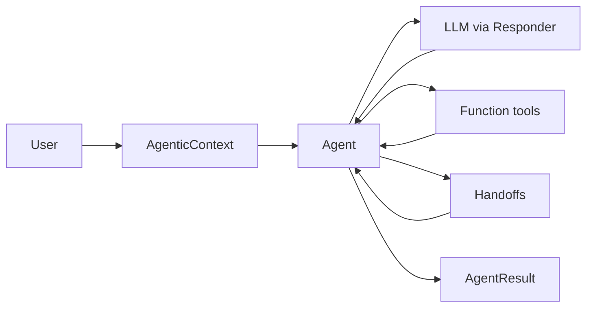

### Control Flow

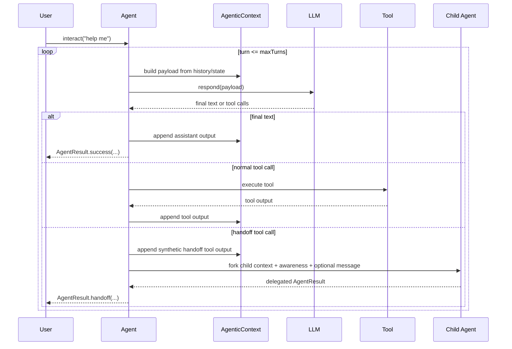

### Context and result semantics

- The same `AgenticContext` is reused across turns in one run, so tool outputs and assistant messages become part of later prompts.
- Input guardrails run before the loop. Output guardrails run after the model produces a terminal answer.
- `maxTurns(...)` caps LLM turns, not individual tool calls.
- A terminal handoff returns `AgentResult` with delegated provenance: `outputOrigin()`, `outputProducerName()`, and `delegationPath()`.
- If the agent is configured with local structured output, the final local response is parsed before returning.

### Usage example

```java
FunctionTool<?> weatherTool = /* your tool */;

Agent billing = Agent.builder()
    .name("Billing")
    .model("openai/gpt-4o")
    .instructions("Handle invoices, payments, and subscriptions.")
    .responder(responder)
    .build();

Agent assistant = Agent.builder()
    .name("FrontDesk")
    .model("openai/gpt-4o")
    .instructions("""
        Answer simple questions directly.
        Use the weather tool for forecasts.
        Transfer billing questions to Billing.
        """)
    .responder(responder)
    .addTool(weatherTool)
    .addHandoff(Handoff.to(billing)
        .withDescription("billing, invoices, payments, subscriptions")
        .build())
    .maxTurns(8)
    .build();

AgentResult result = assistant.interact("Please review my invoice");

System.out.println(result.outputOrigin());       // LOCAL or DELEGATED
System.out.println(result.outputProducerName()); // FrontDesk or Billing
System.out.println(result.delegationPath());     // [FrontDesk] or [FrontDesk, Billing]
```

### Streaming note

Every concrete pattern in this guide that supports streaming does so through either `asStreaming()` or a specialized stream type such as `RouterStream`, `ParallelStream`, or `NetworkStream`.

## Delegation Primitives

### Handoff

#### What it is

Use `Handoff` when the current `Agent` should stop and expose another `Agent`'s result as the final output.

#### Topology

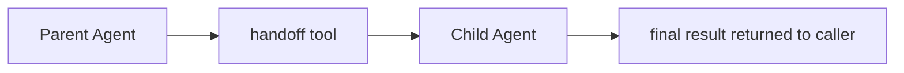

#### Control Flow

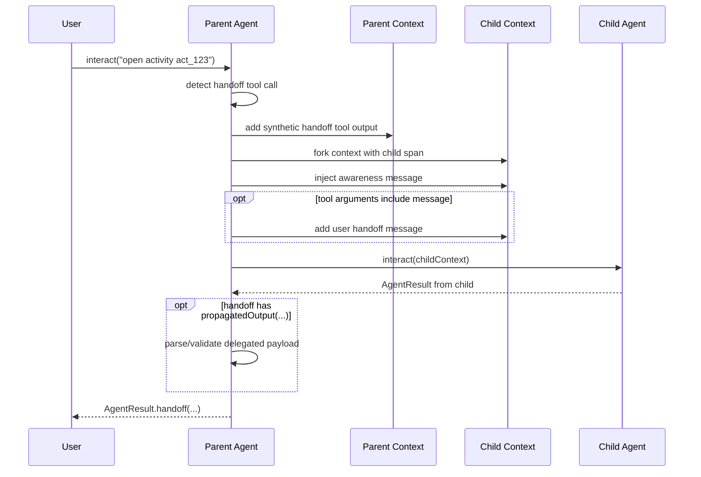

#### Context and result semantics

- `Handoff.to(...)` targets `Agent`, not arbitrary `Interactable`.
- The parent adds a synthetic tool output before transferring so the tool exchange stays valid for the Responses API.
- The child receives a forked context, a fresh child span, and an automatic awareness developer message unless you override or disable it.
- `propagatedOutput(...)` validates what may come back through that specific edge.
- The parent does not continue after the handoff. This is a terminal transfer.

#### Usage example

```java
@JsonTypeInfo(use = JsonTypeInfo.Id.NAME, include = JsonTypeInfo.As.PROPERTY, property = "kind")
@JsonSubTypes({
    @JsonSubTypes.Type(value = DirectAnswer.class, name = "direct_answer"),
    @JsonSubTypes.Type(value = Escalation.class, name = "escalation")
})
sealed interface MainDirectOutput permits DirectAnswer, Escalation {}

@JsonTypeInfo(use = JsonTypeInfo.Id.NAME, include = JsonTypeInfo.As.PROPERTY, property = "kind")
@JsonSubTypes({
    @JsonSubTypes.Type(value = DirectAnswer.class, name = "direct_answer"),
    @JsonSubTypes.Type(value = Escalation.class, name = "escalation"),
    @JsonSubTypes.Type(value = ActivityResult.class, name = "activity_result")
})
sealed interface MainFinalOutput permits DirectAnswer, Escalation, ActivityResult {}

record DirectAnswer(String kind, String message) implements MainDirectOutput, MainFinalOutput {}
record Escalation(String kind, String queue) implements MainDirectOutput, MainFinalOutput {}
record ActivityResult(String kind, String activityId) implements MainFinalOutput {}

Agent activities = Agent.builder()
    .name("Activities")
    .model("openai/gpt-4o")
    .instructions("Return the final activity result as JSON.")
    .responder(responder)
    .outputType(ActivityResult.class)
    .build();

Agent main = Agent.builder()
    .name("Main")
    .model("openai/gpt-4o")
    .instructions("Answer directly when possible. Delegate activity workflows.")
    .responder(responder)
    .outputType(MainDirectOutput.class)
    .addHandoff(Handoff.to(activities)
        .withDescription("Use for activity workflows")
        .propagatedOutput(ActivityResult.class)
        .build())
    .build();

StructuredAgentResult<MainFinalOutput> result =
    main.returns(MainFinalOutput.class).interact("Open activity act_123");
```

#### Streaming note

In the streaming path, handoff events surface through `.onHandoff(...)`, but the parent still ends the run as soon as control is transferred.

### Sub-Agent Tools

#### What they are

Use sub-agent tools when the parent should call another agent or pattern mid-run, receive text back, and keep reasoning.

- `SubAgentTool` wraps an `Agent`.
- `InteractableSubAgentTool` wraps any `Interactable`, including routers, supervisors, parallel teams, and networks.

#### Topology

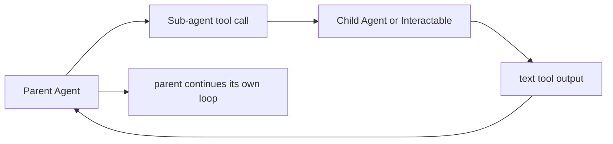

#### Control Flow

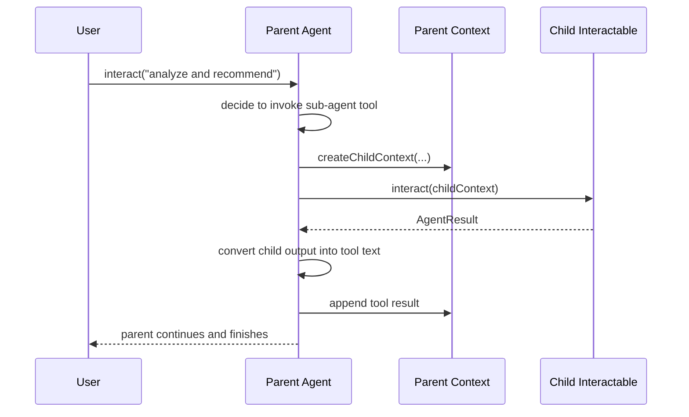

#### Child context propagation

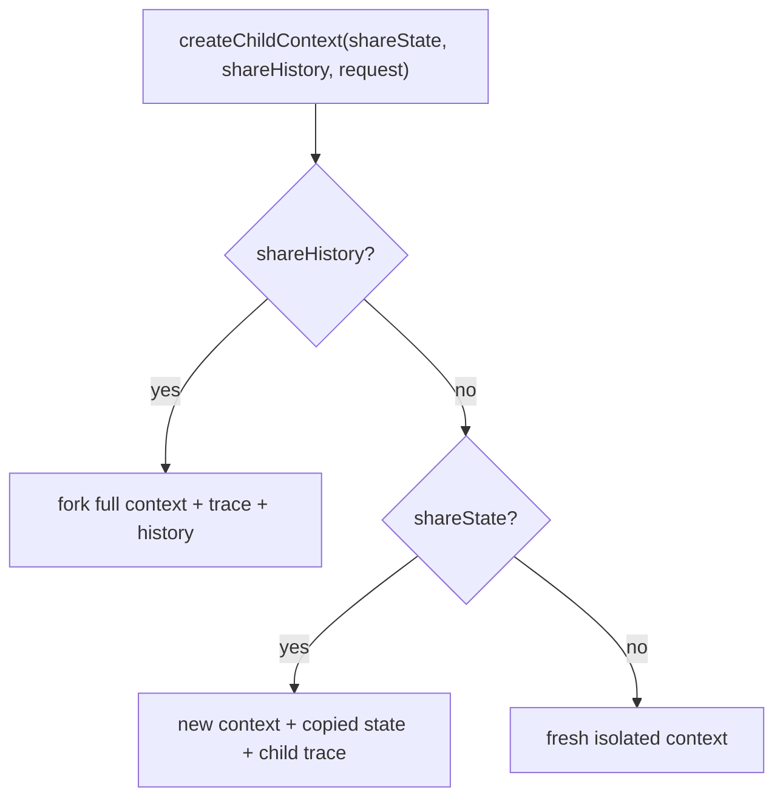

#### Context and result semantics

- Sub-agent tools are non-terminal. The parent receives normal tool output and keeps going.
- `shareHistory(true)` forks the full conversation into the child context.
- `shareState(true)` copies custom state and trace correlation, but starts fresh history.
- `shareState(false)` creates a clean child context.
- Child structured output stays inside the child unless the parent explicitly interprets the returned text.
- These tools are text-only by design. Use `Handoff` plus `propagatedOutput(...)` for terminal structured propagation back to your backend.

#### Usage examples

```java
Agent analyst = Agent.builder()
    .name("Analyst")
    .model("openai/gpt-4o")
    .instructions("Analyze data and return concise findings.")
    .responder(responder)
    .build();

Agent orchestrator = Agent.builder()
    .name("Orchestrator")
    .model("openai/gpt-4o")
    .instructions("Use the analyst when you need deeper analysis, then finish the answer yourself.")
    .responder(responder)
    .addSubAgent(analyst, SubAgentTool.Config.builder()
        .description("For deep analysis")
        .shareHistory(true)
        .build())
    .build();

RouterAgent router = RouterAgent.builder()
    .model("openai/gpt-4o-mini")
    .responder(responder)
    .addRoute(analyst, "analysis, metrics, trends")
    .addRoute(orchestrator, "coordination, planning")
    .build();

Agent manager = Agent.builder()
    .name("Manager")
    .model("openai/gpt-4o")
    .instructions("Call the router when work needs specialist selection.")
    .responder(responder)
    .addTool(new InteractableSubAgentTool(
        router,
        InteractableSubAgentTool.Config.builder()
            .description("Route work to the right specialist")
            .shareState(true)
            .shareHistory(false)
            .build()))
    .build();
```

#### Streaming note

Sub-agent tool calls surface as normal tool execution events in the parent stream. They are not special terminal events the way handoffs are.

### Boundary Contracts With `returns(...)`

#### What it is

`returns(...)` wraps any `Interactable` in a `ReturnContract<T>`. It changes your application boundary, not the schemas sent to the underlying interactable's own LLM calls.

#### Topology

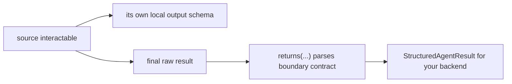

#### Control Flow

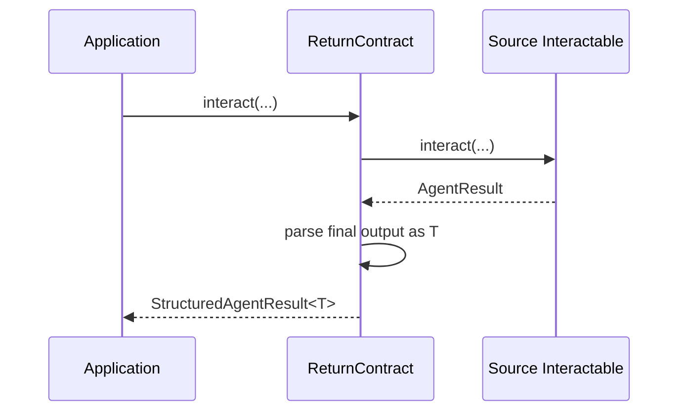

#### Context and result semantics

- `outputType(...)` or `.structured(...)` on a builder is the local producer contract.
- `returns(...)` is the outer boundary contract.
- This separation is what lets a parent produce one local schema while allowing broader delegated terminal results.

#### Usage example

```java
Agent extractor = Agent.builder()
    .name("Extractor")
    .model("openai/gpt-4o")
    .instructions("Return either a direct answer or an escalation.")
    .responder(responder)
    .outputType(MainDirectOutput.class)
    .build();

StructuredAgentResult<MainFinalOutput> finalResult =
    extractor.returns(MainFinalOutput.class).interact("Handle this request");
```

## Orchestration Patterns

### RouterAgent

#### What it is

`RouterAgent` is a dedicated classifier. It picks one target `Interactable` and delegates to it.

#### Topology

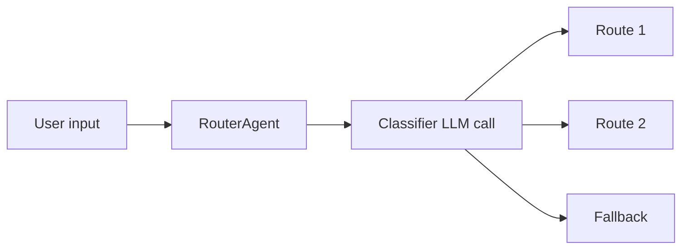

#### Control Flow

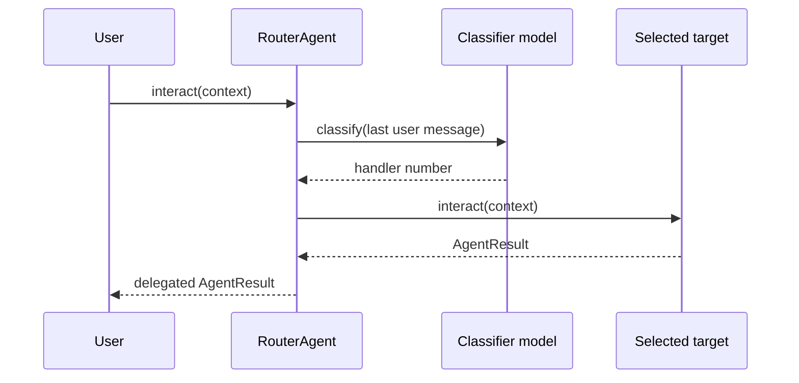

#### Context and result semantics

- `classify(...)` only selects a target and does not execute it.
- `interact(...)` classifies, then delegates to the selected target.
- The selected target receives the same context instance, not a forked child context.
- Result provenance is delegated through `AgentResult.delegated(...)`.
- `fallback(...)` is used when the classifier returns no match or invalid output.

#### Usage example

```java
Agent billing = Agent.builder()
    .name("Billing")
    .model("openai/gpt-4o")
    .instructions("Handle billing issues.")
    .responder(responder)
    .build();

Agent support = Agent.builder()
    .name("Support")
    .model("openai/gpt-4o")
    .instructions("Handle technical issues.")
    .responder(responder)
    .build();

RouterAgent router = RouterAgent.builder()
    .name("HelpRouter")
    .model("openai/gpt-4o-mini")
    .responder(responder)
    .addRoute(billing, "billing, invoices, payments")
    .addRoute(support, "bugs, crashes, errors")
    .fallback(support)
    .build();

AgenticContext context = AgenticContext.create();
context.addInput(Message.user("My invoice is wrong"));

AgentResult routed = router.interact(context);
```

#### Streaming note

Prefer `routeStream(context)` when you want route-specific callbacks such as `.onRouteSelected(...)`. `asStreaming()` is the generic streaming view.

### SupervisorAgent

#### What it is

`SupervisorAgent` builds an internal coordinator `Agent` whose workers are exposed as interactable tools.

#### Topology

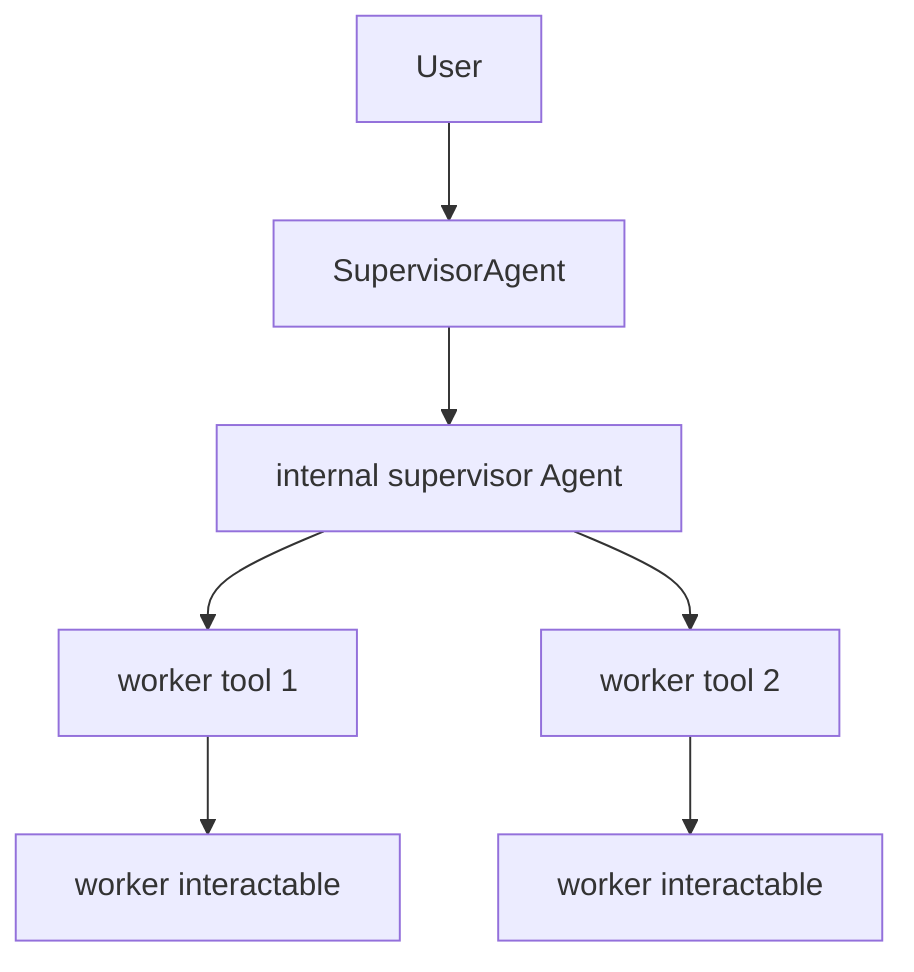

#### Control Flow

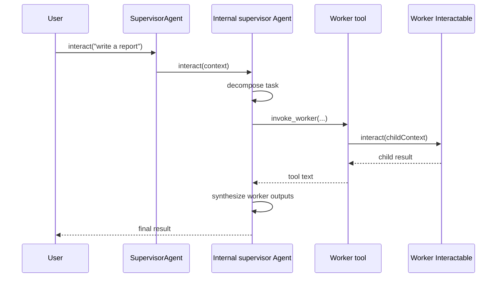

#### Context and result semantics

- Workers can be any `Interactable`.
- Worker tools are built with `InteractableSubAgentTool`, so the supervisor stays in control and workers behave like tools.
- The internal worker-tool wiring defaults to `shareState(true)` and `shareHistory(false)`.
- `interact(...)` is the main entry point. There is no separate `orchestrate(...)` method in the current public API.

#### Usage example

```java
Agent researcher = Agent.builder()
    .name("Researcher")
    .model("openai/gpt-4o")
    .instructions("Research topics thoroughly.")
    .responder(responder)
    .build();

Agent writer = Agent.builder()
    .name("Writer")
    .model("openai/gpt-4o")
    .instructions("Write clear, engaging content.")
    .responder(responder)
    .build();

SupervisorAgent supervisor = SupervisorAgent.builder()
    .name("ProjectManager")
    .model("openai/gpt-4o")
    .instructions("Coordinate workers to produce a concise report.")
    .responder(responder)
    .addWorker(researcher, "research and gather facts")
    .addWorker(writer, "write the final report")
    .build();

AgentResult result = supervisor.interact("Write a report on AI trends");
```

#### Streaming note

Stream it through `supervisor.asStreaming().interact(...)`. Worker invocations surface as tool execution events on the returned `AgentStream`.

### ParallelAgents

#### What it is

`ParallelAgents` fans the same task out to several members concurrently. The public API has multiple result shapes, so pick the method that matches the behavior you want.

#### Topology

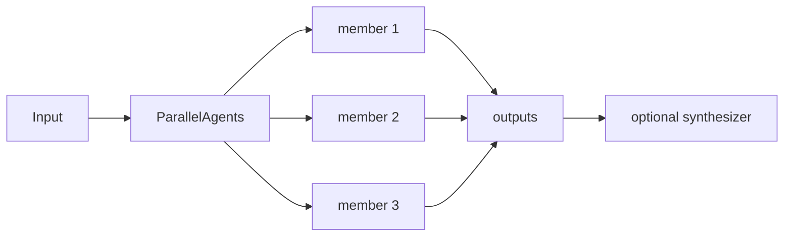

#### Control Flow

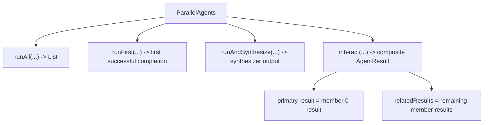

#### Context and result semantics

- `runAll(...)` copies the provided context for each member and returns every result in member order.
- `runFirst(...)` races members and returns the first successful completion.
- `runAndSynthesize(...)` runs all members, then feeds a synthesis prompt to another `Interactable`.
- `interact(...)` is intentionally different: it returns a composite `AgentResult` whose primary result is the first configured member's result, with other member results available through `relatedResults()`.
- Parallel members share a parent trace for observability, but each gets its own copied context.

#### Usage example

```java
Agent researcher = Agent.builder()
    .name("Researcher")
    .model("openai/gpt-4o")
    .instructions("Research facts.")
    .responder(responder)
    .build();

Agent analyst = Agent.builder()
    .name("Analyst")
    .model("openai/gpt-4o")
    .instructions("Analyze patterns.")
    .responder(responder)
    .build();

Agent writer = Agent.builder()
    .name("Writer")
    .model("openai/gpt-4o")
    .instructions("Synthesize multiple viewpoints into one answer.")
    .responder(responder)
    .build();

ParallelAgents team = ParallelAgents.of(researcher, analyst);

List<AgentResult> all = team.runAll("Analyze market trends in AI");
AgentResult fastest = team.runFirst("Give me the quickest useful answer");
AgentResult synthesized = team.runAndSynthesize("What is the outlook?", writer);
AgentResult composite = team.interact("Analyze market trends in AI");
```

#### Streaming note

Use `runAllStream(...)`, `runFirstStream(...)`, or `runAndSynthesizeStream(...)` when you want parallel events. `asStreaming()` only streams the first member.

### AgentNetwork

#### What it is

`AgentNetwork` is for peer-to-peer collaboration. Peers are equals; they are not worker tools under a single coordinator.

#### Topology

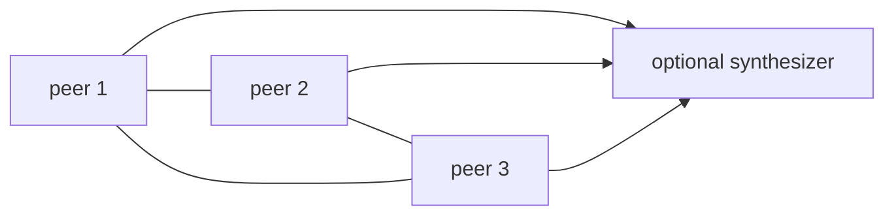

#### Control Flow

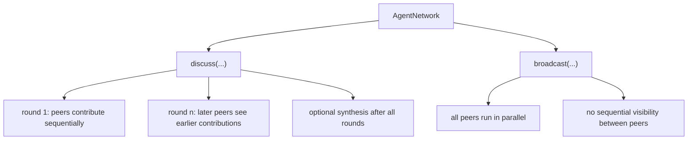

#### Context and result semantics

- `discuss(...)` uses a shared discussion context. Contributions are appended between peers and between rounds.
- Inside a round, peers run sequentially so later peers can build on earlier ones.
- `broadcast(...)` is different: every peer gets only the original message in its own fresh context.
- An optional synthesizer turns accumulated contributions into one final summary.
- `interact(...)` runs `discuss(...)` and returns either the synthesis output or the last contribution.

#### Usage example

```java
Agent optimist = Agent.builder()
    .name("Optimist")
    .model("openai/gpt-4o")
    .instructions("Argue the positive side.")
    .responder(responder)
    .build();

Agent pessimist = Agent.builder()
    .name("Pessimist")
    .model("openai/gpt-4o")
    .instructions("Argue the risks.")
    .responder(responder)
    .build();

Agent synthesizer = Agent.builder()
    .name("Summarizer")
    .model("openai/gpt-4o")
    .instructions("Summarize the discussion clearly.")
    .responder(responder)
    .build();

AgentNetwork network = AgentNetwork.builder()
    .name("Debate")
    .addPeer(optimist)
    .addPeer(pessimist)
    .maxRounds(2)
    .synthesizer(synthesizer)
    .build();

AgentNetwork.NetworkResult result = network.discuss("Should AI be regulated?");

result.contributions().forEach(c ->
    System.out.println(c.peer().name() + " (Round " + c.round() + "): " + c.output()));
```

#### Streaming note

Prefer `discussStream(...)` or `broadcastStream(...)` when you want round and peer callbacks. Those stream types expose network-specific events that `asStreaming()` does not.

### HierarchicalAgents

#### What it is

`HierarchicalAgents` builds a tree of supervisors: one executive at the top, department supervisors in the middle, and workers at the leaves.

#### Topology

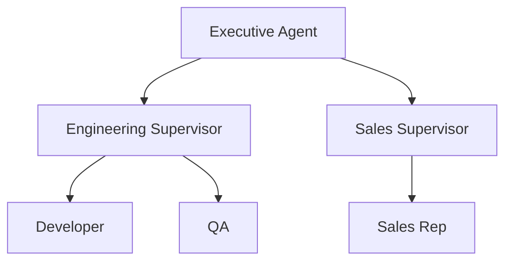

#### Control Flow

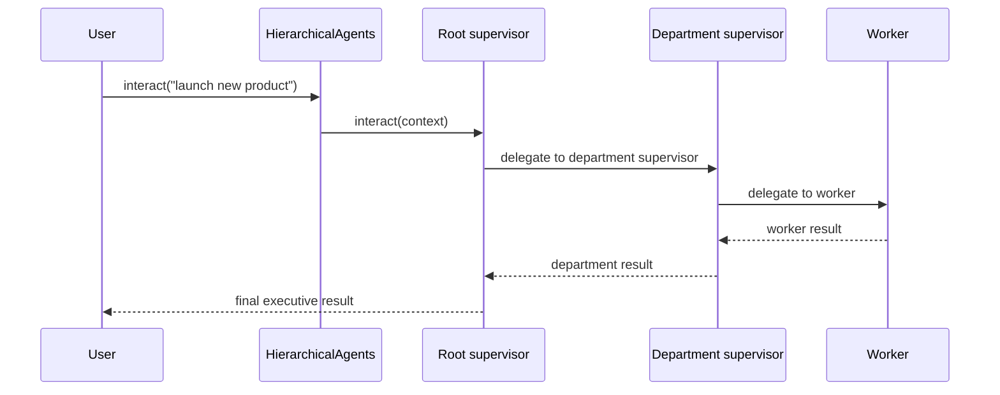

#### Context and result semantics

- Department managers must be `Agent`, because the hierarchy builds department-level `SupervisorAgent`s from their responder/model/instructions.
- Department workers can be any `Interactable`.
- `interact(...)` sends work through the full hierarchy.
- `sendToDepartment(...)` bypasses the executive and directly invokes one department supervisor.
- Internally, the hierarchy is composed out of `SupervisorAgent`s.

#### Usage example

```java
Agent developer = Agent.builder()
    .name("Developer")
    .model("openai/gpt-4o")
    .instructions("Implement features.")
    .responder(responder)
    .build();

Agent qa = Agent.builder()
    .name("QA")
    .model("openai/gpt-4o")
    .instructions("Test and verify quality.")
    .responder(responder)
    .build();

Agent techManager = Agent.builder()
    .name("TechManager")
    .model("openai/gpt-4o")
    .instructions("Lead the engineering team.")
    .responder(responder)
    .build();

Agent ceo = Agent.builder()
    .name("CEO")
    .model("openai/gpt-4o")
    .instructions("Make strategic decisions.")
    .responder(responder)
    .build();

HierarchicalAgents hierarchy = HierarchicalAgents.builder()
    .executive(ceo)
    .addDepartment("Engineering", techManager, developer, qa)
    .build();

AgentResult result = hierarchy.interact("Launch a new product");
AgentResult engineeringOnly = hierarchy.sendToDepartment("Engineering", "Fix the release blocker");
```

#### Streaming note

Stream the hierarchy with `hierarchy.asStreaming().interact(...)`. There is no separate `executeStream(...)` method in the current public API.

## Adjacent Pattern: Tool Planning

### What it is

Tool planning is not an `Interactable` implementation, but it is a core agentic control pattern. The model produces a declarative tool plan once, and the framework executes that plan locally in dependency order with parallel waves where possible.

### Topology

```mermaid
flowchart LR
    A["Agent"] --> L["LLM creates tool plan"]
    L --> E["ToolPlanExecutor"]
    E --> W1["parallel wave 1"]
    E --> W2["parallel wave 2"]
    W1 --> O["resolved outputs"]
    W2 --> O
    O --> A
```

### Control Flow

```mermaid
sequenceDiagram
    participant U as User
    participant A as Agent
    participant L as LLM
    participant E as ToolPlanExecutor
    participant T as Tools

    U->>A: interact("compare weather in Tokyo and London")
    A->>L: create one tool plan
    L-->>A: DAG with ids and $ref dependencies
    A->>E: execute plan locally
    par independent steps
        E->>T: get_weather(Tokyo)
        E->>T: get_weather(London)
    end
    E->>T: compare_data($ref:tokyo, $ref:london)
    T-->>E: final tool outputs
    E-->>A: output_steps
    A-->>U: final answer
```

### Context and result semantics

- The model plans once, instead of issuing one tool call per turn.
- Independent steps run in parallel.
- `$ref` values wire earlier outputs into later steps.
- Intermediate step outputs stay local to the executor instead of inflating the conversation history.

### Usage example

```java
Agent planner = Agent.builder()
    .name("ResearchAssistant")
    .model("openai/gpt-4o")
    .instructions("Gather data from multiple tools and compare the results.")
    .responder(responder)
    .addTool(/* weather tool */)
    .addTool(/* news tool */)
    .addTool(/* comparison tool */)
    .enableToolPlanning()
    .build();

AgentResult result = planner.interact("Compare the weather in Tokyo and London");
```

See the dedicated [Tool Planning Guide](tool-planning.md) for the full plan format and executor behavior.

## Wrapper Behaviors

### SelfCorrectingInteractable

#### What it is

`SelfCorrectingInteractable` wraps any `Interactable` and retries it by injecting feedback into the same conversation when a result matches the retry predicate.

#### Topology

```mermaid
flowchart LR
    U["User"] --> S["SelfCorrectingInteractable"]
    S --> D["delegate interactable"]
    D --> R["AgentResult"]
    R --> S
```

#### Control Flow

```mermaid
flowchart TD
    A["delegate.interact(...)"] --> B{"retryOn(result)?"}
    B -->|no| C["return result"]
    B -->|yes| D["format feedback from error"]
    D --> E["append feedback as user message"]
    E --> F{"attempts < maxRetries?"}
    F -->|yes| A
    F -->|no| C
```

#### Context and result semantics

- Retries happen inside the same `AgenticContext`.
- Feedback is injected as a user message before the next attempt.
- The final returned result is either the first success or the last failing attempt.
- Streaming deliberately bypasses the retry loop and delegates straight to the wrapped interactable.

#### Usage example

```java
Interactable correcting = SelfCorrectingInteractable.wrap(
    Agent.builder()
        .name("CodeWriter")
        .model("openai/gpt-4o")
        .instructions("Write code and fix mistakes when feedback arrives.")
        .responder(responder)
        .build(),
    SelfCorrectionConfig.builder()
        .maxRetries(3)
        .retryOn(AgentResult::isError)
        .feedbackTemplate("Your last attempt failed:\n{error}\nPlease fix it.")
        .build());

AgentResult result = correcting.interact("Write a sorting function");
```

### Harness

#### What it is

`Harness` is a higher-level wrapper that composes policies around an interactable. In verified public behavior, it can wrap runs with lifecycle hooks, optional self-correction, and optional run reporting.

#### Topology

```mermaid
flowchart LR
    U["User"] --> H["HarnessedInteractable"]
    H --> K["beforeRun hooks"]
    K --> SC["optional self-correction wrapper"]
    SC --> D["delegate interactable"]
    D --> A["afterRun hooks"]
    A --> R["optional report export"]
```

#### Control Flow

```mermaid
sequenceDiagram
    participant U as User
    participant H as HarnessedInteractable
    participant HK as HookRegistry
    participant D as Wrapped interactable
    participant RE as RunReportExporter

    U->>H: interact(...)
    H->>HK: beforeRun(context)
    H->>D: interact(...)
    D-->>H: AgentResult
    H->>HK: afterRun(result, context)
    opt report exporter configured
        H->>RE: export(run report)
    end
    H-->>U: result
```

#### Context and result semantics

- If `selfCorrection(...)` is configured, the harness wraps the delegate with `SelfCorrectingInteractable` before exposing the outer harnessed interactable.
- Hooks run around the wrapped interactable, not inside individual tool implementations.
- Streaming applies `beforeRun` immediately and `afterRun` on completion or error.
- This guide intentionally documents only verified wrapper behavior.

#### Usage example

```java
AgentHook loggingHook = new AgentHook() {
  @Override
  public void beforeToolCall(FunctionToolCall call, AgenticContext context) {
    System.out.println("Calling tool: " + call.name());
  }
};

Interactable harnessed = Harness.builder()
    .selfCorrection(SelfCorrectionConfig.builder().maxRetries(2).build())
    .addHook(loggingHook)
    .wrap(Agent.builder()
        .name("Worker")
        .model("openai/gpt-4o")
        .instructions("Do the task carefully.")
        .responder(responder)
        .build());

AgentResult result = harnessed.interact("Complete the task");
```

## Comparison: Which Pattern Should Own The Work?

| Pattern | Control flow | Parent continues? | Context shape | Final shape | Best when |
| --- | --- | --- | --- | --- | --- |
| `Handoff` | Transfer -> child finishes | No | Forked child context | Delegated final result | The specialist should take over completely |
| `SubAgentTool` / `InteractableSubAgentTool` | Call -> child returns text -> parent continues | Yes | Configurable child context | Tool text inside parent loop | The parent needs intermediate specialist output |
| `ParallelAgents` | Fan out concurrently | Yes, after members complete | Copied per member | List, raced result, synthesis result, or composite result | Work is independent and latency matters |
| `AgentNetwork` | Peers discuss or broadcast | No central parent inside the network | Shared discussion context or isolated broadcast contexts | Contributions plus optional synthesis | Peers should challenge or build on one another |
| Tool planning | LLM plans once, executor runs locally | Yes | Local executor state with `$ref` dependencies | Final tool outputs flow back to the agent | You want fewer LLM round-trips for multi-tool work |

## See Also

- [Agents Guide](agents.md)
- [Streaming Guide](streaming.md)
- [Tool Planning Guide](tool-planning.md)
- [Observability Guide](observability.md)
