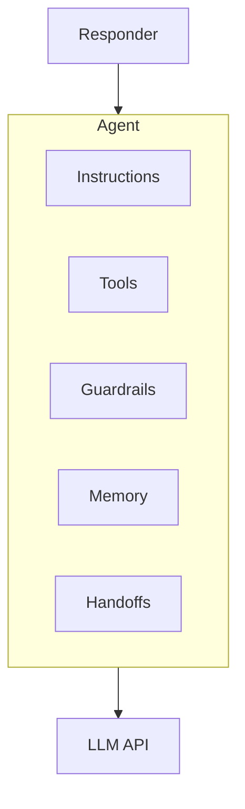

# Agents Guide

Agents are higher-level abstractions that wrap a Responder with tools, guardrails, memory, and multi-agent orchestration capabilities.

## What is an Agent?

An `Agent` adds:

- **Instructions** - System prompt defining the agent's behavior
- **Tools** - Functions the AI can call
- **Guardrails** - Input/output validation
- **Memory** - Cross-conversation persistence
- **Handoffs** - Routing to other agents



## Creating an Agent

### Basic Agent

```java
Agent agent = Agent.builder()
    .name("Assistant")
    .model("openai/gpt-4o")
    .instructions("You are a helpful assistant.")
    .responder(responder)
    .build();
```

### With Tools

```java
Agent agent = Agent.builder()
    .name("WeatherBot")
    .model("openai/gpt-4o")
    .instructions("You help users check the weather.")
    .responder(responder)
    .addTool(weatherTool)
    .addTool(forecastTool)
    .build();
```

## Interacting with Agents

### Simple Interaction

```java
// Async (non-blocking)
agent.interact("What's the weather in Tokyo?")
    .thenAccept(result -> System.out.println(result.output()));

// Blocking
AgentResult result = agent.interact("Hello!").join();
System.out.println(result.output());
```

### With Context

```java
AgentContext context = AgentContext.create();
context.setState("userId", "user-123");

AgentResult result = agent.interact("Remember my name is Alice", context).join();

// Later...
AgentResult result2 = agent.interact("What's my name?", context).join();
// → "Your name is Alice"
```

## The Agentic Loop

When you call `agent.interact()`, Agentle runs the agentic loop:

```
┌─────────────────────────────────────────────────────┐
│                   AGENTIC LOOP                      │
├─────────────────────────────────────────────────────┤
│  1. Validate input (guardrails)                     │
│  2. Build payload from context                      │
│  3. Call LLM                                        │
│  4. If tool calls detected:                         │
│     • Check for handoffs → route to other agent     │
│     • Execute tools → add results to context        │
│     • Go to step 3 (multi-turn)                     │
│  5. Validate output (guardrails)                    │
│  6. Return AgentResult                              │
└─────────────────────────────────────────────────────┘
```

## Guardrails

Validate inputs and outputs:

```java
Agent agent = Agent.builder()
    .name("SafeAssistant")
    .model("openai/gpt-4o")
    .instructions("You are a helpful assistant.")
    .responder(responder)
    // Input validation
    .addInputGuardrail((input, ctx) -> {
        if (input.contains("password")) {
            return GuardrailResult.reject("Cannot discuss passwords");
        }
        return GuardrailResult.pass();
    })
    // Output validation  
    .addOutputGuardrail((output, ctx) -> {
        if (output.length() > 5000) {
            return GuardrailResult.reject("Response too long");
        }
        return GuardrailResult.pass();
    })
    .build();
```

## Handoffs (Multi-Agent)

Route conversations between specialized agents:

```java
Agent billingAgent = Agent.builder()
    .name("BillingSpecialist")
    .model("openai/gpt-4o")
    .instructions("You handle billing inquiries.")
    .responder(responder)
    .build();

Agent frontDesk = Agent.builder()
    .name("FrontDesk")
    .model("openai/gpt-4o")
    .instructions("Route to specialists as needed.")
    .responder(responder)
    .addHandoff(Handoff.to(billingAgent, "billing issues"))
    .build();

// Automatically routes when needed
AgentResult result = frontDesk.interact("I have a billing question").join();
```

## RouterAgent

For dedicated routing without conversational noise:

```java
RouterAgent router = RouterAgent.builder()
    .model("openai/gpt-4o-mini")
    .responder(responder)
    .addRoute(billingAgent, "billing, invoices, payments")
    .addRoute(techSupport, "technical issues, bugs, errors")
    .addRoute(salesAgent, "pricing, demos, upgrades")
    .fallback(techSupport)
    .build();

// Route and execute
AgentResult result = router.route("I have a billing question").join();

// Or just classify
Agent selected = router.classify("My app keeps crashing").join();
```

## Structured Output Agent

Get type-safe responses from agents:

```java
record Analysis(String summary, List<String> keyPoints, int sentiment) {}

Agent.Structured<Analysis> analyst = Agent.builder()
    .name("Analyst")
    .model("openai/gpt-4o")
    .instructions("Analyze text and provide structured insights.")
    .responder(responder)
    .structured(Analysis.class);

AgentResult result = analyst.interact("Analyze this quarterly report...").join();
Analysis analysis = result.parsed(Analysis.class);
```

## Parallel Agents

Run multiple agents concurrently:

```java
Agent researcher = Agent.builder().name("Researcher")...build();
Agent analyst = Agent.builder().name("Analyst")...build();
Agent writer = Agent.builder().name("Writer")...build();

ParallelAgents team = ParallelAgents.of(researcher, analyst);

// Run all in parallel
List<AgentResult> results = team.run("Analyze market trends").join();

// Or get the first result
AgentResult fastest = team.runFirst("Quick analysis needed").join();

// Or combine outputs
AgentResult combined = team.runAndSynthesize(
    "What's the outlook?",
    writer  // Synthesizes researcher + analyst outputs
).join();
```

## Next Steps

- [Function Tools Guide](tools.md) - Create custom tools
- [Streaming Guide](streaming.md) - Stream agent responses
