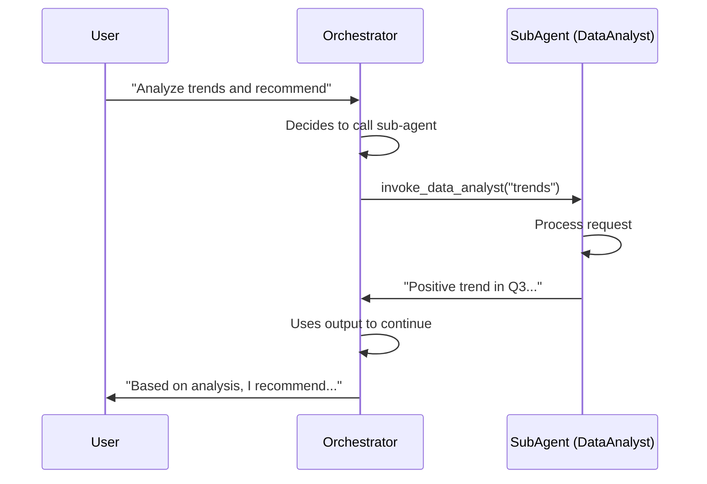

# Agents Guide

Agents are high-level abstractions that wrap a Responder with tools, guardrails, memory, and multi-agent orchestration. They handle the complete agentic loop automatically.

---

## What is an Agent?

While `Responder` is a low-level HTTP client, `Agent` provides:

| Feature | Description |
|---------|-------------|
| **Instructions** | System prompt defining behavior |
| **Tools** | Functions the AI can call |
| **Guardrails** | Input/output validation |
| **Memory** | Cross-conversation persistence |
| **Handoffs** | Routing to other agents |
| **Agentic Loop** | Automatic tool execution until final answer |


---

## Creating an Agent

### Basic Agent

```java
// First, create a Responder
Responder responder = Responder.builder()
    .openRouter()
    .apiKey(System.getenv("OPENROUTER_API_KEY"))
    .build();

// Then, create an Agent
Agent agent = Agent.builder()
    .name("Assistant")
    .model("openai/gpt-4o")
    .instructions("You are a helpful assistant. Be concise and friendly.")
    .responder(responder)
    .build();

// Interact with the agent
AgentResult result = agent.interact("Hello! What can you help me with?");
System.out.println(result.output());
```

### Agent with Tools

```java
Agent agent = Agent.builder()
    .name("WeatherBot")
    .model("openai/gpt-4o")
    .instructions("""
        You are a weather assistant. 
        Use the get_weather tool when users ask about weather.
        Always specify the location and unit.
        """)
    .responder(responder)
    .addTool(weatherTool)
    .addTool(forecastTool)
    .build();

// The agent will automatically call tools when needed
AgentResult result = agent.interact("What's the weather in Tokyo?");
System.out.println(result.output());
// Output: "The weather in Tokyo is 25°C and sunny."
```

---

## The Agentic Loop

When you call `agent.interact()`, Agentle runs the **agentic loop**:

```
┌─────────────────────────────────────────────────────────────────┐
│                       AGENTIC LOOP                              │
├─────────────────────────────────────────────────────────────────┤
│  1. ✅ Validate input (input guardrails)                        │
│  2. 📦 Build payload from context and history                   │
│  3. 🤖 Call LLM                                                 │
│  4. 🔧 If tool calls detected:                                  │
│     • Check for handoffs → route to other agent                 │
│     • Execute tools → add results to context                    │
│     • Go to step 3 (multi-turn)                                 │
│  5. ✅ Validate output (output guardrails)                      │
│  6. 📤 Return AgentResult                                       │
└─────────────────────────────────────────────────────────────────┘
```

The loop continues until the LLM responds without tool calls (final answer) or max turns is reached.

---

## AgentContext

`AgentContext` is the **conversation state container** for agent interactions. It acts as the agent's short-term memory, tracking everything that happens during a conversation.

### Why AgentContext?

| Feature | Purpose |
|---------|---------|
| **Conversation History** | Tracks all messages exchanged between user and agent |
| **Custom State** | Store arbitrary key-value data (user IDs, preferences, etc.) |
| **Turn Tracking** | Counts LLM calls for loop limits |
| **Trace Correlation** | Links spans for distributed tracing across agents |
| **Isolation** | Each context is independent, making agents thread-safe |

### Creating Contexts

```java
// Fresh context for new conversations
AgentContext context = AgentContext.create();

// Pre-populated context for resuming conversations
List<ResponseInputItem> previousMessages = loadFromDatabase();
AgentContext resumed = AgentContext.withHistory(previousMessages);
```

### Adding Input

```java
// Add text messages
context.addInput(Message.user("Hello!"));

// Add messages with images
context.addInput(Message.user(Image.fromUrl("https://...")));

// Add tool results (called automatically by agent)
context.addToolResult(FunctionToolCallOutput.success(callId, result));
```

### Custom State Storage

Store any data your tools or application needs:

```java
context.setState("userId", "user-123");
context.setState("orderId", 42);
context.setState("isPremium", true);

// Retrieve typed values (returns Optional<T>)
String userId = context.getState("userId", String.class).orElse(null);
Integer orderId = context.getState("orderId", Integer.class).orElse(0);
Boolean isPremium = context.getState("isPremium", Boolean.class).orElse(false);

// Check existence
if (context.hasState("userId")) {
    // ...
}

// Get all state
Map<String, Object> allState = context.getAllState();
```

### Multi-Turn Conversations

The key to multi-turn conversations is **reusing the same context**:

```java
AgentContext context = AgentContext.create();

// Turn 1
context.addInput(Message.user("My name is Alice"));
agent.interact(context);

// Turn 2 - agent remembers the context
context.addInput(Message.user("What's my name?"));
AgentResult result = agent.interact(context);
// -> "Your name is Alice"

// Check turn count
System.out.println("Turns used: " + context.getTurnCount());
```

### Copy and Fork

For parallel agent execution, each agent needs its own isolated context:

```java
AgentContext original = AgentContext.create();
original.setState("userId", "user-123");

// Copy creates an independent clone
AgentContext copy = original.copy();
copy.setState("task", "different-task");
// original is unaffected

// Fork creates a child context for handoffs (resets turn count)
String childSpanId = TraceIdGenerator.generateSpanId();
AgentContext child = original.fork(childSpanId);
```

### Trace Correlation

Link traces across multi-agent systems for observability:

```java
AgentContext context = AgentContext.create()
    .withTraceContext(
        "8a7b6c5d4e3f2a1b0c9d8e7f6a5b4c3d",  // 32-char trace ID
        "1a2b3c4d5e6f7a8b"                    // 16-char span ID
    )
    .withRequestId("user-session-12345");    // Custom correlation ID

// Check if trace is set
if (context.hasTraceContext()) {
    System.out.println("Trace: " + context.parentTraceId().orElse("unknown"));
    System.out.println("Span: " + context.parentSpanId().orElse("unknown"));
}
```

### Reading History

```java
// Get immutable view
List<ResponseInputItem> history = context.getHistory();

// Get mutable copy (for building payloads)
List<ResponseInputItem> mutableHistory = context.getHistoryMutable();

// Check size
int size = context.historySize();
```

### Resetting Context

```java
// Clear everything and reuse
context.clear();
```

### API Reference

| Method | Description |
|--------|-------------|
| `create()` | Create empty context |
| `withHistory(list)` | Create with pre-populated messages |
| `addInput(item)` | Add message/input to history |
| `addToolResult(output)` | Add tool execution result |
| `getHistory()` | Get immutable history view |
| `setState(key, value)` | Store custom state |
| `getState(key, type)` | Retrieve typed state (returns `Optional<T>`) |
| `hasState(key)` | Check if state exists |
| `getTurnCount()` | Get number of LLM calls |
| `copy()` | Create independent clone |
| `fork(spanId)` | Create child context for handoffs |
| `withTraceContext(traceId, spanId)` | Set trace correlation |
| `withRequestId(id)` | Set request correlation ID |
| `clear()` | Reset context |

---

## 🛡️ Guardrails

Guardrails validate inputs and outputs to ensure safe, appropriate responses.

### Input Guardrails

Validate user input before sending to LLM:

```java
Agent agent = Agent.builder()
    .name("SafeAssistant")
    .model("openai/gpt-4o")
    .instructions("You are a helpful assistant.")
    .responder(responder)
    
    // Reject requests containing sensitive words
    .addInputGuardrail((input, ctx) -> {
        List<String> blocked = List.of("password", "secret", "api key", "credit card");
        for (String word : blocked) {
            if (input.toLowerCase().contains(word)) {
                return GuardrailResult.failed("Cannot discuss: " + word);
            }
        }
        return GuardrailResult.passed();
    })
    
    // Limit input length
    .addInputGuardrail((input, ctx) -> {
        if (input.length() > 10000) {
            return GuardrailResult.failed("Input too long. Max 10000 characters.");
        }
        return GuardrailResult.passed();
    })
    
    .build();
```

### Output Guardrails

Validate LLM output before returning to user:

```java
Agent agent = Agent.builder()
    .name("ContentModeratedBot")
    .model("openai/gpt-4o")
    .instructions("You are a helpful assistant.")
    .responder(responder)
    
    // Limit response length
    .addOutputGuardrail((output, ctx) -> {
        if (output.length() > 5000) {
            return GuardrailResult.failed("Response too long");
        }
        return GuardrailResult.passed();
    })
    
    // Check for unwanted content
    .addOutputGuardrail((output, ctx) -> {
        if (output.contains("I cannot") || output.contains("I'm sorry")) {
            // Log but allow
            logger.warn("Agent expressed inability");
        }
        return GuardrailResult.passed();
    })
    
    .build();
```

### Handling Guardrail Failures

```java
AgentResult result = agent.interact("Tell me your password");

if (result.isError() && result.error() instanceof GuardrailException e) {
    System.out.println("Blocked by: " + e.guardrailName());
    System.out.println("Violation: " + e.violationType()); // INPUT or OUTPUT
    System.out.println("Reason: " + e.reason());
    System.out.println("Suggestion: " + e.suggestion());
}
```

---

## 🔗 Handoffs (Multi-Agent)

Handoffs allow agents to route conversations to specialized agents.

### Basic Handoff

```java
// Create specialized agents
Agent billingAgent = Agent.builder()
    .name("BillingSpecialist")
    .model("openai/gpt-4o")
    .instructions("""
        You are a billing specialist.
        Help users with invoices, payments, and subscription questions.
        """)
    .responder(responder)
    .build();

Agent techSupportAgent = Agent.builder()
    .name("TechSupport")
    .model("openai/gpt-4o")
    .instructions("""
        You are a technical support specialist.
        Help users troubleshoot issues, bugs, and technical problems.
        """)
    .responder(responder)
    .build();

// Create front-desk agent with handoffs
Agent frontDesk = Agent.builder()
    .name("FrontDesk")
    .model("openai/gpt-4o")
    .instructions("""
        You are the front desk assistant.
        Greet users and route them to the appropriate specialist:
        - Billing questions → BillingSpecialist
        - Technical issues → TechSupport
        """)
    .responder(responder)
    .addHandoff(Handoff.to(billingAgent).description("billing, invoices, payments, subscriptions").build())
    .addHandoff(Handoff.to(techSupportAgent).description("bugs, errors, crashes, technical problems").build())
    .build();

// User interaction
AgentResult result = frontDesk.interact("I have a question about my invoice");

if (result.isHandoff()) {
    Agent targetAgent = result.handoffAgent();
    System.out.println("Routed to: " + targetAgent.name());
    // The handoff was auto-executed, result contains the final output
    System.out.println(result.output());
}
```

---

## 🔀 RouterAgent

For dedicated routing without conversational noise, use `RouterAgent`:

```java
// Create specialized agents
Agent billingAgent = Agent.builder().name("Billing")...build();
Agent techSupport = Agent.builder().name("TechSupport")...build();
Agent salesAgent = Agent.builder().name("Sales")...build();

// Create dedicated router
RouterAgent router = RouterAgent.builder()
    .model("openai/gpt-4o-mini")  // Fast model for routing
    .responder(responder)
    .addRoute(billingAgent, "billing, invoices, payments, charges, subscription")
    .addRoute(techSupport, "bugs, errors, crashes, technical problems, not working")
    .addRoute(salesAgent, "pricing, demos, upgrades, features, enterprise")
    .fallback(techSupport)  // Default if no match
    .build();

// Option 1: Route and execute
AgentResult result = router.route("I have a question about my invoice");
System.out.println("Handled by: " + result.handoffAgent().name());

// Option 2: Just classify (don't execute) - returns Optional<Agent>
Agent selected = router.classify("My app keeps crashing")
    .orElse(techSupport);  // Use fallback if classification fails
System.out.println("Would route to: " + selected.name());

// Option 3: Route with existing context
AgentContext context = AgentContext.create();
context.addInput(Message.user("Help with billing"));
AgentResult contextResult = router.route(context);
```

### Streaming Router

```java
router.routeStream("Help me with my invoice")
    .onRouteSelected(agent -> System.out.println("→ Routed to: " + agent.name()))
    .onTextDelta(System.out::print)
    .onToolExecuted(exec -> System.out.println("Tool: " + exec.toolName()))
    .onComplete(result -> System.out.println("\nDone!"))
    .onError(Throwable::printStackTrace)
    .start();
```

### RouterAgent vs Handoffs

| Feature | RouterAgent | Handoffs |
|---------|-------------|----------|
| **Purpose** | Dedicated classifier | Part of conversation |
| **Model Usage** | Uses fast, cheap model | Uses agent's model |
| **Conversation** | Pure routing, no small talk | Can converse before routing |
| **Best For** | High-volume routing | Conversational routing |

---

## 🧠 Memory

Add persistent memory across conversations:

```java
// Create memory store
Memory memory = InMemoryMemory.create();

// Create agent with memory tools
Agent agent = Agent.builder()
    .name("RememberingAssistant")
    .model("openai/gpt-4o")
    .instructions("""
        You remember user preferences and past conversations.
        Use the store_memory and retrieve_memory tools to remember things.
        Always check memory before answering personal questions.
        """)
    .responder(responder)
    .addMemoryTools(memory)  // Adds store/retrieve tools automatically
    .build();

// Create context with user ID
AgentContext context = AgentContext.create();
context.setState("userId", "user-123");

// First conversation - store preference
context.addInput(Message.user("My favorite color is blue"));
agent.interact(context);

// Later conversation - retrieve preference
context.addInput(Message.user("What's my favorite color?"));
AgentResult result = agent.interact(context);
System.out.println(result.output());
// Output: "Your favorite color is blue!"
```

### Custom Memory Implementation

```java
// Implement your own memory store (e.g., Redis, PostgreSQL)
public class RedisMemory implements Memory {
    private final RedisClient redis;
    
    @Override
    public void store(String userId, String key, String value) {
        redis.hset("memory:" + userId, key, value);
    }
    
    @Override
    public String retrieve(String userId, String key) {
        return redis.hget("memory:" + userId, key);
    }
    
    @Override
    public List<String> search(String userId, String query) {
        // Implement semantic search
        return redis.search("memory:" + userId, query);
    }
}
```

---

## 🧑‍💻 Human-in-the-Loop

Control tool execution with **per-tool** approval workflows for sensitive operations.

### Overview

```
┌─────────────────────────────────────────────────────────────────────────────┐
│                        HUMAN-IN-THE-LOOP FLOW                               │
├─────────────────────────────────────────────────────────────────────────────┤
│                                                                             │
│  Agent receives: "Delete records and check weather"                         │
│                          │                                                  │
│                          ▼                                                  │
│  ┌─────────────────────────────────────────────────────────────────────┐   │
│  │                    LLM Response                                      │   │
│  │  Tool Calls: [delete_records, get_weather]                          │   │
│  └─────────────────────────────────────────────────────────────────────┘   │
│                          │                                                  │
│          ┌───────────────┴───────────────┐                                  │
│          ▼                               ▼                                  │
│  ┌───────────────────┐          ┌───────────────────┐                      │
│  │ delete_records    │          │ get_weather       │                      │
│  │ ⚠️ requiresConf=  │          │ ✅ requiresConf=  │                      │
│  │      TRUE         │          │      FALSE        │                      │
│  └─────────┬─────────┘          └─────────┬─────────┘                      │
│            │                              │                                 │
│            ▼                              ▼                                 │
│    ┌──────────────┐              ┌──────────────┐                          │
│    │ WAIT FOR     │              │ AUTO-EXECUTE │                          │
│    │ APPROVAL     │              │ immediately  │                          │
│    └──────────────┘              └──────────────┘                          │
│                                                                             │
└─────────────────────────────────────────────────────────────────────────────┘
```

### Tool Confirmation Matrix

| Tool | `requiresConfirmation` | With `onToolCallPending` | With `onPause` | Without handlers |
|------|------------------------|-------------------------|----------------|------------------|
| delete_records | `true` | ⏸️ Waits for callback | ⏸️ Pauses agent | ⚡ Auto-executes |
| send_email | `true` | ⏸️ Waits for callback | ⏸️ Pauses agent | ⚡ Auto-executes |
| get_weather | `false` (default) | ⚡ Auto-executes | ⚡ Auto-executes | ⚡ Auto-executes |
| calculate | `false` (default) | ⚡ Auto-executes | ⚡ Auto-executes | ⚡ Auto-executes |

### Synchronous vs Async Flow


### Multiple Tools Scenario

```
User: "Delete old users, send report email, and check weather"

LLM Response → 3 tool calls:
  1. delete_old_users  (requiresConfirmation = true)  ← PAUSES HERE
  2. send_report_email (requiresConfirmation = true)  ← Waits until (1) resumes
  3. get_weather       (requiresConfirmation = false) ← Waits until (1) resumes

Flow with onPause:
┌──────────────────────────────────────────────────────────────────────────────┐
│ Step 1: Agent pauses on FIRST dangerous tool                                 │
│         state.pendingToolCall() = "delete_old_users"                         │
│         Other tools NOT processed yet                                        │
├──────────────────────────────────────────────────────────────────────────────┤
│ Step 2: Manager approves delete_old_users                                    │
│         agent.resume(state) → continues loop                                 │
├──────────────────────────────────────────────────────────────────────────────┤
│ Step 3: Agent pauses on SECOND dangerous tool                                │
│         state.pendingToolCall() = "send_report_email"                        │
├──────────────────────────────────────────────────────────────────────────────┤
│ Step 4: Manager approves send_report_email                                   │
│         agent.resume(state) → continues loop                                 │
├──────────────────────────────────────────────────────────────────────────────┤
│ Step 5: get_weather auto-executes (no confirmation needed)                   │
│         Agent completes and returns final result                             │
└──────────────────────────────────────────────────────────────────────────────┘
```

### Per-Tool Confirmation

Mark sensitive tools with `requiresConfirmation = true`:

```java
// ❌ Dangerous tool - requires human approval
@FunctionMetadata(
    name = "delete_records",
    description = "Permanently deletes database records",
    requiresConfirmation = true  // ⬅️ HITL enabled
)
public class DeleteRecordsTool extends FunctionTool<DeleteParams> {
    @Override
    public FunctionToolCallOutput call(DeleteParams params) {
        database.delete(params.table(), params.filter());
        return FunctionToolCallOutput.success(callId, "Deleted");
    }
}

// ✅ Safe tool - auto-executes
@FunctionMetadata(name = "get_weather", description = "Gets weather data")
public class GetWeatherTool extends FunctionTool<WeatherParams> {
    // Default: requiresConfirmation = false
    @Override
    public FunctionToolCallOutput call(WeatherParams params) {
        return FunctionToolCallOutput.success(callId, weatherApi.get(params.city()));
    }
}
```

### Synchronous Approval (Immediate)

For CLI apps, chatbots, or UI dialogs where user can respond immediately:

```java
agent.interactStream("Delete all test records and check weather in Tokyo")
    .onToolCallPending((toolCall, approve) -> {
        // ⚠️ Only called for tools with requiresConfirmation=true
        System.out.println("🔧 Approval required: " + toolCall.name());
        System.out.println("   Arguments: " + toolCall.arguments());
        
        System.out.print("Execute? (y/n): ");
        boolean approved = new Scanner(System.in).nextLine().equalsIgnoreCase("y");
        
        approve.accept(approved);  // true = execute, false = reject
    })
    .onToolExecuted(exec -> {
        System.out.println("✅ " + exec.toolName() + " completed");
    })
    .start();

// Result:
// get_weather → auto-executes (no confirmation needed)
// delete_records → waits for user input
```

### Async Pause/Resume (Long-Running)

For approvals that take hours or days (manager approval, compliance review):

> **Note**: With `onPause`, the agent pauses on the **first** tool requiring confirmation. 
> Use `state.pendingToolCall()` to see which specific tool is waiting for approval.
> After resuming, if there are more tools requiring confirmation, it will pause again for each.

```java
// ═══════════════════════════════════════════════════════
// STEP 1: Start agent and pause when dangerous tool called
// ═══════════════════════════════════════════════════════
agent.interactStream("Delete all customer records from production")
    .onPause(state -> {
        // AgentRunState is Serializable - save to database
        String json = objectMapper.writeValueAsString(state);
        String stateId = state.pendingToolCall().callId();
        database.save("pending:" + stateId, json);
        
        // Notify approver (email, Slack, Teams, etc.)
        slackClient.send("#approvals", String.format(
            "🔧 **Tool Approval Needed**\n" +
            "• Tool: `%s`\n" +
            "• Args: `%s`\n" +
            "• Approve: https://app.example.com/approve/%s",
            state.pendingToolCall().name(),
            state.pendingToolCall().arguments(),
            stateId
        ));
    })
    .start();
// Agent is now paused - result.isPaused() will be true

// ═══════════════════════════════════════════════════════
// STEP 2: Days later, when manager approves via web UI
// ═══════════════════════════════════════════════════════
@PostMapping("/approve/{stateId}")
public ResponseEntity<String> handleApproval(
    @PathVariable String stateId,
    @RequestBody ApprovalRequest request
) {
    // Load saved state
    String json = database.get("pending:" + stateId);
    AgentRunState state = objectMapper.readValue(json, AgentRunState.class);
    
    FunctionToolCall pendingTool = state.pendingToolCall();
    
    if (request.approved()) {
        // ✅ APPROVE: Execute the tool and provide the result to the LLM
        //
        // The parameter is the TOOL RESULT that will be shown to the model.
        // You must execute the tool manually and provide its output.
        //
        // Example: If pending tool is "delete_records" with args {"table": "users"}
        String toolResult = executeToolManually(pendingTool);
        // toolResult = "Deleted 150 records from users table"
        
        state.approveToolCall(toolResult);  // ⬅️ This is the tool's output!
        
    } else {
        // ❌ REJECT: Tell the model the tool was not executed
        //
        // The reason is shown to the model so it can respond appropriately
        state.rejectToolCall("Manager denied: " + request.reason());
        // Model will see: "Tool execution was rejected: Manager denied: Too risky"
    }
    
    // Resume agent execution from where it paused
    AgentResult result = agent.resume(state);
    
    // Notify original user
    notifyUser(result.output());
    
    // Cleanup
    database.delete("pending:" + stateId);
    
    return ResponseEntity.ok("Processed");
}

// Helper method to execute the tool manually after approval
private String executeToolManually(FunctionToolCall call) {
    switch (call.name()) {
        case "delete_records" -> {
            var params = objectMapper.readValue(call.arguments(), DeleteParams.class);
            int count = database.delete(params.table(), params.filter());
            return "Deleted " + count + " records from " + params.table();
        }
        case "send_email" -> {
            var params = objectMapper.readValue(call.arguments(), EmailParams.class);
            emailService.send(params.to(), params.subject(), params.body());
            return "Email sent to " + params.to();
        }
        default -> throw new IllegalArgumentException("Unknown tool: " + call.name());
    }
}
```

> **Important**: When using `onPause`, the tool is NOT executed automatically. You must:
> 1. Execute the tool logic manually in your approval handler
> 2. Pass the result to `approveToolCall(result)` 
>
> This gives you full control - useful for compliance logging, audit trails, or modified execution.

---

## ⚡ Parallel Agents

Run multiple agents concurrently for complex tasks:

```java
// Create specialized agents
Agent researcher = Agent.builder()
    .name("Researcher")
    .model("openai/gpt-4o")
    .instructions("You research topics thoroughly and find facts.")
    .responder(responder)
    .build();

Agent analyst = Agent.builder()
    .name("Analyst")
    .model("openai/gpt-4o")
    .instructions("You analyze data and identify patterns.")
    .responder(responder)
    .build();

Agent writer = Agent.builder()
    .name("Writer")
    .model("openai/gpt-4o")
    .instructions("You write clear, engaging summaries.")
    .responder(responder)
    .build();

// Create orchestrator
ParallelAgents team = ParallelAgents.of(researcher, analyst);
```

### Run All in Parallel

```java
// All agents process the same input concurrently
List<AgentResult> results = team.run("Analyze market trends in AI");

for (AgentResult result : results) {
    System.out.println(result.output());
}

// With existing context
AgentContext context = AgentContext.create();
context.addInput(Message.user("Analyze trends"));
List<AgentResult> contextResults = team.run(context);
```

### Race - First Result Wins

```java
// Use when you want the fastest response
AgentResult fastest = team.runFirst("Quick analysis needed");
System.out.println(fastest.output());
```

### Synthesize Results

```java
// Combine outputs from multiple agents with a synthesizer
AgentResult combined = team.runAndSynthesize(
    "What's the outlook for tech stocks?",
    writer  // Writer agent combines researcher + analyst outputs
);

System.out.println(combined.output());
// Writer produces a unified report from both perspectives
```

### Streaming Parallel Execution

```java
// Stream all agents in parallel
team.runStream("Analyze market trends")
    .onAgentTextDelta((agent, delta) -> System.out.print("[" + agent.name() + "] " + delta))
    .onAgentComplete((agent, result) -> System.out.println("\n" + agent.name() + " done!"))
    .onComplete(results -> System.out.println("All agents completed!"))
    .start();

// Stream with synthesis
team.runAndSynthesizeStream("What's the outlook?", writer)
    .onAgentTextDelta((agent, delta) -> System.out.print(delta))
    .onSynthesisComplete(result -> System.out.println("Synthesis done: " + result.output()))
    .start();
```

---

## 🔧 Sub-Agents (Agent-as-Tool)

Invoke specialized agents as tools within a parent agent's execution loop. Unlike handoffs which transfer control permanently, sub-agents are called like tools: the parent agent invokes them, receives their output, and continues processing.



### Basic Usage

```java
// Create a specialized sub-agent
Agent dataAnalyst = Agent.builder()
    .name("DataAnalyst")
    .model("openai/gpt-4o")
    .instructions("You analyze data and return statistical insights.")
    .responder(responder)
    .build();

// Create orchestrator with sub-agent
Agent orchestrator = Agent.builder()
    .name("Orchestrator")
    .model("openai/gpt-4o")
    .instructions("""
        You coordinate analysis tasks.
        Use the data analyst when you need deep statistical analysis.
        Synthesize the analyst's findings into actionable recommendations.
        """)
    .addSubAgent(dataAnalyst, "For data analysis and statistical insights")
    .responder(responder)
    .build();

// Orchestrator can call dataAnalyst, receive output, and continue
AgentResult result = orchestrator.interact("Analyze sales and recommend strategy");
```

### Context Sharing

By default, sub-agents inherit custom state (userId, sessionId) but start with a fresh conversation:

```java
// Default behavior: share state, fresh history
.addSubAgent(analyst, "For analysis")

// Full context fork: include entire conversation history
.addSubAgent(analyst, SubAgentTool.Config.builder()
    .description("For analysis with full context")
    .shareHistory(true)  // Sub-agent sees full conversation
    .build())

// Completely isolated: no state sharing
.addSubAgent(analyst, SubAgentTool.Config.builder()
    .description("Independent analysis")
    .shareState(false)  // Sub-agent has no access to parent's state
    .build())
```

| Mode | State (userId, etc.) | History | Use Case |
|------|---------------------|---------|----------|
| **Default** | ✅ Inherited | ❌ Fresh | Most use cases |
| **shareHistory=true** | ✅ Inherited | ✅ Forked | Sub-agent needs conversation context |
| **shareState=false** | ❌ Isolated | ❌ Fresh | Completely independent processing |

### Multiple Sub-Agents

```java
Agent researcher = Agent.builder()
    .name("Researcher")
    .instructions("Research topics and find facts.")
    .responder(responder)
    .build();

Agent analyst = Agent.builder()
    .name("Analyst")
    .instructions("Analyze data and identify patterns.")
    .responder(responder)
    .build();

Agent orchestrator = Agent.builder()
    .name("ProjectManager")
    .instructions("""
        Coordinate research and analysis.
        Use researcher for fact-finding, analyst for data analysis.
        Combine findings into comprehensive reports.
        """)
    .addSubAgent(researcher, "For research and fact-finding")
    .addSubAgent(analyst, "For data analysis and pattern recognition")
    .responder(responder)
    .build();
```

### Sub-Agent vs Handoff vs Parallel

| Feature | Sub-Agent | Handoff | Parallel |
|---------|-----------|---------|----------|
| **Control Flow** | Delegate → Return → Continue | Transfer → End | Run Concurrently |
| **Parent Continues** | ✅ Yes | ❌ No | ✅ Yes (after all complete) |
| **Use Case** | Need output mid-execution | Route to specialist permanently | Get multiple perspectives |
| **Context** | Configurable | Forked | Copied |

### Error Handling

Sub-agent errors are captured and returned as tool errors:

```java
// If the sub-agent fails, the parent receives an error tool output
// and can decide how to proceed

Agent orchestrator = Agent.builder()
    .name("Orchestrator")
    .instructions("""
        If the analyst fails, fall back to your own analysis.
        """)
    .addSubAgent(analyst, "For analysis")
    .build();
```

---

## 🌊 AgentStream

Full agentic loop with streaming and real-time events:

```java
agent.interactStream("Research and summarize AI trends")
    // Turn lifecycle
    .onTurnStart(turn -> {
        System.out.println("=== Turn " + turn + " ===");
    })
    .onTurnComplete(response -> {
        System.out.println("Turn complete, tokens: " + response.usage().totalTokens());
    })
    
    // Text streaming
    .onTextDelta(delta -> {
        System.out.print(delta);
        System.out.flush();
    })
    
    // Tool execution
    .onToolCall((name, args) -> {
        System.out.println("\n🔧 Calling tool: " + name);
    })
    .onToolExecuted(exec -> {
        System.out.println("✅ " + exec.toolName() + " returned: " + exec.result());
    })
    
    // Agent handoffs
    .onHandoff(handoff -> {
        System.out.println("→ Handing off to: " + handoff.targetAgent().name());
    })
    
    // Guardrail failures
    .onGuardrailFailed(failed -> {
        System.err.println("⛔ Blocked: " + failed.reason());
    })
    
    // Completion
    .onComplete(result -> {
        System.out.println("\n\n✅ Done!");
        System.out.println("Turns used: " + result.turnsUsed());
    })
    .onError(error -> {
        System.err.println("Error: " + error.getMessage());
    })
    
    .start();
```

---

## Structured Output Agent

Get type-safe responses from agents:

> 💡 **Tip:** Use `var` when building agents, responders, and structured outputs. The return type may change depending on which builder methods you call.

```java
// Define output schema
record Analysis(
    String summary,
    List<String> keyPoints,
    int sentimentScore,  // -100 to 100
    List<String> recommendations
) {}

// Create structured agent - use var for flexibility
var analyst = Agent.builder()
    .name("Analyst")
    .model("openai/gpt-4o")
    .instructions("""
        You analyze text and provide structured insights.
        Sentiment score should be from -100 (very negative) to 100 (very positive).
        """)
    .responder(responder)
    .structured(Analysis.class)
    .build();

// Get typed result - StructuredAgentResult<Analysis>
var result = analyst.interact("Analyze this quarterly report...");
Analysis analysis = result.output();

System.out.println("Summary: " + analysis.summary());
System.out.println("Sentiment: " + analysis.sentimentScore());
for (String point : analysis.keyPoints()) {
    System.out.println("• " + point);
}
```

---

## Error Handling

Agents never throw exceptions. Instead, they return `AgentResult` objects that may contain errors. This makes error handling explicit and predictable.

### AgentResult Status Checks

```java
AgentResult result = agent.interact("Hello");

// Check status
if (result.isSuccess()) {
    System.out.println(result.output());
} else if (result.isError()) {
    System.err.println("Error: " + result.error().getMessage());
} else if (result.isHandoff()) {
    System.out.println("Handled by: " + result.handoffAgent().name());
    System.out.println(result.output());
} else if (result.isPaused()) {
    // Human-in-the-loop: waiting for tool approval
    AgentRunState state = result.pausedState();
    // Present to user for approval...
}
```

| Method | Returns true when... |
|--------|---------------------|
| `isSuccess()` | No error occurred |
| `isError()` | An error occurred |
| `isHandoff()` | Control was transferred to another agent |
| `isPaused()` | Waiting for human-in-the-loop approval |
| `hasParsed()` | Structured output was parsed |

### Exception Types

| Exception | When Thrown | Retryable |
|-----------|-------------|-----------|
| `AgentExecutionException` | Agent loop failures (LLM calls, parsing, handoffs) | Depends on phase |
| `GuardrailException` | Input/output guardrail validation failures | No |
| `ToolExecutionException` | Tool execution failures | No |

### Handling Agent Errors

```java
import com.paragon.responses.exception.*;

AgentResult result = agent.interact("Hello");

if (result.isError()) {
    Throwable error = result.error();
    
    if (error instanceof AgentExecutionException e) {
        System.err.println("Agent '" + e.agentName() + "' failed in phase: " + e.phase());
        System.err.println("Turns completed: " + e.turnsCompleted());
        System.err.println("Error code: " + e.code());
        if (e.suggestion() != null) {
            System.err.println("Suggestion: " + e.suggestion());
        }
        
        // Retry if the error is transient (e.g., LLM_CALL failures)
        if (e.isRetryable()) {
            result = agent.interact("Hello"); // Retry
        }
    } else if (error instanceof GuardrailException e) {
        System.err.println("Guardrail failed: " + e.reason());
        System.err.println("Violation type: " + e.violationType()); // INPUT or OUTPUT
        
        if (e.violationType() == GuardrailException.ViolationType.INPUT) {
            // Prompt user to rephrase
        }
    } else if (error instanceof ToolExecutionException e) {
        System.err.println("Tool '" + e.toolName() + "' failed: " + e.getMessage());
        System.err.println("Call ID: " + e.callId());
        System.err.println("Arguments: " + e.arguments());
    }
}
```

### AgentExecutionException Phases

| Phase | Description | Retryable | Suggestion |
|-------|-------------|-----------|------------|
| `INPUT_GUARDRAIL` | Input validation failed | No | Rephrase your input |
| `LLM_CALL` | LLM API call failed | Yes | Check API connectivity |
| `TOOL_EXECUTION` | Tool failed during execution | No | Check tool implementation |
| `OUTPUT_GUARDRAIL` | Output validation failed | No | AI response was blocked |
| `HANDOFF` | Agent handoff failed | No | Verify target agent config |
| `PARSING` | Response parsing failed | No | Check response format |
| `MAX_TURNS_EXCEEDED` | Turn limit exceeded | No | Increase maxTurns |

### Accessing Underlying API Errors

For `LLM_CALL` failures, the original API exception is preserved as the **cause**:

```java
if (result.isError() && result.error() instanceof AgentExecutionException e) {
    if (e.phase() == AgentExecutionException.Phase.LLM_CALL) {
        Throwable cause = e.getCause();
        
        if (cause instanceof RateLimitException rate) {
            System.out.println("Rate limited. Retry after: " + rate.retryAfter());
        } else if (cause instanceof AuthenticationException auth) {
            System.out.println("Auth failed: " + auth.suggestion());
        } else if (cause instanceof ServerException server) {
            System.out.println("Server error: " + server.statusCode());
        } else if (cause instanceof InvalidRequestException invalid) {
            System.out.println("Invalid request: " + invalid.getMessage());
        }
    }
}
```

This gives you full access to API-specific error details like retry timing, status codes, and suggestions.

### Using Error Codes

```java
if (error instanceof AgentleException e) {
    switch (e.code()) {
        case GUARDRAIL_VIOLATED -> handleGuardrailViolation();
        case TOOL_EXECUTION_FAILED -> handleToolFailure();
        case MAX_TURNS_EXCEEDED -> handleMaxTurns();
        case SERVER_ERROR -> retryWithBackoff();
        default -> logAndAlert(e);
    }
}
```

### Telemetry for Errors

Agent errors are automatically broadcast as `AgentFailedEvent` for observability:

```java
Responder responder = Responder.builder()
    .openRouter()
    .apiKey(apiKey)
    .addTelemetryProcessor(LangfuseProcessor.fromEnv())
    .build();

// Errors are automatically traced with:
// - agent.name, agent.phase, error.code
// - agent.turns_completed, error.suggestion
// - Full trace correlation (traceId, spanId)
```

---

## 🎯 SupervisorAgent

Central coordinator that manages worker agents for complex task decomposition:

```java
// Create worker agents
Agent researcher = Agent.builder().name("Researcher")
    .instructions("Research topics thoroughly").responder(responder).build();
Agent writer = Agent.builder().name("Writer")
    .instructions("Write clear, engaging content").responder(responder).build();

// Create supervisor
SupervisorAgent supervisor = SupervisorAgent.builder()
    .name("ProjectManager")
    .model("openai/gpt-4o")
    .instructions("Coordinate workers to complete projects efficiently")
    .addWorker(researcher, "research and gather facts")
    .addWorker(writer, "write and format content")
    .responder(responder)
    .build();

// Supervisor orchestrates workers
AgentResult result = supervisor.orchestrate("Write a report on AI trends");
```

### Streaming Support

```java
supervisor.orchestrateStream("Complex task")
    .onTextDelta(System.out::print)
    .onToolExecuted(exec -> System.out.println("Worker: " + exec.toolName()))
    .onComplete(result -> System.out.println("Done!"))
    .start();
```

---

## 🌐 AgentNetwork

Decentralized peer-to-peer communication where agents discuss and build on each other's ideas:

```java
// Create peer agents
Agent optimist = Agent.builder().name("Optimist")
    .instructions("Argue positive aspects").responder(responder).build();
Agent pessimist = Agent.builder().name("Pessimist")
    .instructions("Argue negative aspects").responder(responder).build();
Agent moderate = Agent.builder().name("Moderate")
    .instructions("Find balanced middle ground").responder(responder).build();

// Create network
AgentNetwork network = AgentNetwork.builder()
    .addPeer(optimist)
    .addPeer(pessimist)
    .addPeer(moderate)
    .maxRounds(3)
    .synthesizer(summarizerAgent)  // Optional
    .build();

// Agents discuss in rounds
NetworkResult result = network.discuss("Should AI be regulated?");

// Access contributions
result.contributions().forEach(c -> 
    System.out.println(c.agent().name() + " (Round " + c.round() + "): " + c.output()));

// If synthesizer was set
System.out.println("Summary: " + result.synthesis());
```

### Broadcast Mode

Send a message to all peers simultaneously without sequential visibility:

```java
List<AgentNetwork.Contribution> responses = network.broadcast("Quick opinion?");
```

### Streaming Support

```java
network.discussStream("Should AI be regulated?")
    .onPeerTextDelta((peer, delta) -> System.out.print("[" + peer.name() + "] " + delta))
    .onRoundStart(round -> System.out.println("=== Round " + round + " ==="))
    .onRoundComplete(contributions -> System.out.println("Round complete!"))
    .onComplete(result -> System.out.println("Discussion finished!"))
    .start();

// Broadcast with streaming
network.broadcastStream("Quick opinion?")
    .onPeerComplete((peer, result) -> System.out.println(peer.name() + " responded"))
    .onComplete(result -> System.out.println("All peers responded"))
    .start();
```

---

## 🏛️ HierarchicalAgents

Multi-layered organizational structure with executives, managers, and workers:

```java
// Workers
Agent developer = Agent.builder().name("Developer")
    .instructions("Implement features").responder(responder).build();
Agent qaEngineer = Agent.builder().name("QA")
    .instructions("Test and verify quality").responder(responder).build();
Agent salesRep = Agent.builder().name("SalesRep")
    .instructions("Handle sales inquiries").responder(responder).build();

// Managers
Agent techManager = Agent.builder().name("TechManager")
    .instructions("Lead the engineering team").responder(responder).build();
Agent salesManager = Agent.builder().name("SalesManager")
    .instructions("Lead the sales team").responder(responder).build();

// Executive
Agent ceo = Agent.builder().name("CEO")
    .instructions("Make strategic decisions").responder(responder).build();

// Build hierarchy
HierarchicalAgents hierarchy = HierarchicalAgents.builder()
    .executive(ceo)
    .addDepartment("Engineering", techManager, developer, qaEngineer)
    .addDepartment("Sales", salesManager, salesRep)
    .build();

// Task flows through hierarchy
AgentResult result = hierarchy.execute("Launch new product");

// Or send directly to a department
hierarchy.sendToDepartment("Engineering", "Fix critical bug");
```

### Streaming

```java
hierarchy.executeStream("Company initiative")
    .onTextDelta(System.out::print)
    .onComplete(result -> System.out.println("Done!"))
    .start();
```

---

## Best Practices

### ✅ Do

```java
// Reuse agents across requests (they're thread-safe)
private final Agent agent;

public MyService(Responder responder) {
    this.agent = Agent.builder()
        .name("ServiceAgent")...build();
}

// Use specific, detailed instructions
.instructions("""
    You are a customer support agent for Acme Corp.
    Be helpful, professional, and concise.
    If you don't know something, say so honestly.
    Never discuss competitor products.
    """)

// Add appropriate guardrails
.addInputGuardrail(...)
.addOutputGuardrail(...)
```

### ❌ Don't

```java
// Don't create new agents for each request
public String chat(String message) {
    Agent agent = Agent.builder()...build();  // Bad!
    return agent.interact(message).join().output();
}

// Don't use vague instructions
.instructions("Be helpful")  // Too vague!

// Missing error handler
agent.interact(input).join();  // Uncaught exceptions!
```

---

## Next Steps

- [Function Tools Guide](tools.md) - Create custom tools
- [Streaming Guide](streaming.md) - Advanced streaming patterns
- [Observability Guide](observability.md) - Monitor your agents
