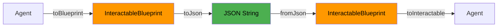
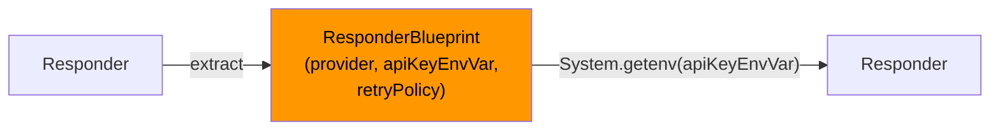
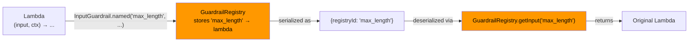

# Blueprints — Serializable Agent Snapshots

Blueprints let you **serialize any agent** (or agent constellation) to JSON and reconstruct it later — with zero external dependencies. API keys are automatically resolved from environment variables.

---

## Why Blueprints?

| Problem | Without Blueprints | With Blueprints |
|---------|-------------------|-----------------|
| **Share agent configs** | Copy-paste builder code | Share a JSON file |
| **Store in database** | Can't serialize `Responder` | Full JSON roundtrip |
| **Version control** | Diff Java code | Diff JSON files |
| **Cross-service deploy** | Rebuild in each service | Deserialize and run |
| **Dynamic config** | Recompile on change | Load JSON at runtime |



---

## Quick Start

### Serialize an Agent

```java
Responder responder = Responder.builder()
    .openRouter()
    .apiKey(System.getenv("OPENROUTER_API_KEY"))
    .build();

Agent agent = Agent.builder()
    .name("Assistant")
    .model("openai/gpt-4o")
    .instructions("You are a helpful assistant.")
    .responder(responder)
    .maxTurns(10)
    .build();

// One-liner: Agent → JSON
String json = agent.toBlueprint().toJson();
```

### Deserialize and Run

```java
ObjectMapper mapper = new ObjectMapper();
InteractableBlueprint blueprint = mapper.readValue(json, InteractableBlueprint.class);

// Reconstruct a fully functional agent (API key auto-resolved from env)
Interactable agent = blueprint.toInteractable();
AgentResult result = agent.interact("Hello!");
```

!!! tip "Zero Dependencies"
    `toInteractable()` takes **zero parameters**. The `Responder` is automatically rebuilt using the provider enum and `System.getenv()`. No need to pass API keys, HTTP clients, or ObjectMappers.

---

## The `toBlueprint()` Method

Every `Interactable` implementation has a `toBlueprint()` method:

```java
// Works on any Interactable
InteractableBlueprint blueprint = myAgent.toBlueprint();
InteractableBlueprint blueprint = myRouter.toBlueprint();
InteractableBlueprint blueprint = mySupervisor.toBlueprint();
InteractableBlueprint blueprint = myNetwork.toBlueprint();
InteractableBlueprint blueprint = myParallel.toBlueprint();
InteractableBlueprint blueprint = myHierarchy.toBlueprint();
```

### Supported Types

| Interactable | Blueprint Record | JSON `type` |
|-------------|-----------------|-------------|
| `Agent` | `AgentBlueprint` | `"agent"` |
| `AgentNetwork` | `AgentNetworkBlueprint` | `"network"` |
| `SupervisorAgent` | `SupervisorAgentBlueprint` | `"supervisor"` |
| `ParallelAgents` | `ParallelAgentsBlueprint` | `"parallel"` |
| `RouterAgent` | `RouterAgentBlueprint` | `"router"` |
| `HierarchicalAgents` | `HierarchicalAgentsBlueprint` | `"hierarchical"` |

---

## JSON Serialization

### Using `toJson()` (Convenience)

```java
// Default ObjectMapper — simplest option
String json = agent.toBlueprint().toJson();

// Custom ObjectMapper — for pretty-printing, custom modules, etc.
ObjectMapper mapper = new ObjectMapper().enable(SerializationFeature.INDENT_OUTPUT);
String prettyJson = agent.toBlueprint().toJson(mapper);
```

!!! note "Exception Handling"
    `toJson()` wraps `JsonProcessingException` into `UncheckedIOException`, so you don't need try-catch for routine serialization.

### Using Jackson Directly

```java
ObjectMapper mapper = new ObjectMapper();

// Serialize
String json = mapper.writeValueAsString(agent.toBlueprint());

// Deserialize (polymorphic — Jackson resolves the correct type)
InteractableBlueprint blueprint = mapper.readValue(json, InteractableBlueprint.class);
```

### Example JSON Output

A simple agent serializes to:

```json
{
  "type": "agent",
  "name": "Assistant",
  "model": "openai/gpt-4o",
  "instructions": "You are a helpful assistant.",
  "maxTurns": 10,
  "temperature": 0.7,
  "responder": {
    "provider": "OPEN_ROUTER",
    "apiKeyEnvVar": "OPENROUTER_API_KEY",
    "retryPolicy": {
      "maxRetries": 3,
      "initialDelayMs": 1000,
      "maxDelayMs": 30000,
      "multiplier": 2.0,
      "retryableStatusCodes": [429, 500, 502, 503]
    }
  },
  "toolClassNames": [],
  "handoffs": [],
  "inputGuardrails": [],
  "outputGuardrails": []
}
```

---

## How Dependencies are Handled

The key design principle: **everything serializable stays as-is; everything runtime gets reconstructed**.

### Responder

`Responder` contains an HTTP client (`OkHttpClient`) which can't be serialized. Instead, the blueprint captures the **configuration** needed to rebuild it:



```java
// What gets serialized:
// - provider: "OPEN_ROUTER" or "OPENAI"  
// - apiKeyEnvVar: "OPENROUTER_API_KEY"
// - retryPolicy: {maxRetries, delays, etc.}
// - traceMetadata: {traceId, spanId, etc.}

// What gets auto-resolved:
// - API key: from System.getenv("OPENROUTER_API_KEY")
// - HTTP client: new OkHttpClient() with retry policy
```

!!! warning "Environment Variables Required"
    Make sure the appropriate environment variable is set in the target environment:

    - **OpenRouter**: `OPENROUTER_API_KEY`
    - **OpenAI**: `OPENAI_API_KEY`

### Function Tools

Tools are serialized by their **fully qualified class name** (FQCN) and reconstructed via reflection:

```java
// Serialized as: "com.myapp.tools.GetWeatherTool"
// Reconstructed via: Class.forName("com.myapp.tools.GetWeatherTool").newInstance()
```

!!! important "No-Arg Constructor Required"
    Tools must have a **no-argument constructor** to be serializable via blueprints. Tools without one (e.g., tools injected with dependencies) are silently skipped during blueprint creation.

### Guardrails (Lambdas)

Lambda guardrails can't be serialized by class name. Use the **named guardrail** pattern:

```java
// ❌ Anonymous lambda — NOT serializable
agent.addInputGuardrail((input, ctx) -> 
    input.length() > 10000 
        ? GuardrailResult.failed("Too long") 
        : GuardrailResult.passed());

// ✅ Named guardrail — fully serializable
agent.addInputGuardrail(InputGuardrail.named("max_length", (input, ctx) ->
    input.length() > 10000 
        ? GuardrailResult.failed("Too long") 
        : GuardrailResult.passed()));
```

Named guardrails are registered in a global `GuardrailRegistry` and serialized by ID:



!!! warning "Registry Must Be Populated"
    When deserializing a blueprint with named guardrails, the same `InputGuardrail.named(...)` / `OutputGuardrail.named(...)` calls must have been executed **before** calling `toInteractable()`. This is typically done at application startup.

### Guardrails (Named Classes)

If your guardrail is a proper class with a no-arg constructor, it's serialized by FQCN automatically:

```java
public class ProfanityFilter implements InputGuardrail {
    @Override
    public GuardrailResult validate(String input, AgenticContext ctx) {
        // ...
    }
}

// Serialized as: {"className": "com.myapp.guards.ProfanityFilter"}
// Reconstructed via reflection
```

### Handoffs

Handoffs are serialized recursively — the target agent becomes a nested blueprint:

```json
{
  "handoffs": [
    {
      "name": "escalate_to_billing",
      "description": "Transfer billing questions",
      "target": {
        "type": "agent",
        "name": "BillingAgent",
        "model": "openai/gpt-4o",
        "..."
      }
    }
  ]
}
```

### Context Management

Both `SlidingWindowStrategy` and `SummarizationStrategy` are captured:

```json
{
  "contextManagement": {
    "strategyType": "sliding",
    "preserveDeveloperMessages": true,
    "maxTokens": 4000
  }
}
```

```json
{
  "contextManagement": {
    "strategyType": "summarization",
    "summarizationModel": "openai/gpt-4o-mini",
    "keepRecentMessages": 5,
    "maxTokens": 8000
  }
}
```

---

## Multi-Agent Blueprints

Blueprints support the complete agent hierarchy recursively. Each compound agent stores its children as nested blueprints.

### RouterAgent

```java
Agent sales = Agent.builder()
    .name("Sales").model("openai/gpt-4o")
    .instructions("Handle sales inquiries")
    .responder(responder).build();

Agent support = Agent.builder()
    .name("Support").model("openai/gpt-4o")
    .instructions("Handle support tickets")
    .responder(responder).build();

RouterAgent router = RouterAgent.builder()
    .name("MainRouter")
    .model("openai/gpt-4o-mini")
    .responder(responder)
    .addRoute(sales, "Sales inquiries and pricing")
    .addRoute(support, "Technical issues and bugs")
    .fallback(support)
    .build();

// Serialize the ENTIRE constellation
String json = router.toBlueprint().toJson();
```

The resulting JSON contains the router AND both target agents:

```json
{
  "type": "router",
  "name": "MainRouter",
  "model": "openai/gpt-4o-mini",
  "routes": [
    {
      "description": "Sales inquiries and pricing",
      "target": {
        "type": "agent",
        "name": "Sales",
        "..."
      }
    },
    {
      "description": "Technical issues and bugs",
      "target": {
        "type": "agent",
        "name": "Support",
        "..."
      }
    }
  ],
  "fallback": {
    "type": "agent",
    "name": "Support",
    "..."
  }
}
```

### SupervisorAgent

```java
SupervisorAgent supervisor = SupervisorAgent.builder()
    .name("ProjectManager")
    .model("openai/gpt-4o")
    .instructions("Manage the development team")
    .responder(responder)
    .addWorker(codeAgent, "Writes code")
    .addWorker(reviewAgent, "Reviews code")
    .build();

String json = supervisor.toBlueprint().toJson();
```

### AgentNetwork

```java
AgentNetwork network = AgentNetwork.builder()
    .name("DebatePanel")
    .addPeer(optimist)
    .addPeer(pessimist)
    .synthesizer(moderator)
    .maxRounds(3)
    .build();

String json = network.toBlueprint().toJson();
```

### Deeply Nested Constellations

Blueprints handle arbitrary nesting — a Router that routes to a Supervisor that manages Agents:

```java
// Build a complex constellation
Agent codeAgent = Agent.builder().name("Coder")...build();
Agent reviewAgent = Agent.builder().name("Reviewer")...build();

SupervisorAgent devTeam = SupervisorAgent.builder()
    .name("DevTeam")
    .addWorker(codeAgent, "Writes code")
    .addWorker(reviewAgent, "Reviews code")
    ...build();

Agent salesAgent = Agent.builder().name("Sales")...build();

RouterAgent mainRouter = RouterAgent.builder()
    .name("MainRouter")
    .addRoute(devTeam, "Development tasks")      // Supervisor as route target!
    .addRoute(salesAgent, "Sales inquiries")
    .build();

// Entire tree serialized to one JSON
String json = mainRouter.toBlueprint().toJson();

// Entire tree reconstructed from JSON
Interactable restored = new ObjectMapper()
    .readValue(json, InteractableBlueprint.class)
    .toInteractable();
```

---

## Practical Recipes

### 1. Store Agents in a Database

```java
// Save
Agent agent = buildMyAgent();
String json = agent.toBlueprint().toJson();
database.save("agent:support-v2", json);

// Load
String json = database.load("agent:support-v2");
Interactable agent = new ObjectMapper()
    .readValue(json, InteractableBlueprint.class)
    .toInteractable();
AgentResult result = agent.interact("Help me with my order");
```

### 2. Agent Config Files

Store agent configurations as JSON files in your resources:

```java
// Save to file
Path configPath = Path.of("agents/support-agent.json");
Files.writeString(configPath, agent.toBlueprint().toJson(prettyMapper));

// Load from file
String json = Files.readString(Path.of("agents/support-agent.json"));
Interactable agent = mapper.readValue(json, InteractableBlueprint.class)
    .toInteractable();
```

### 3. Dynamic Agent Switching

```java
// Load different agents based on runtime config
String agentType = config.get("active-agent"); // "support-v2"
String json = agentConfigStore.load(agentType);

Interactable agent = mapper.readValue(json, InteractableBlueprint.class)
    .toInteractable();

// Switch agents without redeploying
```

### 4. Agent Versioning and Diffing

```json
// v1: agents/support-agent.json
{
  "type": "agent",
  "name": "Support",
  "model": "openai/gpt-4o-mini",
  "instructions": "You are a support agent.",
  "maxTurns": 5
}

// v2: agents/support-agent.json (easy to diff!)
{
  "type": "agent",
  "name": "Support",
  "model": "openai/gpt-4o",          // ← upgraded model
  "instructions": "You are a senior support agent. Be thorough.",
  "maxTurns": 10                      // ← more turns
}
```

### 5. Cross-Service Agent Sharing

```java
// Service A: Create and serialize agent
String json = buildComplexRouter().toBlueprint().toJson();
redis.publish("agent-config", json);

// Service B: Receive and run agent
String json = redis.subscribe("agent-config");
Interactable agent = mapper.readValue(json, InteractableBlueprint.class)
    .toInteractable();  // API key resolved from Service B's env vars
agent.interact(userInput);
```

### 6. Named Guardrails at Startup

Register named guardrails once at application startup so they're available during deserialization:

```java
@Configuration
public class GuardrailConfig {
    
    @PostConstruct
    public void registerGuardrails() {
        InputGuardrail.named("profanity_filter", (input, ctx) -> {
            if (containsProfanity(input)) {
                return GuardrailResult.failed("Inappropriate language detected");
            }
            return GuardrailResult.passed();
        });

        InputGuardrail.named("max_length", (input, ctx) -> {
            if (input.length() > 10_000) {
                return GuardrailResult.failed("Input exceeds 10,000 characters");
            }
            return GuardrailResult.passed();
        });

        OutputGuardrail.named("no_pii", (output, ctx) -> {
            if (containsPII(output)) {
                return GuardrailResult.failed("Response contains PII");
            }
            return GuardrailResult.passed();
        });
    }
}
```

---

## API Reference

### `InteractableBlueprint` (sealed interface)

| Method | Description |
|--------|-------------|
| `name()` | Name of the interactable |
| `toInteractable()` | Reconstruct a fully functional `Interactable` |
| `toJson()` | Serialize to JSON using a default `ObjectMapper` |
| `toJson(ObjectMapper)` | Serialize to JSON using a custom `ObjectMapper` |

### `Interactable.toBlueprint()`

| Method | Description |
|--------|-------------|
| `agent.toBlueprint()` | Returns an `AgentBlueprint` |
| `router.toBlueprint()` | Returns a `RouterAgentBlueprint` |
| `supervisor.toBlueprint()` | Returns a `SupervisorAgentBlueprint` |
| `network.toBlueprint()` | Returns an `AgentNetworkBlueprint` |
| `parallel.toBlueprint()` | Returns a `ParallelAgentsBlueprint` |
| `hierarchy.toBlueprint()` | Returns a `HierarchicalAgentsBlueprint` |

### Helper Records

| Record | Purpose |
|--------|---------|
| `ResponderBlueprint` | Responder config (provider, retry, trace) |
| `RetryPolicyBlueprint` | Retry policy with millis for Duration |
| `GuardrailReference` | Reference by class name or registry ID |
| `HandoffDescriptor` | Handoff name, description, and target blueprint |
| `WorkerBlueprint` | Worker agent + description (for Supervisor) |
| `RouteBlueprint` | Route target + description (for Router) |
| `DepartmentBlueprint` | Manager + workers (for Hierarchical) |
| `ContextBlueprint` | Context management strategy config |

### `GuardrailRegistry`

| Method | Description |
|--------|-------------|
| `registerInput(id, guard)` | Register a named input guardrail |
| `registerOutput(id, guard)` | Register a named output guardrail |
| `getInput(id)` | Retrieve by ID (or `null`) |
| `getOutput(id)` | Retrieve by ID (or `null`) |
| `clear()` | Clear all registrations |

---

## Limitations

| Limitation | Workaround |
|-----------|------------|
| Tools need a no-arg constructor | Tools with constructor dependencies are skipped |
| Lambda guardrails need `named()` | Use `InputGuardrail.named("id", lambda)` |
| `GuardrailRegistry` must be pre-populated | Register at app startup before deserialization |
| Custom base URL requires explicit env var | Set `apiKeyEnvVar` in the blueprint JSON |
| `TraceMetadata` requires `FAIL_ON_UNKNOWN_PROPERTIES=false` | Configure your ObjectMapper accordingly |
