# Blueprints — Serializable Agent Snapshots

> This docs was updated at: 2026-02-23

Blueprints let you **serialize any agent** (or agent constellation) to JSON and reconstruct it later — with zero external dependencies. API keys are automatically resolved from environment variables.

---

## Why Blueprints?

| Problem | Without Blueprints | With Blueprints |
|---------|-------------------|-----------------|
| **Share agent configs** | Copy-paste builder code | Share a JSON file |
| **Store in database** | Can't serialize `Responder` | Full JSON roundtrip |
| **Version control** | Diff Java code | Diff JSON files |
| **Cross-service deploy** | Rebuild in each service | Deserialize and run |
| **Dynamic config** | Recompile on change | Load JSON at runtime |


---

## Quick Start

### Serialize an Agent

```java
Responder responder = Responder.builder()
    .openRouter()
    .apiKey(System.getenv("OPENROUTER_API_KEY"))
    .build();

Agent agent = Agent.builder()
    .name("Assistant")
    .model("openai/gpt-4o")
    .instructions("You are a helpful assistant.")
    .responder(responder)
    .maxTurns(10)
    .build();

// One-liner: Agent → JSON
String json = agent.toBlueprint().toJson();
```

### Deserialize and Run

```java
ObjectMapper mapper = new ObjectMapper();
InteractableBlueprint blueprint = mapper.readValue(json, InteractableBlueprint.class);

// Reconstruct a fully functional agent (API key auto-resolved from env)
Interactable agent = blueprint.toInteractable();
AgentResult result = agent.interact("Hello!");
```

!!! tip "Zero Dependencies"
    `toInteractable()` takes **zero parameters**. The `Responder` is automatically rebuilt using the provider enum and `System.getenv()`. No need to pass API keys, HTTP clients, or ObjectMappers.

---

## The `toBlueprint()` Method

Every `Interactable` implementation has a `toBlueprint()` method:

```java
// Works on any Interactable
InteractableBlueprint blueprint = myAgent.toBlueprint();
InteractableBlueprint blueprint = myRouter.toBlueprint();
InteractableBlueprint blueprint = mySupervisor.toBlueprint();
InteractableBlueprint blueprint = myNetwork.toBlueprint();
InteractableBlueprint blueprint = myParallel.toBlueprint();
InteractableBlueprint blueprint = myHierarchy.toBlueprint();
```

### Supported Types

| Interactable | Blueprint Record | JSON `type` |
|-------------|-----------------|-------------|
| `Agent` | `AgentBlueprint` | `"agent"` |
| `AgentNetwork` | `AgentNetworkBlueprint` | `"network"` |
| `SupervisorAgent` | `SupervisorAgentBlueprint` | `"supervisor"` |
| `ParallelAgents` | `ParallelAgentsBlueprint` | `"parallel"` |
| `RouterAgent` | `RouterAgentBlueprint` | `"router"` |
| `HierarchicalAgents` | `HierarchicalAgentsBlueprint` | `"hierarchical"` |

---

## JSON Serialization

### Using `toJson()` (Convenience)

```java
// Default ObjectMapper — simplest option
String json = agent.toBlueprint().toJson();

// Custom ObjectMapper — for pretty-printing, custom modules, etc.
ObjectMapper mapper = new ObjectMapper().enable(SerializationFeature.INDENT_OUTPUT);
String prettyJson = agent.toBlueprint().toJson(mapper);
```

!!! note "Exception Handling"
    `toJson()` wraps `JsonProcessingException` into `UncheckedIOException`, so you don't need try-catch for routine serialization.

### Using Jackson Directly

```java
ObjectMapper mapper = new ObjectMapper();

// Serialize
String json = mapper.writeValueAsString(agent.toBlueprint());

// Deserialize (polymorphic — Jackson resolves the correct type)
InteractableBlueprint blueprint = mapper.readValue(json, InteractableBlueprint.class);
```

### Example JSON Output

A simple agent serializes to:

```json
{
  "type": "agent",
  "name": "Assistant",
  "model": "openai/gpt-4o",
  "instructions": "You are a helpful assistant.",
  "maxTurns": 10,
  "temperature": 0.7,
  "responder": {
    "provider": "OPEN_ROUTER",
    "apiKeyEnvVar": "OPENROUTER_API_KEY",
    "retryPolicy": {
      "maxRetries": 3,
      "initialDelayMs": 1000,
      "maxDelayMs": 30000,
      "multiplier": 2.0,
      "retryableStatusCodes": [429, 500, 502, 503]
    }
  },
  "toolClassNames": [],
  "handoffs": [],
  "inputGuardrails": [],
  "outputGuardrails": []
}
```

---

## How Dependencies are Handled

The key design principle: **everything serializable stays as-is; everything runtime gets reconstructed**.

### Responder

`Responder` contains an HTTP client (`OkHttpClient`) which can't be serialized. Instead, the blueprint captures the **configuration** needed to rebuild it:


```java
// What gets serialized:
// - provider: "OPEN_ROUTER" or "OPENAI"  
// - apiKeyEnvVar: "OPENROUTER_API_KEY"
// - retryPolicy: {maxRetries, delays, etc.}
// - traceMetadata: {traceId, spanId, etc.}

// What gets auto-resolved:
// - API key: from System.getenv("OPENROUTER_API_KEY")
// - HTTP client: new OkHttpClient() with retry policy
```

!!! warning "Environment Variables Required"
    Make sure the appropriate environment variable is set in the target environment:

    - **OpenRouter**: `OPENROUTER_API_KEY`
    - **OpenAI**: `OPENAI_API_KEY`

### Function Tools

Tools are serialized by their **fully qualified class name** (FQCN) and reconstructed via reflection:

```java
// Serialized as: "com.myapp.tools.GetWeatherTool"
// Reconstructed via: Class.forName("com.myapp.tools.GetWeatherTool").newInstance()
```

!!! important "No-Arg Constructor Required"
    Tools must have a **no-argument constructor** to be serializable via blueprints. Tools without one (e.g., tools injected with dependencies) are silently skipped during blueprint creation.

### Guardrails (Lambdas)

Lambda guardrails can't be serialized by class name. Use the **named guardrail** pattern:

```java
// ❌ Anonymous lambda — NOT serializable
agent.addInputGuardrail((input, ctx) -> 
    input.length() > 10000 
        ? GuardrailResult.failed("Too long") 
        : GuardrailResult.passed());

// ✅ Named guardrail — fully serializable
agent.addInputGuardrail(InputGuardrail.named("max_length", (input, ctx) ->
    input.length() > 10000 
        ? GuardrailResult.failed("Too long") 
        : GuardrailResult.passed()));
```

Named guardrails are registered in a global `GuardrailRegistry` and serialized by ID:

```mermaid
flowchart LR
    L["Lambda<br/>(input, ctx) → ..."] -->|"InputGuardrail.named('max_length', ...)"| R["GuardrailRegistry<br/>stores 'max_length' → lambda"]
    R -->|"serialized as"| J["{registryId: 'max_length'}"]
    J -->|"deserialized via"| R2["GuardrailRegistry.getInput('max_length')"]
    R2 -->|returns| L2["Original Lambda"]
    
    style R fill:#ff9800,color:#000
    style R2 fill:#ff9800,color:#000
```



!!! warning "Registry Must Be Populated"
    When deserializing a blueprint with named guardrails, the same `InputGuardrail.named(...)` / `OutputGuardrail.named(...)` calls must have been executed **before** calling `toInteractable()`. This is typically done at application startup.

### Guardrails (Named Classes)

If your guardrail is a proper class with a no-arg constructor, it's serialized by FQCN automatically:

```java
public class ProfanityFilter implements InputGuardrail {
    @Override
    public GuardrailResult validate(String input, AgenticContext ctx) {
        // ...
    }
}

// Serialized as: {"className": "com.myapp.guards.ProfanityFilter"}
// Reconstructed via reflection
```

### Handoffs

Handoffs are serialized recursively — the target agent becomes a nested blueprint:

```json
{
  "handoffs": [
    {
      "name": "escalate_to_billing",
      "description": "Transfer billing questions",
      "target": {
        "type": "agent",
        "name": "BillingAgent",
        "model": "openai/gpt-4o",
        "..."
      }
    }
  ]
}
```

### Context Management

Both `SlidingWindowStrategy` and `SummarizationStrategy` are captured:

```json
{
  "contextManagement": {
    "strategyType": "sliding",
    "preserveDeveloperMessages": true,
    "maxTokens": 4000
  }
}
```

```json
{
  "contextManagement": {
    "strategyType": "summarization",
    "summarizationModel": "openai/gpt-4o-mini",
    "keepRecentMessages": 5,
    "maxTokens": 8000
  }
}
```

---

## Multi-Agent Blueprints

Blueprints support the complete agent hierarchy recursively. Each compound agent stores its children as nested blueprints.

### RouterAgent

```java
Agent sales = Agent.builder()
    .name("Sales").model("openai/gpt-4o")
    .instructions("Handle sales inquiries")
    .responder(responder).build();

Agent support = Agent.builder()
    .name("Support").model("openai/gpt-4o")
    .instructions("Handle support tickets")
    .responder(responder).build();

RouterAgent router = RouterAgent.builder()
    .name("MainRouter")
    .model("openai/gpt-4o-mini")
    .responder(responder)
    .addRoute(sales, "Sales inquiries and pricing")
    .addRoute(support, "Technical issues and bugs")
    .fallback(support)
    .build();

// Serialize the ENTIRE constellation
String json = router.toBlueprint().toJson();
```

The resulting JSON contains the router AND both target agents:

```json
{
  "type": "router",
  "name": "MainRouter",
  "model": "openai/gpt-4o-mini",
  "routes": [
    {
      "description": "Sales inquiries and pricing",
      "target": {
        "type": "agent",
        "name": "Sales",
        "..."
      }
    },
    {
      "description": "Technical issues and bugs",
      "target": {
        "type": "agent",
        "name": "Support",
        "..."
      }
    }
  ],
  "fallback": {
    "type": "agent",
    "name": "Support",
    "..."
  }
}
```

### SupervisorAgent

```java
SupervisorAgent supervisor = SupervisorAgent.builder()
    .name("ProjectManager")
    .model("openai/gpt-4o")
    .instructions("Manage the development team")
    .responder(responder)
    .addWorker(codeAgent, "Writes code")
    .addWorker(reviewAgent, "Reviews code")
    .build();

String json = supervisor.toBlueprint().toJson();
```

### AgentNetwork

```java
AgentNetwork network = AgentNetwork.builder()
    .name("DebatePanel")
    .addPeer(optimist)
    .addPeer(pessimist)
    .synthesizer(moderator)
    .maxRounds(3)
    .build();

String json = network.toBlueprint().toJson();
```

### Deeply Nested Constellations

Blueprints handle arbitrary nesting — a Router that routes to a Supervisor that manages Agents:

```java
// Build a complex constellation
Agent codeAgent = Agent.builder().name("Coder")...build();
Agent reviewAgent = Agent.builder().name("Reviewer")...build();

SupervisorAgent devTeam = SupervisorAgent.builder()
    .name("DevTeam")
    .addWorker(codeAgent, "Writes code")
    .addWorker(reviewAgent, "Reviews code")
    ...build();

Agent salesAgent = Agent.builder().name("Sales")...build();

RouterAgent mainRouter = RouterAgent.builder()
    .name("MainRouter")
    .addRoute(devTeam, "Development tasks")      // Supervisor as route target!
    .addRoute(salesAgent, "Sales inquiries")
    .build();

// Entire tree serialized to one JSON
String json = mainRouter.toBlueprint().toJson();

// Entire tree reconstructed from JSON
Interactable restored = new ObjectMapper()
    .readValue(json, InteractableBlueprint.class)
    .toInteractable();
```

---

## 📝 JSON-First Agent Definitions

You don't need to write any Java code to define an agent. Write a JSON file by hand, deserialize it with Jackson, and call `toInteractable()` — you get a fully functional, live agent.


### The Core Idea

```java
// 1. Write JSON by hand (or generate it, load from DB, receive over network, etc.)
// 2. Deserialize → Blueprint → Agent. That's it.

String json = Files.readString(Path.of("agents/my-agent.json"));

Interactable agent = new ObjectMapper()
    .readValue(json, InteractableBlueprint.class)
    .toInteractable();

AgentResult result = agent.interact("Hello!");
```

!!! tip "No Java Builder Code Needed"
    The JSON **is** the agent definition. You never need to touch `Agent.builder()`. The blueprint format is a universal, language-agnostic agent configuration format that Jackson understands natively.

---

### JSON Schema Reference

Every JSON agent file must have a `"type"` field that tells Jackson which blueprint record to use. Below is the complete field reference for each type.

#### `"type": "agent"` — Single Agent

This is the most common blueprint. It maps to `Agent.builder()`.

| Field | Type | Required | Description |
|-------|------|----------|-------------|
| `type` | `"agent"` | ✅ | Type discriminator |
| `name` | string | ✅ | Agent name (used for logging, handoffs) |
| `model` | string | ✅ | LLM model identifier (e.g., `"openai/gpt-4o"`) |
| `instructions` | string | ✅ | System prompt — the agent's personality and behavior |
| `maxTurns` | integer | ✅ | Maximum LLM turns in the agentic loop |
| `responder` | object | ✅ | Responder configuration (see below) |
| `toolClassNames` | string[] | ✅ | FQCNs of `FunctionTool` classes (use `[]` if none) |
| `handoffs` | object[] | ✅ | Handoff descriptors (use `[]` if none) |
| `inputGuardrails` | object[] | ✅ | Input guardrail references (use `[]` if none) |
| `outputGuardrails` | object[] | ✅ | Output guardrail references (use `[]` if none) |
| `temperature` | number | ❌ | LLM temperature (0.0–2.0) |
| `outputType` | string | ❌ | FQCN of output class for structured output |
| `traceMetadata` | object | ❌ | Trace metadata for observability |
| `contextManagement` | object | ❌ | Context window management config |

**Full example — a complete, hand-written agent JSON:**

```json
{
  "type": "agent",
  "name": "CustomerSupport",
  "model": "openai/gpt-4o",
  "instructions": "You are a professional customer support agent for Acme Corp.\n\nGuidelines:\n- Be friendly, concise, and solution-oriented\n- Always verify the customer's identity before discussing account details\n- If you cannot resolve an issue, escalate to a human agent\n- Never share internal policies or pricing formulas\n- Respond in the same language the customer uses",
  "maxTurns": 15,
  "temperature": 0.3,
  "responder": {
    "provider": "OPEN_ROUTER",
    "apiKeyEnvVar": "OPENROUTER_API_KEY",
    "retryPolicy": {
      "maxRetries": 3,
      "initialDelayMs": 1000,
      "maxDelayMs": 30000,
      "multiplier": 2.0,
      "retryableStatusCodes": [429, 500, 502, 503]
    }
  },
  "toolClassNames": [
    "com.acme.tools.SearchKnowledgeBase",
    "com.acme.tools.LookupOrder",
    "com.acme.tools.CreateTicket"
  ],
  "handoffs": [
    {
      "name": "escalate_to_billing",
      "description": "Transfer to billing specialist for payment issues, refunds, and invoice disputes",
      "target": {
        "type": "agent",
        "name": "BillingSpecialist",
        "model": "openai/gpt-4o",
        "instructions": "You are a billing specialist. Handle refunds, invoice disputes, and payment issues.",
        "maxTurns": 10,
        "responder": {
          "provider": "OPEN_ROUTER",
          "apiKeyEnvVar": "OPENROUTER_API_KEY"
        },
        "toolClassNames": ["com.acme.tools.ProcessRefund"],
        "handoffs": [],
        "inputGuardrails": [],
        "outputGuardrails": []
      }
    }
  ],
  "inputGuardrails": [
    { "registryId": "profanity_filter" },
    { "registryId": "max_length" }
  ],
  "outputGuardrails": [
    { "registryId": "no_pii" }
  ],
  "contextManagement": {
    "strategyType": "sliding",
    "preserveDeveloperMessages": true,
    "maxTokens": 4000
  }
}
```

---

#### The `responder` Object

The responder object tells the blueprint how to construct the HTTP client.

| Field | Type | Required | Description |
|-------|------|----------|-------------|
| `provider` | string | ❌¹ | `"OPENAI"` or `"OPEN_ROUTER"` |
| `baseUrl` | string | ❌¹ | Custom API endpoint URL |
| `apiKeyEnvVar` | string | ❌ | Environment variable name for the API key |
| `retryPolicy` | object | ❌ | Retry policy configuration |
| `traceMetadata` | object | ❌ | Default trace metadata |

¹ You must provide either `provider` **or** `baseUrl`, not both.

**Minimal (uses provider defaults):**

```json
{
  "provider": "OPEN_ROUTER",
  "apiKeyEnvVar": "OPENROUTER_API_KEY"
}
```

**Full with retry policy:**

```json
{
  "provider": "OPENAI",
  "apiKeyEnvVar": "OPENAI_API_KEY",
  "retryPolicy": {
    "maxRetries": 5,
    "initialDelayMs": 500,
    "maxDelayMs": 60000,
    "multiplier": 1.5,
    "retryableStatusCodes": [429, 500, 502, 503, 504]
  }
}
```

**Custom API endpoint (e.g., Azure OpenAI, local model):**

```json
{
  "baseUrl": "https://my-azure-instance.openai.azure.com/openai",
  "apiKeyEnvVar": "AZURE_OPENAI_KEY"
}
```

!!! note "How API Keys Work"
    The JSON never contains the actual API key — only the **name** of the environment variable. When `toInteractable()` is called, the blueprint reads `System.getenv("OPENROUTER_API_KEY")` to get the real key. This means the same JSON file works across dev, staging, and production — each environment just sets its own env var.

---

#### The `contextManagement` Object

| Field | Type | Required | Description |
|-------|------|----------|-------------|
| `strategyType` | string | ✅ | `"sliding"` or `"summarization"` |
| `maxTokens` | integer | ✅ | Maximum context window size in tokens |
| `preserveDeveloperMessages` | boolean | ❌ | Keep system/developer messages (sliding only) |
| `summarizationModel` | string | ❌ | Model for summarization (summarization only) |
| `keepRecentMessages` | integer | ❌ | Recent messages to keep verbatim (summarization only) |
| `summarizationPrompt` | string | ❌ | Custom prompt for summarization |
| `tokenCounterClassName` | string | ❌ | FQCN of custom `TokenCounter` implementation |

**Sliding window:**

```json
{
  "strategyType": "sliding",
  "preserveDeveloperMessages": true,
  "maxTokens": 4000
}
```

**Summarization:**

```json
{
  "strategyType": "summarization",
  "summarizationModel": "openai/gpt-4o-mini",
  "keepRecentMessages": 5,
  "maxTokens": 8000
}
```

---

#### The `inputGuardrails` / `outputGuardrails` Arrays

Each guardrail reference has one of two forms:

**By registry ID** (for lambdas registered at startup):

```json
{ "registryId": "profanity_filter" }
```

**By class name** (for guardrails implemented as classes):

```json
{ "className": "com.acme.guards.ProfanityFilter" }
```

---

#### `"type": "router"` — RouterAgent

| Field | Type | Required | Description |
|-------|------|----------|-------------|
| `type` | `"router"` | ✅ | Type discriminator |
| `name` | string | ✅ | Router name |
| `model` | string | ✅ | Classification model (use a fast/cheap model) |
| `responder` | object | ✅ | Responder config |
| `routes` | object[] | ✅ | Array of `{ description, target }` |
| `fallback` | object | ❌ | Default agent if classification fails |
| `traceMetadata` | object | ❌ | Trace metadata |

**Complete router example:**

```json
{
  "type": "router",
  "name": "CustomerServiceRouter",
  "model": "openai/gpt-4o-mini",
  "responder": {
    "provider": "OPEN_ROUTER",
    "apiKeyEnvVar": "OPENROUTER_API_KEY"
  },
  "routes": [
    {
      "description": "Billing inquiries: invoices, payments, refunds, subscription changes",
      "target": {
        "type": "agent",
        "name": "BillingAgent",
        "model": "openai/gpt-4o",
        "instructions": "You are a billing specialist. Help customers with invoices, payments, and refund requests.",
        "maxTurns": 10,
        "responder": { "provider": "OPEN_ROUTER", "apiKeyEnvVar": "OPENROUTER_API_KEY" },
        "toolClassNames": ["com.acme.tools.LookupInvoice", "com.acme.tools.ProcessRefund"],
        "handoffs": [], "inputGuardrails": [], "outputGuardrails": []
      }
    },
    {
      "description": "Technical support: bugs, errors, crashes, installation problems",
      "target": {
        "type": "agent",
        "name": "TechSupportAgent",
        "model": "openai/gpt-4o",
        "instructions": "You are a technical support engineer. Diagnose issues and provide step-by-step solutions.",
        "maxTurns": 15,
        "temperature": 0.2,
        "responder": { "provider": "OPEN_ROUTER", "apiKeyEnvVar": "OPENROUTER_API_KEY" },
        "toolClassNames": ["com.acme.tools.SearchDocs", "com.acme.tools.CheckSystemStatus"],
        "handoffs": [], "inputGuardrails": [], "outputGuardrails": []
      }
    },
    {
      "description": "Sales: pricing, demos, enterprise plans, feature comparisons",
      "target": {
        "type": "agent",
        "name": "SalesAgent",
        "model": "openai/gpt-4o",
        "instructions": "You are a sales representative. Help potential customers understand our products and pricing.",
        "maxTurns": 10,
        "responder": { "provider": "OPEN_ROUTER", "apiKeyEnvVar": "OPENROUTER_API_KEY" },
        "toolClassNames": [],
        "handoffs": [], "inputGuardrails": [], "outputGuardrails": []
      }
    }
  ],
  "fallback": {
    "type": "agent",
    "name": "GeneralAssistant",
    "model": "openai/gpt-4o-mini",
    "instructions": "You are a general assistant. Help the customer with their question.",
    "maxTurns": 5,
    "responder": { "provider": "OPEN_ROUTER", "apiKeyEnvVar": "OPENROUTER_API_KEY" },
    "toolClassNames": [],
    "handoffs": [], "inputGuardrails": [], "outputGuardrails": []
  }
}
```

---

#### `"type": "supervisor"` — SupervisorAgent

| Field | Type | Required | Description |
|-------|------|----------|-------------|
| `type` | `"supervisor"` | ✅ | Type discriminator |
| `name` | string | ✅ | Supervisor name |
| `model` | string | ✅ | Supervisor's LLM model |
| `instructions` | string | ✅ | System prompt for the supervisor |
| `maxTurns` | integer | ✅ | Max turns for supervisor loop |
| `workers` | object[] | ✅ | Array of `{ worker, description }` |
| `responder` | object | ✅ | Responder config |
| `traceMetadata` | object | ❌ | Trace metadata |

```json
{
  "type": "supervisor",
  "name": "DevTeamLead",
  "model": "openai/gpt-4o",
  "instructions": "You lead a development team. Break down tasks and delegate to the right worker. Review their output before submitting.",
  "maxTurns": 10,
  "responder": {
    "provider": "OPEN_ROUTER",
    "apiKeyEnvVar": "OPENROUTER_API_KEY"
  },
  "workers": [
    {
      "description": "Writes production-quality code from specifications",
      "worker": {
        "type": "agent",
        "name": "CodeWriter",
        "model": "openai/gpt-4o",
        "instructions": "You are a senior developer. Write clean, well-documented code.",
        "maxTurns": 5,
        "temperature": 0.2,
        "responder": { "provider": "OPEN_ROUTER", "apiKeyEnvVar": "OPENROUTER_API_KEY" },
        "toolClassNames": [], "handoffs": [], "inputGuardrails": [], "outputGuardrails": []
      }
    },
    {
      "description": "Reviews code for bugs, security issues, and style",
      "worker": {
        "type": "agent",
        "name": "CodeReviewer",
        "model": "openai/gpt-4o",
        "instructions": "You are a code reviewer. Find bugs, security vulnerabilities, and suggest improvements.",
        "maxTurns": 5,
        "temperature": 0.1,
        "responder": { "provider": "OPEN_ROUTER", "apiKeyEnvVar": "OPENROUTER_API_KEY" },
        "toolClassNames": [], "handoffs": [], "inputGuardrails": [], "outputGuardrails": []
      }
    }
  ]
}
```

---

#### `"type": "network"` — AgentNetwork

| Field | Type | Required | Description |
|-------|------|----------|-------------|
| `type` | `"network"` | ✅ | Type discriminator |
| `name` | string | ✅ | Network name |
| `peers` | object[] | ✅ | Array of peer agent blueprints |
| `maxRounds` | integer | ✅ | Maximum discussion rounds |
| `synthesizer` | object | ❌ | Agent that summarizes the discussion |
| `traceMetadata` | object | ❌ | Trace metadata |

```json
{
  "type": "network",
  "name": "ProductReviewPanel",
  "maxRounds": 3,
  "peers": [
    {
      "type": "agent",
      "name": "UserAdvocate",
      "model": "openai/gpt-4o",
      "instructions": "You advocate for the end user. Prioritize usability, simplicity, and user experience above all else.",
      "maxTurns": 5,
      "responder": { "provider": "OPEN_ROUTER", "apiKeyEnvVar": "OPENROUTER_API_KEY" },
      "toolClassNames": [], "handoffs": [], "inputGuardrails": [], "outputGuardrails": []
    },
    {
      "type": "agent",
      "name": "EngineeringLead",
      "model": "openai/gpt-4o",
      "instructions": "You represent engineering. Consider feasibility, technical debt, scalability, and maintainability.",
      "maxTurns": 5,
      "responder": { "provider": "OPEN_ROUTER", "apiKeyEnvVar": "OPENROUTER_API_KEY" },
      "toolClassNames": [], "handoffs": [], "inputGuardrails": [], "outputGuardrails": []
    },
    {
      "type": "agent",
      "name": "BusinessAnalyst",
      "model": "openai/gpt-4o",
      "instructions": "You represent business interests. Consider ROI, market fit, competitive advantage, and revenue impact.",
      "maxTurns": 5,
      "responder": { "provider": "OPEN_ROUTER", "apiKeyEnvVar": "OPENROUTER_API_KEY" },
      "toolClassNames": [], "handoffs": [], "inputGuardrails": [], "outputGuardrails": []
    }
  ],
  "synthesizer": {
    "type": "agent",
    "name": "Moderator",
    "model": "openai/gpt-4o",
    "instructions": "You are a neutral moderator. Synthesize the discussion into a clear recommendation with pros and cons from each perspective.",
    "maxTurns": 3,
    "responder": { "provider": "OPEN_ROUTER", "apiKeyEnvVar": "OPENROUTER_API_KEY" },
    "toolClassNames": [], "handoffs": [], "inputGuardrails": [], "outputGuardrails": []
  }
}
```

---

#### `"type": "parallel"` — ParallelAgents

| Field | Type | Required | Description |
|-------|------|----------|-------------|
| `type` | `"parallel"` | ✅ | Type discriminator |
| `name` | string | ✅ | Name for this parallel group |
| `members` | object[] | ✅ | Agent blueprints to run concurrently |
| `traceMetadata` | object | ❌ | Trace metadata |

```json
{
  "type": "parallel",
  "name": "MultiPerspectiveAnalysis",
  "members": [
    {
      "type": "agent",
      "name": "TechnicalAnalyst",
      "model": "openai/gpt-4o",
      "instructions": "Analyze the input from a technical perspective.",
      "maxTurns": 5,
      "responder": { "provider": "OPEN_ROUTER", "apiKeyEnvVar": "OPENROUTER_API_KEY" },
      "toolClassNames": [], "handoffs": [], "inputGuardrails": [], "outputGuardrails": []
    },
    {
      "type": "agent",
      "name": "BusinessAnalyst",
      "model": "openai/gpt-4o",
      "instructions": "Analyze the input from a business perspective.",
      "maxTurns": 5,
      "responder": { "provider": "OPEN_ROUTER", "apiKeyEnvVar": "OPENROUTER_API_KEY" },
      "toolClassNames": [], "handoffs": [], "inputGuardrails": [], "outputGuardrails": []
    }
  ]
}
```

---

#### `"type": "hierarchical"` — HierarchicalAgents

| Field | Type | Required | Description |
|-------|------|----------|-------------|
| `type` | `"hierarchical"` | ✅ | Type discriminator |
| `executive` | object | ✅ | Top-level executive agent (must be `"type": "agent"`) |
| `departments` | map | ✅ | Map of department name → `{ manager, workers }` |
| `maxTurns` | integer | ✅ | Max turns for the hierarchy |
| `traceMetadata` | object | ❌ | Trace metadata |

```json
{
  "type": "hierarchical",
  "maxTurns": 15,
  "executive": {
    "type": "agent",
    "name": "CEO",
    "model": "openai/gpt-4o",
    "instructions": "You are the CEO. Delegate tasks to department managers and synthesize their results.",
    "maxTurns": 5,
    "responder": { "provider": "OPEN_ROUTER", "apiKeyEnvVar": "OPENROUTER_API_KEY" },
    "toolClassNames": [], "handoffs": [], "inputGuardrails": [], "outputGuardrails": []
  },
  "departments": {
    "Engineering": {
      "manager": {
        "type": "agent",
        "name": "VP_Engineering",
        "model": "openai/gpt-4o",
        "instructions": "You manage the engineering department. Coordinate with your team to deliver technical solutions.",
        "maxTurns": 5,
        "responder": { "provider": "OPEN_ROUTER", "apiKeyEnvVar": "OPENROUTER_API_KEY" },
        "toolClassNames": [], "handoffs": [], "inputGuardrails": [], "outputGuardrails": []
      },
      "workers": [
        {
          "type": "agent",
          "name": "BackendDev",
          "model": "openai/gpt-4o",
          "instructions": "You are a backend developer. Build APIs and server-side logic.",
          "maxTurns": 3,
          "responder": { "provider": "OPEN_ROUTER", "apiKeyEnvVar": "OPENROUTER_API_KEY" },
          "toolClassNames": [], "handoffs": [], "inputGuardrails": [], "outputGuardrails": []
        },
        {
          "type": "agent",
          "name": "FrontendDev",
          "model": "openai/gpt-4o",
          "instructions": "You are a frontend developer. Build user interfaces.",
          "maxTurns": 3,
          "responder": { "provider": "OPEN_ROUTER", "apiKeyEnvVar": "OPENROUTER_API_KEY" },
          "toolClassNames": [], "handoffs": [], "inputGuardrails": [], "outputGuardrails": []
        }
      ]
    },
    "Marketing": {
      "manager": {
        "type": "agent",
        "name": "VP_Marketing",
        "model": "openai/gpt-4o",
        "instructions": "You manage marketing. Create campaigns and analyze market trends.",
        "maxTurns": 5,
        "responder": { "provider": "OPEN_ROUTER", "apiKeyEnvVar": "OPENROUTER_API_KEY" },
        "toolClassNames": [], "handoffs": [], "inputGuardrails": [], "outputGuardrails": []
      },
      "workers": [
        {
          "type": "agent",
          "name": "ContentWriter",
          "model": "openai/gpt-4o",
          "instructions": "You write marketing content: blog posts, emails, and social media.",
          "maxTurns": 3,
          "responder": { "provider": "OPEN_ROUTER", "apiKeyEnvVar": "OPENROUTER_API_KEY" },
          "toolClassNames": [], "handoffs": [], "inputGuardrails": [], "outputGuardrails": []
        }
      ]
    }
  }
}
```

---

### Loading Agents from JSON

#### Basic: Load and Run

```java
ObjectMapper mapper = new ObjectMapper();

String json = Files.readString(Path.of("agents/support-agent.json"));
Interactable agent = mapper.readValue(json, InteractableBlueprint.class)
    .toInteractable();

AgentResult result = agent.interact("I can't access my account");
System.out.println(result.output());
```

#### Load from Classpath Resources

```java
// Load from src/main/resources/agents/support.json
try (InputStream is = getClass().getResourceAsStream("/agents/support.json")) {
    InteractableBlueprint blueprint = mapper.readValue(is, InteractableBlueprint.class);
    Interactable agent = blueprint.toInteractable();
}
```

#### Lazy Loading Registry

Only construct agents when first requested:

```java
public class AgentRegistry {
    private final ObjectMapper mapper = new ObjectMapper();
    private final Map<String, Interactable> cache = new ConcurrentHashMap<>();
    private final Path agentsDir;

    public AgentRegistry(Path agentsDir) {
        this.agentsDir = agentsDir;
    }

    /**
     * Returns the agent with the given name.
     * Loads from JSON on first access, then caches.
     */
    public Interactable get(String name) {
        return cache.computeIfAbsent(name, this::loadAgent);
    }

    private Interactable loadAgent(String name) {
        try {
            Path jsonFile = agentsDir.resolve(name + ".json");
            String json = Files.readString(jsonFile);
            return mapper.readValue(json, InteractableBlueprint.class)
                .toInteractable();
        } catch (Exception e) {
            throw new RuntimeException("Failed to load agent: " + name, e);
        }
    }

    /** Reload a specific agent (e.g., after config change). */
    public void reload(String name) {
        cache.remove(name);
    }

    /** List all available agent names. */
    public List<String> listAvailable() throws IOException {
        try (var files = Files.list(agentsDir)) {
            return files
                .filter(p -> p.toString().endsWith(".json"))
                .map(p -> p.getFileName().toString().replace(".json", ""))
                .toList();
        }
    }
}
```

```java
// Usage
AgentRegistry registry = new AgentRegistry(Path.of("agents"));

// List available agents
registry.listAvailable().forEach(System.out::println);
// → support-agent
// → router
// → dev-team

// Lazy load and use
Interactable support = registry.get("support-agent");
AgentResult result = support.interact("Help me with my order");

// Hot-reload after editing the JSON file
registry.reload("support-agent");
```

---

### Recommended Directory Structure

Organize your JSON agent files by purpose:

```
src/main/resources/
└── agents/
    ├── simple/
    │   ├── support.json          ← basic support agent
    │   ├── sales.json            ← basic sales agent
    │   └── general.json          ← general-purpose fallback
    ├── routers/
    │   ├── customer-service.json ← routes to support/sales/billing
    │   └── internal.json         ← routes internal requests
    ├── teams/
    │   ├── dev-team.json         ← supervisor + code/review workers
    │   └── content-team.json     ← supervisor + writer/editor workers
    └── networks/
        ├── debate-panel.json     ← multi-perspective discussion
        └── review-board.json     ← product review committee
```

---

### Spring Boot Integration

Load JSON agents as Spring beans:

```java
@Configuration
public class AgentConfig {

    @Bean
    public AgentRegistry agentRegistry() {
        return new AgentRegistry(Path.of("src/main/resources/agents/simple"));
    }

    @Bean("supportAgent")
    public Interactable supportAgent(AgentRegistry registry) {
        return registry.get("support");
    }

    @Bean("customerServiceRouter")
    public Interactable customerServiceRouter() throws Exception {
        ObjectMapper mapper = new ObjectMapper();
        String json = Files.readString(
            Path.of("src/main/resources/agents/routers/customer-service.json"));
        return mapper.readValue(json, InteractableBlueprint.class).toInteractable();
    }
}
```

```java
@RestController
@RequestMapping("/api/chat")
public class ChatController {

    private final Interactable router;

    public ChatController(@Qualifier("customerServiceRouter") Interactable router) {
        this.router = router;
    }

    @PostMapping
    public ResponseEntity<String> chat(@RequestBody ChatRequest request) {
        AgentResult result = router.interact(request.message());
        return ResponseEntity.ok(result.output());
    }
}
```

---

### Checklist: Before Running a JSON-Defined Agent

Before calling `toInteractable()` on a blueprint loaded from JSON, make sure:

- [x] **Environment variables** are set (`OPENROUTER_API_KEY`, `OPENAI_API_KEY`, etc.)
- [x] **Tool classes** referenced in `toolClassNames` are on the classpath and have no-arg constructors
- [x] **Named guardrails** referenced by `registryId` are registered via `InputGuardrail.named(...)` / `OutputGuardrail.named(...)` at startup
- [x] **Class guardrails** referenced by `className` are on the classpath with no-arg constructors
- [x] **Custom `TokenCounter`** classes (if any) are on the classpath

!!! tip "Minimal Agent JSON"
    The smallest valid agent JSON is just:

    ```json
    {
      "type": "agent",
      "name": "Mini",
      "model": "openai/gpt-4o-mini",
      "instructions": "You are a helpful assistant.",
      "maxTurns": 5,
      "responder": { "provider": "OPEN_ROUTER", "apiKeyEnvVar": "OPENROUTER_API_KEY" },
      "toolClassNames": [],
      "handoffs": [],
      "inputGuardrails": [],
      "outputGuardrails": []
    }
    ```

---

## 🤖 LLM Structured Output — Meta-Agent Pattern

The `AgentDefinition` record is designed specifically for **LLM structured output**. It lets you build a **meta-agent**: an agent that creates other agents.

`AgentDefinition` contains **only fields the LLM can reason about**:

- ✅ `name`, `instructions`, `maxTurns`, `temperature` — behavioral decisions
- ✅ `toolNames` — human-readable names like `"search_kb"` (not Java class FQCNs)
- ✅ `inputGuardrails` / `outputGuardrails` — registry IDs like `"profanity_filter"`
- ✅ `handoffs` — nested agent definitions with descriptions
- ✅ `contextManagement` — strategy type and token limits
- ❌ No `model` — the LLM doesn't know your available models
- ❌ No `Responder` — infrastructure is your responsibility
- ❌ No tool class names — the LLM can't invent Java FQCNs
- ❌ No guardrail class names — same reason


### Basic Example

```java
// 1. Register tools and guardrails your agents can use
List<FunctionTool<?>> availableTools = List.of(
    new SearchKnowledgeBaseTool(),   // getName() returns "search_kb"
    new CreateTicketTool(),          // getName() returns "create_ticket"
    new LookupOrderTool()            // getName() returns "lookup_order"
);
InputGuardrail.named("profanity_filter", input -> { /* check */ });
InputGuardrail.named("max_length", input -> { /* check */ });

// 2. Create a meta-agent that outputs AgentDefinition
Interactable.Structured<AgentDefinition> metaAgent = Agent.builder()
    .name("AgentFactory")
    .model("openai/gpt-4o")
    .instructions("""
        You create agent definitions. You decide:
        - instructions (detailed, specific, well-structured)
        - maxTurns (1 for simple Q&A, 5-10 with tools, 10+ for complex tasks)
        - temperature (low for factual, high for creative)

        Available tools you can assign:
        - "search_kb": Searches the company knowledge base by query
        - "create_ticket": Creates a support ticket with subject and body
        - "lookup_order": Looks up order details by order ID

        Available guardrails:
        - "profanity_filter": blocks profanity from user input
        - "max_length": limits input to 10000 characters
        """)
    .structured(AgentDefinition.class)
    .responder(responder)
    .build();

// 3. Ask the LLM to define an agent
AgentDefinition def = metaAgent.interactStructured(
    "Create a customer support agent that speaks Spanish"
).output();

// 4. Convert to a live agent — YOU provide responder, model, and tools
Interactable agent = def.toInteractable(responder, "openai/gpt-4o", availableTools);
agent.interact("¿Cómo puedo recuperar mi contraseña?");
```

!!! tip "Why `toInteractable(Responder, String model, List<FunctionTool<?>>)`?"
    The LLM decides **what** the agent does (behavior). **You** decide **how** it runs (infrastructure). The LLM picks tool names like `"search_kb"` from your documented list; you provide the actual tool instances for resolution.

### What the LLM Outputs

The LLM produces pure behavioral JSON — no infrastructure:

```json
{
  "name": "SpanishSupport",
  "instructions": "Eres un agente de soporte profesional...",
  "maxTurns": 10,
  "temperature": 0.3,
  "toolNames": ["search_kb"],
  "inputGuardrails": ["profanity_filter"]
}
```

### `AgentDefinition` Field Reference

| Field | Type | Required | LLM sees this description |
|-------|------|----------|--------------------------|
| `name` | string | ✅ | Unique name for identification in logs and handoffs |
| `instructions` | string | ✅ | System prompt — personality, behavior, constraints |
| `maxTurns` | integer | ✅ | Max turns in the agentic loop |
| `temperature` | number | ❌ | Response randomness (0.0–2.0) |
| `toolNames` | string[] | ❌ | Human-readable tool names (matched against provided tools) |
| `inputGuardrails` | string[] | ❌ | Guardrail registry IDs for input validation |
| `outputGuardrails` | string[] | ❌ | Guardrail registry IDs for output validation |
| `handoffs` | HandoffAgentDef[] | ❌ | Agents to delegate to (recursive) |
| `contextManagement` | ContextDef | ❌ | Context window strategy (`sliding` / `summarization`) |

### Handoffs in Definitions

The LLM can define nested agents for handoffs:

```java
AgentDefinition def = metaAgent.interactStructured(
    "Create a front desk agent that routes billing to a specialist"
).output();

// def.handoffs() contains nested AgentDefinitions — the LLM defined both!
Interactable frontDesk = def.toInteractable(responder, "openai/gpt-4o", availableTools);
```

### Bridging to Blueprints

Convert between `AgentDefinition` and `InteractableBlueprint`:

```java
// Definition → Blueprint (add model + responder for self-contained serialization)
ResponderBlueprint responderBp = ResponderBlueprint.from(responder);
AgentBlueprint blueprint = definition.toBlueprint(responderBp, "openai/gpt-4o", availableTools);

// Blueprint → Definition (strip infrastructure, keep behavior)
AgentDefinition def = AgentDefinition.fromBlueprint(blueprint, availableTools);
```

### Dynamic Agent Factory

```java
public class DynamicAgentFactory {
    private final Interactable.Structured<AgentDefinition> metaAgent;
    private final Responder responder;
    private final String model;
    private final List<FunctionTool<?>> tools;
    private final Map<String, Interactable> cache = new ConcurrentHashMap<>();

    public Interactable createAgent(String purpose) {
        return cache.computeIfAbsent(purpose, key -> {
            AgentDefinition def = metaAgent.interactStructured(
                "Create an agent for: " + key
            ).output();
            return def.toInteractable(responder, model, tools);
        });
    }
}

// Usage
DynamicAgentFactory factory = new DynamicAgentFactory(metaAgent, responder, "openai/gpt-4o", tools);
Interactable agent = factory.createAgent("answering questions about Brazilian tax law");
```

---

## Practical Recipes

### 1. Store Agents in a Database

```java
// Save
Agent agent = buildMyAgent();
String json = agent.toBlueprint().toJson();
database.save("agent:support-v2", json);

// Load
String json = database.load("agent:support-v2");
Interactable agent = new ObjectMapper()
    .readValue(json, InteractableBlueprint.class)
    .toInteractable();
AgentResult result = agent.interact("Help me with my order");
```

### 2. Dynamic Agent Switching

```java
// Load different agents based on runtime config
String agentType = config.get("active-agent"); // "support-v2"
String json = agentConfigStore.load(agentType);

Interactable agent = mapper.readValue(json, InteractableBlueprint.class)
    .toInteractable();

// Switch agents without redeploying
```

### 3. Agent Versioning and Diffing

```json
// v1: agents/support-agent.json
{
  "type": "agent",
  "name": "Support",
  "model": "openai/gpt-4o-mini",
  "instructions": "You are a support agent.",
  "maxTurns": 5
}

// v2: agents/support-agent.json (easy to diff!)
{
  "type": "agent",
  "name": "Support",
  "model": "openai/gpt-4o",          // ← upgraded model
  "instructions": "You are a senior support agent. Be thorough.",
  "maxTurns": 10                      // ← more turns
}
```

### 4. Cross-Service Agent Sharing

```java
// Service A: Create and serialize agent
String json = buildComplexRouter().toBlueprint().toJson();
redis.publish("agent-config", json);

// Service B: Receive and run agent
String json = redis.subscribe("agent-config");
Interactable agent = mapper.readValue(json, InteractableBlueprint.class)
    .toInteractable();  // API key resolved from Service B's env vars
agent.interact(userInput);
```

### 5. Named Guardrails at Startup

Register named guardrails once at application startup so they're available during deserialization:

```java
@Configuration
public class GuardrailConfig {
    
    @PostConstruct
    public void registerGuardrails() {
        InputGuardrail.named("profanity_filter", (input, ctx) -> {
            if (containsProfanity(input)) {
                return GuardrailResult.failed("Inappropriate language detected");
            }
            return GuardrailResult.passed();
        });

        InputGuardrail.named("max_length", (input, ctx) -> {
            if (input.length() > 10_000) {
                return GuardrailResult.failed("Input exceeds 10,000 characters");
            }
            return GuardrailResult.passed();
        });

        OutputGuardrail.named("no_pii", (output, ctx) -> {
            if (containsPII(output)) {
                return GuardrailResult.failed("Response contains PII");
            }
            return GuardrailResult.passed();
        });
    }
}
```

---

## API Reference

### `InteractableBlueprint` (sealed interface)

| Method | Description |
|--------|-------------|
| `name()` | Name of the interactable |
| `toInteractable()` | Reconstruct a fully functional `Interactable` |
| `toJson()` | Serialize to JSON using a default `ObjectMapper` |
| `toJson(ObjectMapper)` | Serialize to JSON using a custom `ObjectMapper` |

### `Interactable.toBlueprint()`

| Method | Description |
|--------|-------------|
| `agent.toBlueprint()` | Returns an `AgentBlueprint` |
| `router.toBlueprint()` | Returns a `RouterAgentBlueprint` |
| `supervisor.toBlueprint()` | Returns a `SupervisorAgentBlueprint` |
| `network.toBlueprint()` | Returns an `AgentNetworkBlueprint` |
| `parallel.toBlueprint()` | Returns a `ParallelAgentsBlueprint` |
| `hierarchy.toBlueprint()` | Returns a `HierarchicalAgentsBlueprint` |

### Helper Records

| Record | Purpose |
|--------|---------|
| `ResponderBlueprint` | Responder config (provider, retry, trace) |
| `RetryPolicyBlueprint` | Retry policy with millis for Duration |
| `GuardrailReference` | Reference by class name or registry ID |
| `HandoffDescriptor` | Handoff name, description, and target blueprint |
| `WorkerBlueprint` | Worker agent + description (for Supervisor) |
| `RouteBlueprint` | Route target + description (for Router) |
| `DepartmentBlueprint` | Manager + workers (for Hierarchical) |
| `ContextBlueprint` | Context management strategy config |

### `GuardrailRegistry`

| Method | Description |
|--------|-------------|
| `registerInput(id, guard)` | Register a named input guardrail |
| `registerOutput(id, guard)` | Register a named output guardrail |
| `getInput(id)` | Retrieve by ID (or `null`) |
| `getOutput(id)` | Retrieve by ID (or `null`) |
| `clear()` | Clear all registrations |

---

## Limitations

| Limitation | Workaround |
|-----------|------------|
| Tools need a no-arg constructor | Tools with constructor dependencies are skipped |
| Lambda guardrails need `named()` | Use `InputGuardrail.named("id", lambda)` |
| `GuardrailRegistry` must be pre-populated | Register at app startup before deserialization |
| Custom base URL requires explicit env var | Set `apiKeyEnvVar` in the blueprint JSON |
| `TraceMetadata` requires `FAIL_ON_UNKNOWN_PROPERTIES=false` | Configure your ObjectMapper accordingly |
