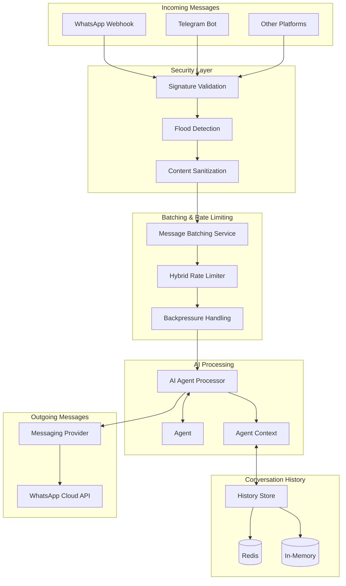

# Messaging Integration

> This docs was updated at: 2026-02-23

Agentle4j provides a comprehensive messaging module designed for building AI-powered messaging integrations with platforms like WhatsApp Business API. The module combines intelligent message batching, rate limiting, security features, and seamless AI agent integration.

---

## Overview

The messaging module (`com.paragon.messaging`) is a production-ready framework for processing messages from messaging platforms with AI agents. It's designed to handle high-volume messaging scenarios while maintaining context, preventing abuse, and ensuring reliable delivery.



### Key Features

| Feature | Description |
|---------|-------------|
| **Adaptive Batching** | Intelligently groups rapid messages with configurable silence thresholds |
| **Rate Limiting** | Hybrid token bucket + sliding window algorithm prevents API overload |
| **AI Integration** | Seamless integration with Agentle agents for intelligent responses |
| **Conversation History** | Redis or in-memory persistence for multi-turn conversations |
| **Security** | Webhook validation, flood detection, content sanitization |
| **Extensibility** | Hook system for custom pre/post processing logic |
| **Virtual Threads** | High-performance async processing with Java 21+ virtual threads |
| **Multi-Platform** | Provider abstraction supports WhatsApp, Telegram, and others |

---

## Quick Start

### WhatsApp + AI Agent Integration

```java
import com.paragon.agents.Agent;
import com.paragon.messaging.processor.AIAgentProcessor;
import com.paragon.messaging.whatsapp.WhatsAppMessagingProvider;
import com.paragon.messaging.store.history.RedisConversationHistoryStore;
import com.paragon.messaging.batching.*;
import com.paragon.responses.Responder;

// 1. Create AI agent
Responder responder = Responder.builder()
    .openRouter()
    .apiKey(System.getenv("OPENROUTER_API_KEY"))
    .build();

Agent agent = Agent.builder()
    .name("CustomerSupport")
    .model("openai/gpt-4o")
    .instructions("""
        You are a helpful customer support assistant.
        Be concise, friendly, and professional.
        """)
    .responder(responder)
    .build();

// 2. Create WhatsApp provider
WhatsAppMessagingProvider whatsapp = WhatsAppMessagingProvider.builder()
    .phoneNumberId(System.getenv("WHATSAPP_PHONE_NUMBER_ID"))
    .accessToken(System.getenv("WHATSAPP_ACCESS_TOKEN"))
    .build();

// 3. Create conversation history store
RedisConversationHistoryStore history = 
    RedisConversationHistoryStore.create(redisClient);

// 4. Create AI processor
AIAgentProcessor<?> processor = AIAgentProcessor.forAgent(agent)
    .messagingProvider(whatsapp)
    .historyStore(history)
    .maxHistoryMessages(20)
    .maxHistoryAge(Duration.ofHours(24))
    .build();

// 5. Create batching service
MessageBatchingService batchingService = MessageBatchingService.builder()
    .config(BatchingConfig.builder()
        .adaptiveTimeout(Duration.ofSeconds(3))
        .silenceThreshold(Duration.ofMillis(800))
        .maxBufferSize(10)
        .build())
    .processor(processor)
    .build();

// 6. Process incoming webhook
@PostMapping("/webhook")
public void handleWebhook(@RequestBody WebhookEvent event) {
    for (var entry : event.entry()) {
        for (var change : entry.changes()) {
            for (var message : change.value().messages()) {
                batchingService.receiveMessage(
                    message.from(), 
                    message
                );
            }
        }
    }
}
```

---

## Core Concepts

### MessagingProvider

The `MessagingProvider` interface abstracts messaging platform APIs (WhatsApp, Telegram, etc.). It provides a unified API for sending various message types.

```java
public interface MessagingProvider {
    ProviderType getProviderType();
    boolean isConfigured();
    
    // Send different message types
    MessageResponse sendText(Recipient recipient, TextMessage message);
    MessageResponse sendMedia(Recipient recipient, MediaMessage message);
    MessageResponse sendInteractive(Recipient recipient, InteractiveMessage message);
    MessageResponse sendTemplate(Recipient recipient, TemplateMessage message);
    MessageResponse sendLocation(Recipient recipient, LocationMessage message);
    MessageResponse sendContact(Recipient recipient, ContactMessage message);
    MessageResponse sendReaction(Recipient recipient, ReactionMessage message);
    
    // Batch sending with virtual threads
    List<MessageResponse> sendBatch(Recipient recipient, List<OutboundMessage> messages);
}
```

#### WhatsApp Implementation

```java
WhatsAppMessagingProvider provider = WhatsAppMessagingProvider.builder()
    .phoneNumberId("YOUR_PHONE_NUMBER_ID")
    .accessToken("YOUR_ACCESS_TOKEN")
    .apiVersion("v21.0")  // Optional: defaults to v21.0
    .build();

// Send text message
Recipient recipient = Recipient.of("5511999999999");
TextMessage text = TextMessage.builder()
    .body("Hello from Agentle!")
    .build();

MessageResponse response = provider.sendText(recipient, text);
System.out.println("Message ID: " + response.messageId());
```

#### Supported Message Types

| Type | Class | Use Case |
|------|-------|----------|
| **Text** | `TextMessage` | Simple text messages with optional preview |
| **Media** | `MediaMessage` | Images, videos, audio, documents |
| **Interactive** | `InteractiveMessage` | Buttons, lists, CTA buttons |
| **Template** | `TemplateMessage` | Pre-approved templates (24h+ window) |
| **Location** | `LocationMessage` | Share locations |
| **Contact** | `ContactMessage` | Share contact cards |
| **Reaction** | `ReactionMessage` | React to messages with emojis |

---

### Message Batching

The `MessageBatchingService` intelligently groups rapid messages from users before processing them with the AI agent. This prevents redundant API calls and provides better context.

#### Why Batching?

```
User types rapidly:
15:30:01 → "I need help"
15:30:02 → "with my order"
15:30:03 → "number 12345"

WITHOUT batching:
✗ 3 separate AI calls
✗ No context between messages
✗ Fragmented responses

WITH batching:
✓ 1 combined AI call: "I need help with my order number 12345"
✓ Full context preserved
✓ Coherent single response
```

#### Configuration

```java
BatchingConfig config = BatchingConfig.builder()
    // Maximum wait time before forcing processing
    .adaptiveTimeout(Duration.ofSeconds(3))
    
    // Silence threshold: process if no message for 800ms
    .silenceThreshold(Duration.ofMillis(800))
    
    // Maximum messages to buffer per user
    .maxBufferSize(10)
    
    // Backpressure strategy when buffer is full
    .backpressureStrategy(BackpressureStrategy.FLUSH_AND_ACCEPT)
    
    // Rate limiting config
    .rateLimitConfig(RateLimitConfig.builder()
        .maxMessagesPerMinute(20)
        .build())
    
    // Optional: message deduplication
    .messageStore(InMemoryMessageStore.create(1000))
    
    // Optional: error handling with retry
    .errorHandlingStrategy(ErrorHandlingStrategy.builder()
        .maxRetries(3)
        .initialDelay(Duration.ofSeconds(1))
        .build())
    
    .build();
```

#### Backpressure Strategies

When the message buffer is full:

| Strategy | Behavior | Use Case |
|----------|----------|----------|
| `DROP_NEW` | Discard new messages | Strict ordering required |
| `DROP_OLDEST` | Remove oldest, accept new | Recent messages more important |
| `FLUSH_AND_ACCEPT` | Process batch immediately | Minimize message loss |
| `REJECT_WITH_NOTIFICATION` | Notify user to slow down | User feedback desired |
| `BLOCK_UNTIL_SPACE` | Wait for space (risky) | Guaranteed delivery |

---

### Rate Limiting

The `HybridRateLimiter` combines two algorithms for robust rate limiting:

1. **Token Bucket** - smooth rate limiting with bursts
2. **Sliding Window** - prevents sustained high volume

```java
RateLimitConfig config = RateLimitConfig.builder()
    // Tokens per minute (token bucket)
    .maxMessagesPerMinute(20)
    
    // Sliding window: max per 10 seconds
    .slidingWindowSize(Duration.ofSeconds(10))
    .maxMessagesPerWindow(5)
    
    // Burst allowance
    .burstCapacity(5)
    
    .build();

HybridRateLimiter limiter = new HybridRateLimiter(config);

if (limiter.tryAcquire()) {
    // Process message
} else {
    // Rate limit exceeded
}
```

---

### AI Agent Processing

The `AIAgentProcessor` connects your AI agent to the messaging pipeline. It handles context building, history retrieval, and response sending.

#### Basic Agent Processor

```java
Agent agent = Agent.builder()
    .name("Assistant")
    .model("openai/gpt-4o")
    .instructions("You are a helpful assistant")
    .responder(responder)
    .build();

AIAgentProcessor<?> processor = AIAgentProcessor.forAgent(agent)
    .messagingProvider(whatsappProvider)
    .historyStore(historyStore)
    .maxHistoryMessages(20)
    .maxHistoryAge(Duration.ofHours(24))
    .build();
```

#### Structured Output Agent

For complex responses (buttons, lists, etc.):

```java
// Define structured response
public record WhatsAppResponse(
    String text,
    @Nullable List<Button> buttons
) {}

// Create structured agent
Interactable.Structured<WhatsAppResponse> structuredAgent = Agent.builder()
    .name("MenuBot")
    .model("openai/gpt-4o")
    .instructions("Help users navigate our menu")
    .structured(WhatsAppResponse.class)
    .responder(responder)
    .build();

// Create processor for structured responses
AIAgentProcessor<WhatsAppResponse> processor = 
    AIAgentProcessor.forStructuredAgent(structuredAgent)
        .messagingProvider(whatsappProvider)
        .historyStore(historyStore)
        .build();
```

#### Agent Integration Flow

```
┌─────────────────────────────────────────────────────────────┐
│               AI AGENT PROCESSING FLOW                       │
├─────────────────────────────────────────────────────────────┤
│  1. 📥 Receive batched messages                             │
│  2. 🔄 Convert to Agent context (MessageConverter)          │
│  3. 📚 Load conversation history from store                 │
│  4. 🤖 Call AI agent with full context                       │
│  5. 💬 Send response via MessagingProvider                  │
│  6. 💾 Save messages to history store                       │
└─────────────────────────────────────────────────────────────┘
```

---

## Conversation History

Maintain context across user interactions with persistent conversation history.

### In-Memory Store

```java
// Simple in-memory storage (development/testing)
ConversationHistoryStore store = InMemoryConversationHistoryStore.create(
    100  // max users
);

// Add messages
store.addMessage(userId, Message.user("Hello!"));
store.addMessage(userId, Message.assistant("Hi! How can I help?"));

// Retrieve history
List<ResponseInputItem> history = store.getHistory(
    userId,
    20,  // max messages
    Duration.ofHours(24)  // max age
);

// Check history
if (store.hasHistory(userId)) {
    int count = store.getMessageCount(userId);
    System.out.println("User has " + count + " messages");
}
```

### Redis Store (Production)

```java
// Redis-backed storage (production)
RedisClient redis = RedisClient.create("redis://localhost:6379");

ConversationHistoryStore store = RedisConversationHistoryStore.builder()
    .redisClient(redis)
    .keyPrefix("chat:history:")  // Optional: custom prefix
    .maxMessagesPerUser(50)      // Optional: limit per user
    .ttl(Duration.ofDays(7))     // Optional: auto-expire
    .build();

// Same API as in-memory store
store.addMessage(userId, Message.user("Hello!"));
List<ResponseInputItem> history = store.getHistory(userId, 20);

// Periodic cleanup
int removed = store.cleanupExpired(Duration.ofDays(7));
```

---

## Security Features

### Webhook Signature Validation

Verify that webhook requests are authentic:

```java
WebhookSignatureValidator validator = WebhookSignatureValidator.builder()
    .appSecret(System.getenv("WHATSAPP_APP_SECRET"))
    .build();

@PostMapping("/webhook")
public ResponseEntity<Void> handleWebhook(
        @RequestBody String payload,
        @RequestHeader("X-Hub-Signature-256") String signature) {
    
    // Validate signature
    if (!validator.validate(payload, signature)) {
        return ResponseEntity.status(401).build();
    }
    
    // Process webhook
    processWebhook(payload);
    return ResponseEntity.ok().build();
}
```

### Flood Detection

Prevent message flooding attacks:

```java
SecurityConfig securityConfig = SecurityConfig.builder()
    .floodPreventionWindow(Duration.ofMinutes(1))
    .maxMessagesPerWindow(10)
    .build();

FloodDetector floodDetector = FloodDetector.create(securityConfig);

// Before processing
if (floodDetector.isFlooding(userId)) {
    log.warn("Flood detected from user: {}", userId);
    // Send warning message or temporarily block
    return;
}

// Record message after processing
floodDetector.recordMessage(userId);

// Periodic cleanup
floodDetector.cleanup();
```

### Content Sanitization

Sanitize user input before processing:

```java
ContentSanitizer sanitizer = ContentSanitizer.create();

String userInput = "<script>alert('xss')</script> Hello!";
String sanitized = sanitizer.sanitize(userInput);
// Result: "Hello!"

// Configure allowed tags
ContentSanitizer customSanitizer = ContentSanitizer.builder()
    .allowedTags("b", "i", "u", "a")
    .allowedAttributes("a", "href")
    .maxLength(5000)
    .build();
```

---

## Extensibility with Hooks

Add custom logic before or after message processing:

```java
// Custom logging hook
ProcessingHook loggingHook = (context) -> {
    log.info("Processing {} messages for user {}", 
        context.messageCount(), 
        context.userId());
};

// Metrics hook
ProcessingHook metricsHook = (context) -> {
    metrics.recordMessageBatch(
        context.userId(),
        context.messageCount(),
        context.isRetry() ? context.retryCount() : 0
    );
};

// Build service with hooks
MessageBatchingService service = MessageBatchingService.builder()
    .config(config)
    .processor(processor)
    .addPreHook(loggingHook)     // Before processing
    .addPostHook(metricsHook)    // After processing
    .build();
```

### Hook Context

```java
public interface ProcessingHook {
    void execute(HookContext context) throws Exception;
}

// Available context methods:
context.userId()           // User identifier
context.messages()         // List of messages being processed
context.messageCount()     // Number of messages
context.isRetry()          // Is this a retry?
context.retryCount()       // How many retries so far
context.metadata()         // Custom metadata map
```

### Interrupting Processing

Hooks can interrupt processing:

```java
ProcessingHook moderationHook = (context) -> {
    for (var message : context.messages()) {
        if (containsBannedWords(message.text().body())) {
            throw new HookInterruptedException(
                "INAPPROPRIATE_CONTENT",
                "Message contains banned words"
            );
        }
    }
};
```

---

## Production Configuration

### Complete WhatsApp Bot Setup

```java
@Configuration
public class WhatsAppBotConfig {

    @Bean
    public Responder responder() {
        return Responder.builder()
            .openRouter()
            .apiKey(System.getenv("OPENROUTER_API_KEY"))
            .maxRetries(3)
            .build();
    }

    @Bean
    public Agent customerSupportAgent(Responder responder) {
        return Agent.builder()
            .name("CustomerSupport")
            .model("openai/gpt-4o")
            .instructions(Files.readString(Path.of("prompts/support.txt")))
            .responder(responder)
            .build();
    }

    @Bean
    public WhatsAppMessagingProvider whatsappProvider() {
        return WhatsAppMessagingProvider.builder()
            .phoneNumberId(System.getenv("WHATSAPP_PHONE_NUMBER_ID"))
            .accessToken(System.getenv("WHATSAPP_ACCESS_TOKEN"))
            .build();
    }

    @Bean
    public ConversationHistoryStore historyStore(RedisClient redis) {
        return RedisConversationHistoryStore.builder()
            .redisClient(redis)
            .maxMessagesPerUser(50)
            .ttl(Duration.ofDays(7))
            .build();
    }

    @Bean
    public AIAgentProcessor<?> aiProcessor(
            Agent agent,
            WhatsAppMessagingProvider provider,
            ConversationHistoryStore history) {
        
        return AIAgentProcessor.forAgent(agent)
            .messagingProvider(provider)
            .historyStore(history)
            .maxHistoryMessages(25)
            .maxHistoryAge(Duration.ofHours(24))
            .build();
    }

    @Bean
    public MessageBatchingService batchingService(
            AIAgentProcessor<?> processor) {
        
        return MessageBatchingService.builder()
            .config(BatchingConfig.builder()
                .adaptiveTimeout(Duration.ofSeconds(3))
                .silenceThreshold(Duration.ofMillis(800))
                .maxBufferSize(10)
                .backpressureStrategy(BackpressureStrategy.FLUSH_AND_ACCEPT)
                .rateLimitConfig(RateLimitConfig.builder()
                    .maxMessagesPerMinute(20)
                    .build())
                .errorHandlingStrategy(ErrorHandlingStrategy.builder()
                    .maxRetries(3)
                    .initialDelay(Duration.ofSeconds(1))
                    .build())
                .build())
            .processor(processor)
            .addPreHook(loggingHook())
            .addPostHook(metricsHook())
            .build();
    }

    @Bean
    public ProcessingHook loggingHook() {
        return (context) -> {
            log.info("Processing batch: user={}, count={}, retry={}",
                context.userId(),
                context.messageCount(),
                context.isRetry());
        };
    }

    @Bean
    public ProcessingHook metricsHook() {
        return (context) -> {
            // Send metrics to your monitoring system
        };
    }

    @Bean
    public FloodDetector floodDetector() {
        return FloodDetector.create(
            Duration.ofMinutes(1),
            10  // max 10 messages per minute
        );
    }

    @Bean
    public WebhookSignatureValidator webhookValidator() {
        return WebhookSignatureValidator.builder()
            .appSecret(System.getenv("WHATSAPP_APP_SECRET"))
            .build();
    }
}
```

### Webhook Controller

```java
@RestController
@RequestMapping("/whatsapp/webhook")
public class WhatsAppWebhookController {

    private final MessageBatchingService batchingService;
    private final WebhookSignatureValidator validator;
    private final FloodDetector floodDetector;

    @GetMapping
    public ResponseEntity<String> verifyWebhook(
            @RequestParam("hub.mode") String mode,
            @RequestParam("hub.challenge") String challenge,
            @RequestParam("hub.verify_token") String token) {
        
        if ("subscribe".equals(mode) && 
            System.getenv("WEBHOOK_VERIFY_TOKEN").equals(token)) {
            return ResponseEntity.ok(challenge);
        }
        return ResponseEntity.status(403).build();
    }

    @PostMapping
    public ResponseEntity<Void> handleWebhook(
            @RequestBody String payload,
            @RequestHeader("X-Hub-Signature-256") String signature) {
        
        // 1. Validate signature
        if (!validator.validate(payload, signature)) {
            log.warn("Invalid webhook signature");
            return ResponseEntity.status(401).build();
        }

        // 2. Parse webhook
        WebhookEvent event = parseWebhook(payload);

        // 3. Process messages
        for (var entry : event.entry()) {
            for (var change : entry.changes()) {
                for (var message : change.value().messages()) {
                    String userId = message.from();
                    
                    // 4. Check flood detection
                    if (floodDetector.isFlooding(userId)) {
                        log.warn("Flood detected: {}", userId);
                        continue;
                    }
                    
                    // 5. Send to batching service
                    batchingService.receiveMessage(userId, message);
                    
                    // 6. Record for flood detection
                    floodDetector.recordMessage(userId);
                }
            }
        }

        return ResponseEntity.ok().build();
    }
}
```

---

## Best Practices

### 1. Virtual Thread Sizing

```java
// MessageBatchingService uses virtual threads internally
// No need to configure thread pools - they scale automatically

// For webhook controllers, enable virtual threads in Spring Boot
@Bean
public TomcatProtocolHandlerCustomizer<?> protocolHandlerVirtualThreadExecutorCustomizer() {
    return protocolHandler -> {
        protocolHandler.setExecutor(Executors.newVirtualThreadPerTaskExecutor());
    };
}
```

### 2. Error Handling

```java
ErrorHandlingStrategy strategy = ErrorHandlingStrategy.builder()
    .maxRetries(3)
    .initialDelay(Duration.ofSeconds(1))
    .maxDelay(Duration.ofSeconds(30))
    .backoffMultiplier(2.0)
    
    // Dead Letter Queue for permanent failures
    .deadLetterHandler((userId, messages) -> {
        log.error("Permanent failure for user {}", userId);
        alertOps(userId, messages);
    })
    
    // Notify user on permanent failure
    .notifyUserOnFailure(true)
    .notificationMessage("Sorry, we're experiencing issues. Please try again later.")
    
    .build();
```

### 3. Monitoring

```java
// Expose service stats
@GetMapping("/metrics/batching")
public ServiceStats getStats() {
    return batchingService.getStats();
}

// Result: {"activeUsers": 150, "pendingMessages": 45}

// Flood detector stats
@GetMapping("/metrics/flood")
public Map<String, Object> getFloodStats() {
    return Map.of(
        "trackedUsers", floodDetector.getTrackedUserCount(),
        "window", floodDetector.getWindow().toString(),
        "maxMessages", floodDetector.getMaxMessages()
    );
}
```

### 4. Graceful Shutdown

```java
@PreDestroy
public void shutdown() {
    log.info("Shutting down messaging services...");
    
    // Process remaining batches
    batchingService.shutdown();
    
    // Close Redis connections
    redis.close();
    
    log.info("Shutdown complete");
}
```

---

## Advanced Topics

### Custom Message Converter

```java
public class WhatsAppMessageConverter implements MessageConverter {
    @Override
    public UserMessage convert(InboundMessage message) {
        // Custom conversion logic
        String text = extractText(message);
        List<Content> contents = new ArrayList<>();
        
        // Add text
        if (text != null) {
            contents.add(Content.text(text));
        }
        
        // Add media if present
        if (message.image() != null) {
            contents.add(Content.image(
                Image.fromUrl(message.image().url())
            ));
        }
        
        return Message.builder()
            .addContents(contents)
            .asUser();
    }
}

// Use custom converter
AIAgentProcessor<?> processor = AIAgentProcessor.forAgent(agent)
    .messageConverter(new WhatsAppMessageConverter())
    .build();
```

### Multi-Platform Support

```java
// Create provider factory
public interface MessagingProviderFactory {
    MessagingProvider getProvider(String platform);
}

@Component
public class MessagingProviderFactoryImpl implements MessagingProviderFactory {
    
    @Autowired
    private WhatsAppMessagingProvider whatsapp;
    
    @Autowired
    private TelegramMessagingProvider telegram;
    
    @Override
    public MessagingProvider getProvider(String platform) {
        return switch (platform) {
            case "whatsapp" -> whatsapp;
            case "telegram" -> telegram;
            default -> throw new IllegalArgumentException("Unknown platform: " + platform);
        };
    }
}
```

### Custom Processing Context

```java
// Add metadata to hook context
ProcessingHook enrichmentHook = (context) -> {
    // Fetch user profile
    UserProfile profile = userService.getProfile(context.userId());
    
    // Add to metadata
    context.metadata().put("userTier", profile.tier());
    context.metadata().put("language", profile.preferredLanguage());
};

// Use metadata in other hooks
ProcessingHook personalizationHook = (context) -> {
    String tier = (String) context.metadata().get("userTier");
    
    if ("premium".equals(tier)) {
        // Give premium users priority
        context.metadata().put("priority", "high");
    }
};
```

---

## Troubleshooting

### Messages Not Being Batched

**Problem**: Each message processed immediately instead of batching.

**Solutions**:
```java
// Increase silence threshold
.silenceThreshold(Duration.ofSeconds(2))  // Wait longer for more messages

// Reduce adaptive timeout
.adaptiveTimeout(Duration.ofSeconds(5))   // Don't wait too long
```

### Rate Limit Exceeded

**Problem**: Too many API calls to WhatsApp.

**Solutions**:
```java
// Reduce rate limit
.maxMessagesPerMinute(15)  // Lower limit

// Monitor rate limiter
if (!limiter.tryAcquire()) {
    log.warn("Rate limit hit for user: {}", userId);
    // Queue for later processing
}
```

### Memory Growth

**Problem**: Memory usage grows over time.

**Solutions**:
```java
// Enable automated cleanup
@Scheduled(fixedRate = 60000)  // Every minute
public void cleanup() {
    floodDetector.cleanup();
    store.cleanupExpired(Duration.ofDays(7));
}

// Limit buffer sizes
.maxBufferSize(5)  // Smaller buffers per user

// Use Redis instead of in-memory
ConversationHistoryStore store = RedisConversationHistoryStore.create(redis);
```

### Webhook Timeouts

**Problem**: Webhook processing takes too long, causing timeouts.

**Solutions**:
```java
// Return immediately, process async
@PostMapping("/webhook")
public CompletableFuture<ResponseEntity<Void>> handleWebhook(@RequestBody String payload) {
    // Validate and queue immediately
    CompletableFuture.runAsync(() -> processWebhook(payload));
    
    // Return success immediately
    return CompletableFuture.completedFuture(ResponseEntity.ok().build());
}

// Use smaller timeouts
.adaptiveTimeout(Duration.ofSeconds(2))
```

---

## API Reference

### Core Interfaces

- [`MessagingProvider`](../../src/main/java/com/paragon/messaging/core/MessagingProvider.java) - Platform abstraction
- [`MessageProcessor`](../../src/main/java/com/paragon/messaging/core/MessageProcessor.java) - Message processing interface
- [`ConversationHistoryStore`](../../src/main/java/com/paragon/messaging/store/history/ConversationHistoryStore.java) - History persistence

### Main Classes

- [`AIAgentProcessor`](../../src/main/java/com/paragon/messaging/processor/AIAgentProcessor.java) - AI-powered message processor
- [`MessageBatchingService`](../../src/main/java/com/paragon/messaging/batching/MessageBatchingService.java) - Batching and rate limiting
- [`WhatsAppMessagingProvider`](../../src/main/java/com/paragon/messaging/whatsapp/WhatsAppMessagingProvider.java) - WhatsApp Cloud API client
- [`FloodDetector`](../../src/main/java/com/paragon/messaging/security/FloodDetector.java) - Flood prevention
- [`HybridRateLimiter`](../../src/main/java/com/paragon/messaging/ratelimit/HybridRateLimiter.java) - Rate limiting

### Configuration Classes

- [`BatchingConfig`](../../src/main/java/com/paragon/messaging/batching/BatchingConfig.java) - Batching configuration
- [`SecurityConfig`](../../src/main/java/com/paragon/messaging/security/SecurityConfig.java) - Security configuration
- [`RateLimitConfig`](../../src/main/java/com/paragon/messaging/ratelimit/RateLimitConfig.java) - Rate limit configuration

---

## Examples

See the [examples directory](../../examples/messaging) for complete working examples:

- **Basic WhatsApp Bot** - Simple echo bot with AI responses
- **Customer Support Bot** - Multi-turn conversations with history
- **Menu Assistant** - Structured outputs with buttons
- **Multi-Language Bot** - Language detection and response
