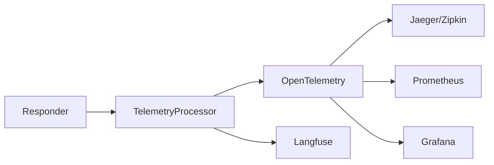

# Observability Guide

Agentle4j provides built-in observability through OpenTelemetry, enabling you to trace, measure, and monitor your AI interactions.

## Overview



## Quick Setup

### OpenTelemetry

```java
import io.opentelemetry.api.GlobalOpenTelemetry;
import io.opentelemetry.api.trace.Tracer;
import io.opentelemetry.api.metrics.Meter;

Tracer tracer = GlobalOpenTelemetry.getTracer("agentle4j");
Meter meter = GlobalOpenTelemetry.getMeter("agentle4j");

Responder responder = Responder.builder()
    .openRouter()
    .apiKey(apiKey)
    .telemetry(new OtelProcessor(tracer, meter))
    .build();
```

## What's Tracked

### Spans

Each API call creates a span with:

| Attribute | Description |
|-----------|-------------|
| `llm.model` | Model used |
| `llm.provider` | API provider |
| `llm.input_tokens` | Input token count |
| `llm.output_tokens` | Output token count |
| `llm.total_tokens` | Total tokens |
| `llm.cost` | Cost (OpenRouter only) |
| `llm.latency_ms` | Request latency |

### Metrics

| Metric | Type | Description |
|--------|------|-------------|
| `llm.requests` | Counter | Total requests |
| `llm.tokens.input` | Counter | Total input tokens |
| `llm.tokens.output` | Counter | Total output tokens |
| `llm.latency` | Histogram | Request latency distribution |
| `llm.errors` | Counter | Error count |

## Provider-Specific Features

### OpenRouter Cost Tracking

When using OpenRouter, Agentle4j automatically tracks costs:

```java
Responder responder = Responder.builder()
    .openRouter()
    .apiKey(apiKey)
    .telemetry(telemetryProcessor)
    .build();

// Response includes cost information
Response response = responder.respond(payload).join();
// Cost is automatically added to telemetry
```

## Custom Telemetry Processor

Implement your own processor:

```java
public class CustomTelemetryProcessor implements TelemetryProcessor {
    
    @Override
    public void onRequestStart(RequestContext ctx) {
        // Log request start
    }
    
    @Override
    public void onRequestComplete(RequestContext ctx, Response response) {
        // Log completion with metrics
    }
    
    @Override
    public void onRequestError(RequestContext ctx, Throwable error) {
        // Log errors
    }
}
```

## Langfuse Integration

For LLM-specific analytics:

```java
LangfuseProcessor langfuse = LangfuseProcessor.builder()
    .publicKey("pk-xxx")
    .secretKey("sk-xxx")
    .build();

Responder responder = Responder.builder()
    .openRouter()
    .apiKey(apiKey)
    .telemetry(langfuse)
    .build();
```

Langfuse provides:

- Conversation tracing
- Cost analytics
- Quality scoring
- A/B testing support

## Telemetry Context

Add custom metadata to traces:

```java
TelemetryContext telemetryContext = TelemetryContext.builder()
    .userId("user-123")
    .sessionId("session-456")
    .traceName("customer-support-chat")
    .addTag("environment", "production")
    .addTag("feature", "billing")
    .addAttribute("customer_tier", "premium")
    .build();

var payload = CreateResponsePayload.builder()
    .model("openai/gpt-4o")
    .addUserMessage("Help with my invoice")
    .telemetryContext(telemetryContext)
    .build();
```

## Grafana Dashboard

Example PromQL queries for a Grafana dashboard:

```promql
# Request rate
rate(llm_requests_total[5m])

# Average latency
histogram_quantile(0.95, rate(llm_latency_bucket[5m]))

# Token usage
sum(rate(llm_tokens_input_total[1h]))

# Error rate
rate(llm_errors_total[5m]) / rate(llm_requests_total[5m])
```

## Best Practices

!!! tip "Use Tracing in Production"
    Always enable telemetry in production to monitor costs and performance.

!!! tip "Set Sampling Rate"
    For high-traffic applications, configure OpenTelemetry sampling to reduce overhead.

!!! warning "Sensitive Data"
    Be careful not to log prompts or responses that contain sensitive user data.

```java
// Configure in OTel SDK
SdkTracerProvider tracerProvider = SdkTracerProvider.builder()
    .setSampler(Sampler.traceIdRatioBased(0.1))  // 10% sampling
    .build();
```

## Debugging

Enable debug logging for development:

```java
// Add to your logging config (logback.xml)
<logger name="com.paragon" level="DEBUG"/>
```

## Next Steps

- [Responder Guide](responder.md) - Configure the Responder
- [Agents Guide](agents.md) - Monitor agent execution
