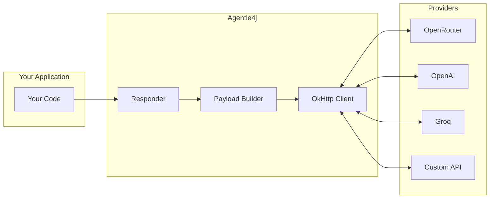

# Responder Guide

The `Responder` is the core HTTP client for the OpenAI Responses API. It handles all API communication, streaming, telemetry, and provider configuration.

---

## Overview



The `Responder` is **thread-safe** and **reusable**. Create one instance and share it across your application.

---

## Creating a Responder

### Basic Setup

```java
// Minimal configuration
Responder responder = Responder.builder()
    .openRouter()
    .apiKey("your-api-key")
    .build();
```

### Full Configuration

```java
import java.time.Duration;

Responder responder = Responder.builder()
    .openRouter()
    .apiKey(System.getenv("OPENROUTER_API_KEY"))
    
    // Telemetry (optional)
    .addTelemetryProcessor(LangfuseProcessor.fromEnv())
    
    .build();
```

### Configuration Options

| Option | Default | Description |
|--------|---------|-------------|
| `.apiKey(String)` | Required | Your API key |
| `.addTelemetryProcessor(TelemetryProcessor)` | None | Observability integration |

---

## Supported Providers

=== "OpenRouter"

    Access 300+ models through a single API:
    
    ```java
    Responder responder = Responder.builder()
        .openRouter()
        .apiKey(System.getenv("OPENROUTER_API_KEY"))
        .build();
    ```
    
    **Available Models (examples):**
    - `openai/gpt-4o`, `openai/gpt-4o-mini`
    - `anthropic/claude-3.5-sonnet`, `anthropic/claude-3-opus`
    - `google/gemini-pro`, `google/gemini-1.5-pro`
    - `meta-llama/llama-3.1-70b-instruct`
    - [See all models →](https://openrouter.ai/models)

=== "OpenAI Direct"

    ```java
    Responder responder = Responder.builder()
        .openAi()
        .apiKey(System.getenv("OPENAI_API_KEY"))
        .build();
    ```
    
    **Available Models:**
    - `gpt-4o`, `gpt-4o-mini`
    - `gpt-4-turbo`
    - `o1-preview`, `o1-mini`

=== "Groq"

    Ultra-fast inference:
    
    ```java
    Responder responder = Responder.builder()
        .baseUrl(HttpUrl.parse("https://api.groq.com/openai/v1"))
        .apiKey(System.getenv("GROQ_API_KEY"))
        .build();
    ```
    
    **Available Models:**
    - `llama-3.1-70b-versatile`
    - `llama-3.1-8b-instant`
    - `mixtral-8x7b-32768`

=== "Custom Endpoint"

    Any OpenAI-compatible API:
    
    ```java
    Responder responder = Responder.builder()
        .baseUrl(HttpUrl.parse("https://api.your-company.com/v1"))
        .apiKey("your-key")
        .build();
    ```

---

## Building Payloads

The `CreateResponsePayload.builder()` provides a fluent API:

### Basic Payload

```java
var payload = CreateResponsePayload.builder()
    .model("openai/gpt-4o")
    .addDeveloperMessage("You are a helpful assistant.")
    .addUserMessage("Hello!")
    .build();
```

### All Options

```java
var payload = CreateResponsePayload.builder()
    // Required
    .model("openai/gpt-4o")
    
    // Messages
    .addDeveloperMessage("System prompt here")  // First message (optional)
    .addUserMessage("User's question")           // User input
    .addAssistantMessage("Previous response")    // For multi-turn
    
    // Generation parameters
    .temperature(0.7)          // Creativity (0.0-2.0)
    .topP(0.9)                 // Nucleus sampling
    .maxTokens(1000)           // Response length limit
    .presencePenalty(0.0)      // Reduce repetition
    .frequencyPenalty(0.0)     // Reduce common tokens
    
    // Advanced
    .user("user-123")          // User identifier for abuse detection
    
    .build();
```

### Parameter Reference

| Parameter | Range | Description |
|-----------|-------|-------------|
| `temperature` | 0.0-2.0 | Higher = more creative, lower = more focused |
| `topP` | 0.0-1.0 | Nucleus sampling threshold |
| `maxTokens` | 1+ | Maximum response tokens |
| `presencePenalty` | -2.0 to 2.0 | Penalize tokens already in context |
| `frequencyPenalty` | -2.0 to 2.0 | Penalize tokens by frequency |

### Temperature Examples

```java
// Factual/deterministic (code generation, Q&A)
.temperature(0.0)

// Balanced (general chat)
.temperature(0.7)

// Creative (stories, brainstorming)
.temperature(1.2)
```

---

## Making Requests

### Synchronous (Blocking)

```java
// Simple blocking call
Response response = responder.respond(payload).join();
System.out.println(response.outputText());
```

### Asynchronous (Non-Blocking)

```java
// With callbacks
responder.respond(payload)
    .thenAccept(response -> {
        System.out.println("Response: " + response.outputText());
    })
    .exceptionally(error -> {
        System.err.println("Error: " + error.getMessage());
        return null;
    });

// With chaining
CompletableFuture<String> upperCase = responder.respond(payload)
    .thenApply(Response::outputText)
    .thenApply(String::toUpperCase);
```

### Parallel Requests

```java
CompletableFuture<Response> response1 = responder.respond(payload1);
CompletableFuture<Response> response2 = responder.respond(payload2);
CompletableFuture<Response> response3 = responder.respond(payload3);

// Wait for all
CompletableFuture.allOf(response1, response2, response3).join();

// Or race - first to complete wins
CompletableFuture<Object> first = CompletableFuture.anyOf(response1, response2, response3);
```

---

## Streaming

Enable streaming for real-time responses:

```java
var payload = CreateResponsePayload.builder()
    .model("openai/gpt-4o")
    .addUserMessage("Write a poem about Java")
    .streaming()  // Enable streaming
    .build();

responder.respond(payload)
    .onTextDelta(delta -> {
        System.out.print(delta);
        System.out.flush();
    })
    .onComplete(response -> {
        System.out.println("\n\nTokens: " + response.usage().totalTokens());
    })
    .onError(Throwable::printStackTrace)
    .start();
```

### Streaming Callbacks

| Callback | When Called |
|----------|-------------|
| `.onTextDelta(String)` | Each text chunk arrives |
| `.onComplete(Response)` | Stream finished successfully |
| `.onError(Throwable)` | Error occurred |

---

## Structured Output

Get type-safe JSON responses:

```java
public record Person(String name, int age, String occupation) {}

var payload = CreateResponsePayload.builder()
    .model("openai/gpt-4o")
    .addUserMessage("Create a fictional software engineer")
    .withStructuredOutput(Person.class)
    .build();

ParsedResponse<Person> response = responder.respond(payload).join();
Person person = response.parsed();
```

---

## Response Object

The `Response` contains all available information:

```java
Response response = responder.respond(payload).join();

// Text output
String text = response.outputText();

// Token usage
Usage usage = response.usage();
int inputTokens = usage.inputTokens();
int outputTokens = usage.outputTokens();
int totalTokens = usage.totalTokens();

// Metadata
String id = response.id();
String model = response.model();
long createdAt = response.createdAt();

// Output items (for complex responses)
List<ResponseOutputItem> items = response.output();
```

---

## Error Handling

### Common Errors

```java
responder.respond(payload)
    .exceptionally(error -> {
        String message = error.getCause().getMessage();
        
        if (message.contains("401")) {
            System.err.println("Invalid API key");
        } else if (message.contains("429")) {
            System.err.println("Rate limit exceeded - wait and retry");
        } else if (message.contains("500")) {
            System.err.println("Server error - try again later");
        } else if (message.contains("timeout")) {
            System.err.println("Request timed out");
        }
        
        return null;
    });
```

### Retry Pattern

```java
public Response respondWithRetry(CreateResponsePayload payload, int maxRetries) {
    for (int i = 0; i < maxRetries; i++) {
        try {
            return responder.respond(payload).join();
        } catch (Exception e) {
            if (i == maxRetries - 1) throw e;
            
            long delay = (long) Math.pow(2, i) * 1000;  // Exponential backoff
            Thread.sleep(delay);
        }
    }
    throw new RuntimeException("Unreachable");
}
```

---

## Best Practices

### ✅ Do

```java
// Reuse the Responder instance
private final Responder responder;

public MyService(String apiKey) {
    this.responder = Responder.builder()
        .openRouter()
        .apiKey(apiKey)
        .build();
}

// Load API keys from environment
String apiKey = System.getenv("OPENROUTER_API_KEY");

// Handle errors appropriately
responder.respond(payload)
    .exceptionally(e -> { /* handle */ return null; });
```

### ❌ Don't

```java
// Don't create new Responder for each request
public String chat(String message) {
    Responder r = Responder.builder()...build();  // Bad!
    return r.respond(payload).join().outputText();
}

// Don't hardcode API keys
Responder responder = Responder.builder()
    .apiKey("sk-xxxxxxxxxxxxx")  // Bad!
    .build();

// Don't ignore errors
responder.respond(payload).join();  // Uncaught exceptions!
```

---

## Next Steps

- [Agents Guide](agents.md) - Higher-level agent abstraction
- [Streaming Guide](streaming.md) - Advanced streaming patterns
- [Function Tools Guide](tools.md) - Let AI call your functions
