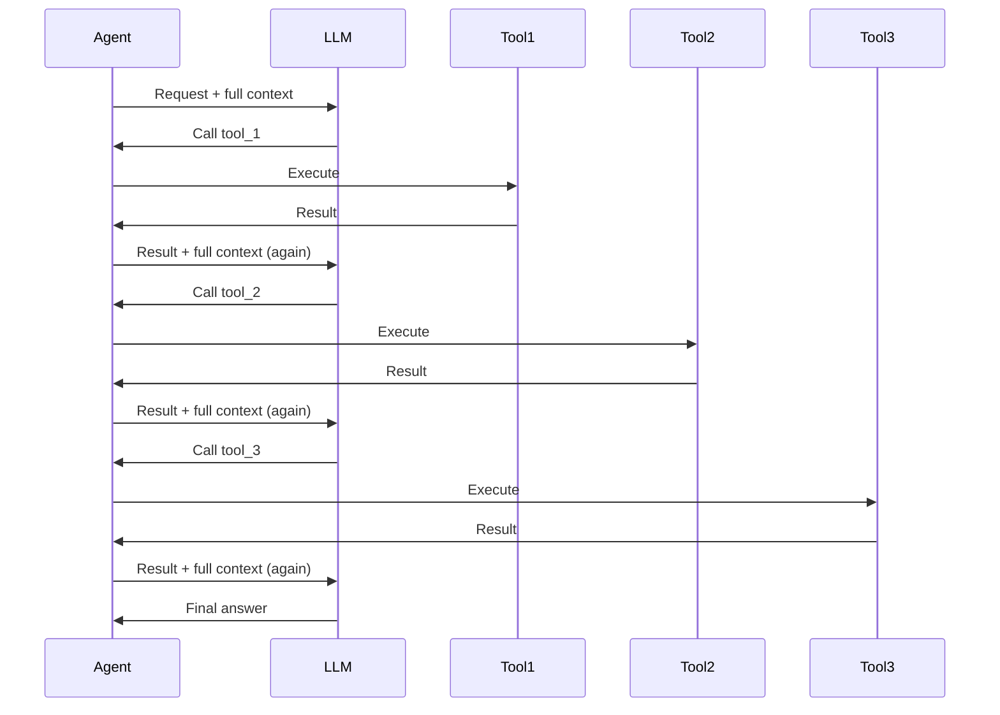
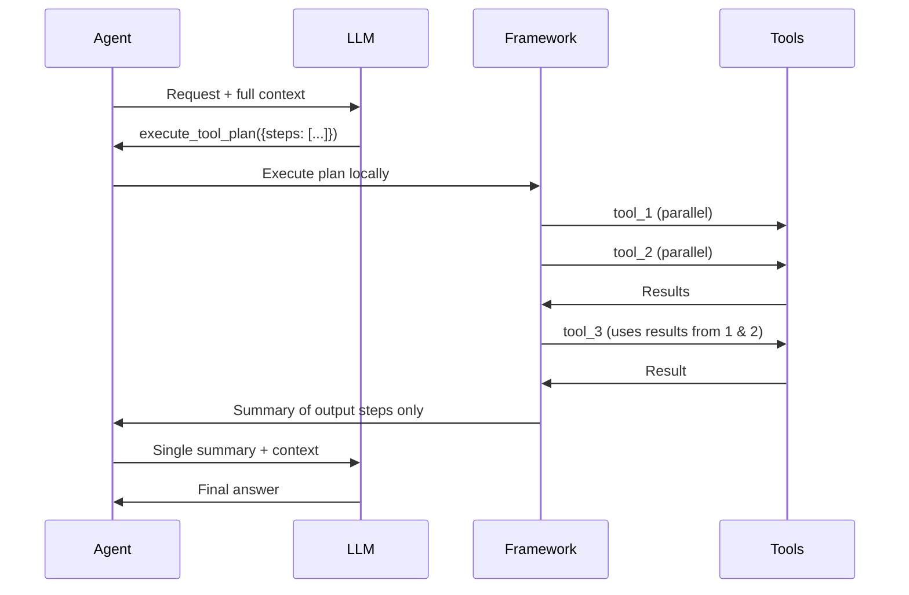
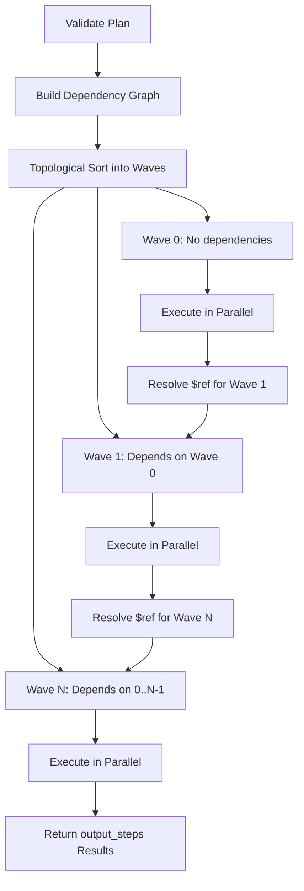

# Tool Planning Guide

Batch multiple tool calls into a single execution plan, saving tokens and reducing latency by eliminating unnecessary LLM round-trips.

---

## The Problem: Unnecessary Round-Trips

Without tool planning, every tool call requires a full LLM round-trip. If the LLM needs to call 5 tools (some depending on others), that means 5+ separate API calls — each re-sending the entire conversation history:



**Each round-trip adds latency and re-sends the full context, wasting tokens.**

---

## The Solution: Declarative Tool Plans

With tool planning enabled, the LLM produces a **single execution plan** describing all the tool calls and their data dependencies. The framework executes the plan locally and returns only the final results:



**One LLM round-trip instead of five. Intermediate results never enter the context window.**

---

## Enabling Tool Planning

Add `.enableToolPlanning()` to your agent builder:

```java
Agent agent = Agent.builder()
    .name("ResearchAssistant")
    .model("openai/gpt-4o")
    .instructions("You are a research assistant that gathers and compares data.")
    .responder(responder)
    .addTool(new GetWeatherTool())
    .addTool(new GetNewsTool())
    .addTool(new CompareDataTool())
    .enableToolPlanning()  // Registers the execute_tool_plan meta-tool
    .build();

// The LLM can now either:
// 1. Call tools individually (existing behavior, unchanged)
// 2. Call execute_tool_plan with a batched plan
AgentResult result = agent.interact("Compare the weather in Tokyo and London");
```

!!! info "Opt-in Only"
    Tool planning is disabled by default. Existing agents work exactly as before.
    The LLM decides whether to use individual tool calls or a plan based on the task.

---

## The Plan Format

When the LLM uses tool planning, it produces a JSON plan as the argument to `execute_tool_plan`:

```json
{
  "steps": [
    {
      "id": "weather_tokyo",
      "tool": "get_weather",
      "arguments": "{\"location\": \"Tokyo\"}"
    },
    {
      "id": "weather_london",
      "tool": "get_weather",
      "arguments": "{\"location\": \"London\"}"
    },
    {
      "id": "comparison",
      "tool": "compare_data",
      "arguments": "{\"data_a\": \"$ref:weather_tokyo\", \"data_b\": \"$ref:weather_london\"}"
    }
  ],
  "output_steps": ["comparison"]
}
```

Each step has:

| Field | Type | Description |
|-------|------|-------------|
| **`id`** | String | Unique identifier, used by `$ref` references from other steps |
| **`tool`** | String | Name of the `FunctionTool` to call |
| **`arguments`** | String | JSON string of arguments. May contain `$ref` references |

The `output_steps` field lists which step results should be returned to the LLM. If omitted, all results are returned.

---

## Reference Syntax

Steps can reference outputs from previous steps using `$ref` syntax inside their arguments:

| Syntax | Description | Example |
|--------|-------------|---------|
| `"$ref:step_id"` | Full output of a previous step | `"$ref:weather_tokyo"` |
| `"$ref:step_id.field"` | Extract a JSON field from a step's output | `"$ref:weather_tokyo.temp"` |
| `"$ref:step_id.field.nested"` | Nested JSON field extraction | `"$ref:user_data.address.city"` |

**How values are inserted:**

- If the referenced output is a JSON object or array, it is inserted unquoted (as structured JSON)
- If the output is plain text, it is inserted as a quoted string
- If a field path points to a missing field, `null` is inserted
- Numbers and booleans are inserted as their JSON primitives

---

## How Execution Works



1. **Validate** — Check for duplicate IDs, unknown tools, and recursive plan references
2. **Build dependency graph** — Scan arguments for `$ref` patterns to identify which steps depend on which
3. **Topological sort** — Group steps into execution "waves" using Kahn's algorithm
4. **Execute waves** — Each wave runs all its steps in parallel using virtual threads (`StructuredTaskScope`)
5. **Resolve references** — After each wave completes, `$ref` values are resolved for the next wave
6. **Return results** — Only `output_steps` results go back to the LLM context

---

## Parallel Execution

Steps with no dependencies on each other automatically execute in parallel. The framework uses Java virtual threads for efficient concurrency:

```json
{
  "steps": [
    {"id": "a", "tool": "get_weather", "arguments": "{\"location\": \"Tokyo\"}"},
    {"id": "b", "tool": "get_weather", "arguments": "{\"location\": \"London\"}"},
    {"id": "c", "tool": "get_weather", "arguments": "{\"location\": \"Paris\"}"},
    {"id": "summary", "tool": "summarize", "arguments": "{\"data\": [\"$ref:a\", \"$ref:b\", \"$ref:c\"]}"}
  ],
  "output_steps": ["summary"]
}
```

In this example:
- **Wave 0**: `a`, `b`, and `c` execute in parallel (no dependencies)
- **Wave 1**: `summary` executes after all three complete (depends on `a`, `b`, `c`)

This is especially powerful when each tool call involves network I/O — three 500ms API calls take 500ms total instead of 1500ms.

---

## Error Handling

The executor uses a **fail-forward** strategy:

- If a step fails, its dependents are **skipped** (marked as failed with a reason)
- Independent steps **continue executing** regardless of failures
- The final result includes both successful outputs and error details

```json
{
  "steps": [
    {"id": "s1", "tool": "flaky_api", "arguments": "{}"},
    {"id": "s2", "tool": "reliable_api", "arguments": "{}"},
    {"id": "s3", "tool": "process", "arguments": "{\"data\": \"$ref:s1\"}"}
  ],
  "output_steps": ["s2", "s3"]
}
```

If `s1` fails:
- `s2` still executes successfully (no dependency on `s1`)
- `s3` is skipped with the message "Skipped because dependency 's1' failed"
- The LLM receives both the `s2` result and the `s3` error, and can decide what to do

---

## Context Window Savings

The key benefit of tool planning is **reduced token consumption**:

| Scenario | Without Planning | With Planning |
|----------|-----------------|---------------|
| 5 sequential tool calls | 5 LLM round-trips, each re-sending full context | 1 round-trip for plan + 1 for final answer |
| Context tokens per round-trip | ~4,000 (grows with history) | Same ~4,000 but only twice |
| Tool result tokens in context | All 5 results stay in context | Only `output_steps` results |
| Total token overhead | ~20,000+ input tokens | ~8,000 input tokens |

!!! tip "Use output_steps to Maximize Savings"
    Always specify `output_steps` to return only the results the LLM actually needs.
    Intermediate step results are discarded — they never enter the context window.

---

## When to Use Tool Planning

| Feature | Individual Tool Calls | Tool Planning | Sub-Agents |
|---------|----------------------|---------------|------------|
| **Best for** | Simple, 1-2 tool calls | Multi-step workflows with dependencies | Complex delegation requiring LLM reasoning |
| **LLM Round-trips** | 1 per tool call | 1 for the entire plan | 1+ per sub-agent turn |
| **Parallel Execution** | Only if LLM requests parallel | Automatic for independent steps | No (sequential) |
| **Data Flow** | Via context history | Via `$ref` references | Via sub-agent input/output |
| **Context Usage** | All results in context | Only output_steps in context | Sub-agent results in context |
| **Error Recovery** | LLM can retry each step | Fail-forward, LLM sees errors after | Sub-agent handles errors independently |
| **Enable** | Default behavior | `.enableToolPlanning()` | `.addSubAgent(agent, desc)` |

---

## Best Practices

### Do

```java
// Use tool planning when you have multiple tools with data dependencies
Agent agent = Agent.builder()
    .name("DataPipeline")
    .instructions("""
        You orchestrate data pipeline tasks.
        When you need to fetch from multiple sources and then combine results,
        use execute_tool_plan to batch the operations.
        """)
    .addTool(new FetchFromDatabaseTool())
    .addTool(new FetchFromApiTool())
    .addTool(new MergeResultsTool())
    .enableToolPlanning()
    .build();
```

```java
// Keep tools focused and composable — they work better in plans
@FunctionMetadata(
    name = "get_user",
    description = "Fetch a user by ID. Returns JSON with name, email, role fields."
)
public class GetUserTool extends FunctionTool<GetUserParams> {
    // Return structured JSON so $ref:step_id.field works well
}
```

### Don't

```java
// Don't enable tool planning if you only have 1-2 simple tools
Agent agent = Agent.builder()
    .name("SimpleHelper")
    .addTool(new GetTimeTool())
    .enableToolPlanning()  // Unnecessary — adds overhead for simple cases
    .build();
```

```java
// Don't return unstructured text from tools used in plans
// BAD: "The weather is 25 degrees and sunny in Tokyo"
// GOOD: {"temp": 25, "condition": "sunny", "city": "Tokyo"}
// Structured output enables $ref:step_id.field extraction
```

---

## Safety

- **No code execution** — Plans are declarative JSON, not executable code. The framework interprets them, it does not `eval` anything.
- **No recursive plans** — A plan cannot call `execute_tool_plan` within itself. The executor rejects this.
- **No arbitrary tools** — Only tools registered with the agent can be called from a plan. Unknown tool names cause validation errors.

---

## Next Steps

- [Function Tools Guide](tools.md) - Create tools that work great in plans
- [Agents Guide](agents.md) - Build agents with tools, handoffs, and sub-agents
- [Streaming Guide](streaming.md) - Real-time streaming with tool calls
