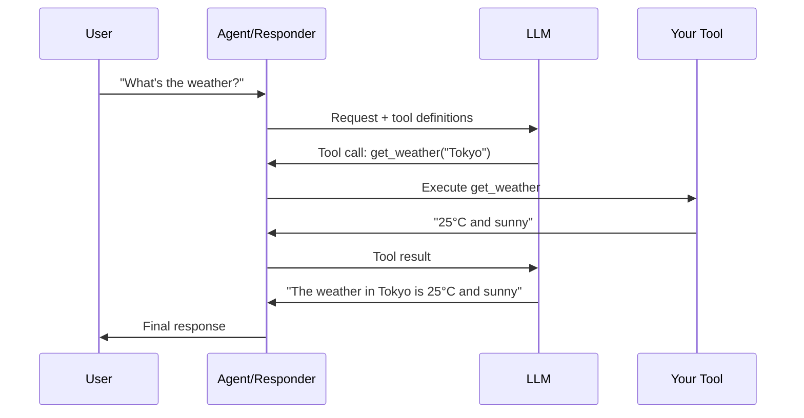

# Function Tools Guide

> This docs was updated at: 2026-02-23

Function tools let the AI call your Java functions to interact with external systems, databases, APIs, and more.

---

## How Tools Work



---

## Creating a Tool

### Step 1: Define Parameters

Use a Java record to define the tool's input parameters:

```java
// Simple parameters
public record WeatherParams(
    String location,    // City name or coordinates
    String unit         // "celsius" or "fahrenheit"
) {}

// Complex parameters with nested objects
public record SearchParams(
    String query,
    List<String> categories,
    DateRange dateRange,
    int maxResults
) {}

public record DateRange(LocalDate start, LocalDate end) {}
```

### Step 2: Create the Tool Class

Extend `FunctionTool<T>` and implement the `call` method:

```java
import com.paragon.responses.spec.FunctionTool;
import com.paragon.responses.annotations.FunctionMetadata;
import com.paragon.responses.spec.FunctionToolCallOutput;
import org.jspecify.annotations.Nullable;

@FunctionMetadata(
    name = "get_weather",
    description = "Gets the current weather for a specified location"
)
public class WeatherTool extends FunctionTool<WeatherParams> {
    
    @Override
    public FunctionToolCallOutput call(@Nullable WeatherParams params) {
        // Validate input
        if (params == null || params.location() == null) {
            return FunctionToolCallOutput.error("Location is required");
        }
        
        // Your implementation here
        String weather = fetchWeatherFromAPI(params.location(), params.unit());
        
        return FunctionToolCallOutput.success(weather);
    }
    
    private String fetchWeatherFromAPI(String location, String unit) {
        // Call your weather API...
        return "25°C and sunny in " + location;
    }
}
```

### Step 3: Register the Tool

```java
// Create tool store with Jackson ObjectMapper
ObjectMapper objectMapper = new ObjectMapper();
FunctionToolStore store = FunctionToolStore.create(objectMapper);

// Create and register tool
WeatherTool weatherTool = new WeatherTool();
store.add(weatherTool);
```

### Step 4: Use with Responder

```java
var payload = CreateResponsePayload.builder()
    .model("openai/gpt-4o")
    .addUserMessage("What's the weather in Tokyo?")
    .addTool(weatherTool)
    .build();

Response response = responder.respond(payload);

// Check if the model wants to call a tool
for (var toolCall : response.functionToolCalls(store)) {
    FunctionToolCallOutput result = toolCall.call();
    System.out.println("Tool result: " + result.output());
}
```

---

## Complete Examples

### Calculator Tool

```java
public record CalcParams(
    double a,
    double b,
    String operation  // "add", "subtract", "multiply", "divide"
) {}

@FunctionMetadata(
    name = "calculator",
    description = "Performs basic math operations: add, subtract, multiply, divide"
)
public class CalculatorTool extends FunctionTool<CalcParams> {
    
    @Override
    public FunctionToolCallOutput call(@Nullable CalcParams params) {
        if (params == null) {
            return FunctionToolCallOutput.error("Parameters required");
        }
        
        double result = switch (params.operation().toLowerCase()) {
            case "add" -> params.a() + params.b();
            case "subtract" -> params.a() - params.b();
            case "multiply" -> params.a() * params.b();
            case "divide" -> {
                if (params.b() == 0) {
                    yield Double.NaN;
                }
                yield params.a() / params.b();
            }
            default -> throw new IllegalArgumentException("Unknown operation: " + params.operation());
        };
        
        return FunctionToolCallOutput.success(String.valueOf(result));
    }
}
```

### Database Query Tool

```java
public record QueryParams(
    String tableName,
    Map<String, String> filters,
    int limit
) {}

public record QueryResult(
    List<Map<String, Object>> rows,
    int totalCount
) {}

@FunctionMetadata(
    name = "query_database",
    description = "Queries the database with the given filters. Returns matching records."
)
public class DatabaseQueryTool extends FunctionTool<QueryParams> {
    
    private final DataSource dataSource;
    
    public DatabaseQueryTool(DataSource dataSource) {
        this.dataSource = dataSource;
    }
    
    @Override
    public FunctionToolCallOutput call(@Nullable QueryParams params) {
        if (params == null) {
            return FunctionToolCallOutput.error("Query parameters required");
        }
        
        try {
            List<Map<String, Object>> results = executeQuery(params);
            QueryResult result = new QueryResult(results, results.size());
            // Serialize to JSON string for structured data
            return FunctionToolCallOutput.success(objectMapper.writeValueAsString(result));
        } catch (SQLException e) {
            return FunctionToolCallOutput.error("Database error: " + e.getMessage());
        }
    }
    
    private List<Map<String, Object>> executeQuery(QueryParams params) throws SQLException {
        // Your database query logic here
        // ...
    }
}
```

### HTTP API Tool

```java
public record ApiRequestParams(
    String endpoint,
    String method,
    Map<String, String> headers,
    String body
) {}

@FunctionMetadata(
    name = "http_request",
    description = "Makes an HTTP request to an external API"
)
public class HttpApiTool extends FunctionTool<ApiRequestParams> {
    
    private final OkHttpClient client = new OkHttpClient();
    
    @Override
    public FunctionToolCallOutput call(@Nullable ApiRequestParams params) {
        if (params == null || params.endpoint() == null) {
            return FunctionToolCallOutput.error("Endpoint required");
        }
        
        try {
            Request.Builder requestBuilder = new Request.Builder()
                .url(params.endpoint());
            
            if (params.headers() != null) {
                params.headers().forEach(requestBuilder::addHeader);
            }
            
            if ("POST".equalsIgnoreCase(params.method())) {
                RequestBody body = RequestBody.create(
                    params.body(), 
                    MediaType.parse("application/json")
                );
                requestBuilder.post(body);
            }
            
            try (okhttp3.Response response = client.newCall(requestBuilder.build()).execute()) {
                return FunctionToolCallOutput.success(response.body().string());
            }
        } catch (Exception e) {
            return FunctionToolCallOutput.error("HTTP error: " + e.getMessage());
        }
    }
}
```

### Email Sending Tool

```java
public record EmailParams(
    String to,
    String subject,
    String body,
    boolean isHtml
) {}

@FunctionMetadata(
    name = "send_email",
    description = "Sends an email to the specified recipient"
)
public class EmailTool extends FunctionTool<EmailParams> {
    
    private final EmailService emailService;
    
    public EmailTool(EmailService emailService) {
        this.emailService = emailService;
    }
    
    @Override
    public FunctionToolCallOutput call(@Nullable EmailParams params) {
        if (params == null) {
            return FunctionToolCallOutput.error("Email parameters required");
        }
        
        if (!isValidEmail(params.to())) {
            return FunctionToolCallOutput.error("Invalid email address: " + params.to());
        }
        
        try {
            emailService.send(params.to(), params.subject(), params.body(), params.isHtml());
            return FunctionToolCallOutput.success("Email sent successfully to " + params.to());
        } catch (Exception e) {
            return FunctionToolCallOutput.error("Failed to send email: " + e.getMessage());
        }
    }
    
    private boolean isValidEmail(String email) {
        return email != null && email.matches("^[A-Za-z0-9+_.-]+@(.+)$");
    }
}
```

---

## Tool Output Types

| Method | Use Case | Example |
|--------|----------|---------|
| `success(String)` | Simple text result | `"25°C and sunny"` |
| `error(String)` | Operation failed | `"Location not found"` |
| `json(Object)` | Structured data | Complex objects, lists |

```java
// Success with simple text
return FunctionToolCallOutput.success("Operation completed");

// Error with message
return FunctionToolCallOutput.error("Invalid parameters");

// Structured JSON response (serialize to string)
record SearchResult(List<Product> products, int total) {}
ObjectMapper mapper = new ObjectMapper();
return FunctionToolCallOutput.success(mapper.writeValueAsString(new SearchResult(products, total)));
```

---

## Long-Running Tools

For long-running operations, use virtual threads for efficiency:

```java
@FunctionMetadata(
    name = "generate_report",
    description = "Generates a detailed report (may take up to 30 seconds)"
)
public class ReportGeneratorTool extends FunctionTool<ReportParams> {
    
    @Override
    public FunctionToolCallOutput call(@Nullable ReportParams params) {
        // Long-running operation - virtual threads handle blocking efficiently
        Report report = generateDetailedReport(params);
        try {
            return FunctionToolCallOutput.success(new ObjectMapper().writeValueAsString(report));
        } catch (Exception e) {
            return FunctionToolCallOutput.error("Failed to serialize report");
        }
    }
}
```

---

## Using Tools with Agents

Agents automatically execute tools in the agentic loop:

```java
Agent agent = Agent.builder()
    .name("AssistantWithTools")
    .model("openai/gpt-4o")
    .instructions("You have access to various tools. Use them when appropriate.")
    .responder(responder)
    .addTool(weatherTool)
    .addTool(calculatorTool)
    .addTool(emailTool)
    .build();

// Tools are called automatically when needed
AgentResult result = agent.interact("What's the weather in Tokyo and calculate 15 * 7");
System.out.println(result.output());
// "The weather in Tokyo is 25°C and sunny. 15 * 7 = 105"
```

---

## Multiple Tools Example

```java
// Create all tools
WeatherTool weatherTool = new WeatherTool();
CalculatorTool calculatorTool = new CalculatorTool();
DatabaseQueryTool dbTool = new DatabaseQueryTool(dataSource);
EmailTool emailTool = new EmailTool(emailService);

// Register in store
FunctionToolStore store = FunctionToolStore.create(objectMapper);
store.add(weatherTool);
store.add(calculatorTool);
store.add(dbTool);
store.add(emailTool);

// Use with payload
var payload = CreateResponsePayload.builder()
    .model("openai/gpt-4o")
    .addDeveloperMessage("""
        You are a helpful assistant with access to:
        - Weather information
        - Calculator for math
        - Database queries
        - Email sending
        Use these tools when the user's request requires them.
        """)
    .addUserMessage("Calculate 25% tip on $85.50 and email me the result")
    .addTools(store.getTools())  // Add all tools
    .build();
```

---

## Tool Execution Loop

When using Responder directly, you need to handle the tool loop manually:

```java
Response response = responder.respond(payload);
List<ResponseInputItem> conversationHistory = new ArrayList<>(response.output());

// Keep executing tools until no more tool calls
while (!response.functionToolCalls(store).isEmpty()) {
    // Execute each tool call
    for (var toolCall : response.functionToolCalls(store)) {
        System.out.println("Executing: " + toolCall.name());
        FunctionToolCallOutput result = toolCall.call();
        conversationHistory.add(result);
    }
    
    // Continue conversation with tool results in input
    var continuePayload = CreateResponsePayload.builder()
        .model("openai/gpt-4o")
        .input(conversationHistory)
        .addTools(store.getTools())
        .build();
    
    response = responder.respond(continuePayload);
    conversationHistory.addAll(response.output());
}

// Final response
System.out.println(response.outputText());
```

!!! tip "Use Agents for Easier Tool Handling"
    The `Agent` class handles the tool execution loop automatically.
    Consider using an Agent instead of raw Responder when working with tools.

---

## Tool Planning (Batching Multiple Calls)

When your agent needs to call multiple tools — especially when some depend on others' results — you can enable **tool planning** to batch them into a single execution plan. The LLM produces a declarative plan with `$ref` references for data flow, and the framework executes it locally with automatic parallel execution:

```java
Agent agent = Agent.builder()
    .name("DataPipeline")
    .instructions("You orchestrate data pipeline tasks.")
    .addTool(new FetchDatabaseTool())
    .addTool(new FetchApiTool())
    .addTool(new MergeResultsTool())
    .enableToolPlanning()  // Enables the execute_tool_plan meta-tool
    .build();
```

!!! tip "Return Structured JSON from Tools"
    Tools used in plans work best when they return structured JSON output.
    This enables the LLM to use `$ref:step_id.field` to extract specific values.

See the [Tool Planning Guide](tool-planning.md) for full details on the plan format, `$ref` syntax, parallel execution, and error handling.

---

## Best Practices

### ✅ Do

```java
// Use clear, descriptive names
@FunctionMetadata(
    name = "search_products",  // verb_noun format
    description = "Searches the product catalog by name, category, or price range"
)

// Validate all inputs
@Override
public FunctionToolCallOutput call(@Nullable SearchParams params) {
    if (params == null) {
        return FunctionToolCallOutput.error("Parameters required");
    }
    if (params.query() == null || params.query().isBlank()) {
        return FunctionToolCallOutput.error("Search query is required");
    }
    // ...
}

// Return helpful error messages
return FunctionToolCallOutput.error(
    "Product not found. Try searching with different keywords."
);
```

### ❌ Don't

```java
// Don't use vague names
@FunctionMetadata(name = "do_thing", description = "Does stuff")  // Bad!

// Don't throw exceptions (return errors instead)
@Override
public FunctionToolCallOutput call(@Nullable Params params) {
    throw new RuntimeException("Something went wrong");  // Bad!
}

// Missing null check
String location = params.location();  // NPE if params is null!
```

---

## Security Considerations

### Input Validation

```java
@Override
public FunctionToolCallOutput call(@Nullable Params params) {
    // Sanitize user input
    String query = sanitize(params.query());
    
    // Validate ranges
    if (params.limit() > MAX_LIMIT) {
        return FunctionToolCallOutput.error("Limit cannot exceed " + MAX_LIMIT);
    }
    
    // Whitelist allowed values
    if (!ALLOWED_CATEGORIES.contains(params.category())) {
        return FunctionToolCallOutput.error("Invalid category");
    }
}
```

### Rate Limiting

```java
public class RateLimitedTool extends FunctionTool<Params> {
    private final RateLimiter rateLimiter = RateLimiter.create(10.0);  // 10/sec
    
    @Override
    public FunctionToolCallOutput call(@Nullable Params params) {
        if (!rateLimiter.tryAcquire()) {
            return FunctionToolCallOutput.error("Rate limit exceeded. Try again later.");
        }
        // ... execute tool
    }
}
```

---

## Next Steps

- [Tool Planning Guide](tool-planning.md) - Batch multiple tool calls into execution plans
- [Agents Guide](agents.md) - Use tools with the Agent framework
- [Streaming Guide](streaming.md) - Handle tool calls in streams
