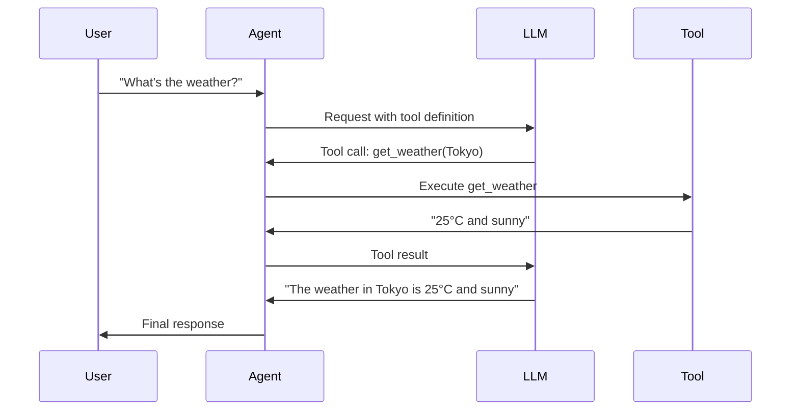

# Function Tools Guide

Function tools allow the AI to call your Java functions, enabling powerful integrations with external systems.

## Overview



## Creating a Tool

### Step 1: Define Parameters

```java
public record WeatherParams(
    String location,
    String unit  // "celsius" or "fahrenheit"
) {}
```

### Step 2: Implement the Tool

```java
import com.paragon.tools.FunctionTool;
import com.paragon.tools.FunctionMetadata;
import com.paragon.tools.FunctionToolCallOutput;

@FunctionMetadata(
    name = "get_weather",
    description = "Gets current weather for a location"
)
public class WeatherTool extends FunctionTool<WeatherParams> {
    
    @Override
    public FunctionToolCallOutput call(@Nullable WeatherParams params) {
        if (params == null) {
            return FunctionToolCallOutput.error("Parameters required");
        }
        
        // Your implementation here
        String weather = fetchWeather(params.location(), params.unit());
        return FunctionToolCallOutput.success(weather);
    }
    
    private String fetchWeather(String location, String unit) {
        // Call weather API...
        return "25°C and sunny in " + location;
    }
}
```

### Step 3: Register and Use

```java
// Create tool store
FunctionToolStore store = FunctionToolStore.create(objectMapper);

// Create tool instance
WeatherTool weatherTool = new WeatherTool();
store.add(weatherTool);

// Add to payload
var payload = CreateResponsePayload.builder()
    .model("openai/gpt-4o")
    .addUserMessage("What's the weather in Tokyo?")
    .addTool(weatherTool)
    .build();
```

## Tool Output Types

| Method | Use Case |
|--------|----------|
| `FunctionToolCallOutput.success(String)` | Successful execution |
| `FunctionToolCallOutput.error(String)` | Execution failed |
| `FunctionToolCallOutput.json(Object)` | Return structured data |

## Executing Tool Calls

### Manual Execution

```java
Response response = responder.respond(payload).join();

for (var toolCall : response.functionToolCalls(store)) {
    FunctionToolCallOutput output = toolCall.call();
    System.out.println("Result: " + output.output());
}
```

### With Agent (Automatic)

Agents automatically execute tool calls in the agentic loop:

```java
Agent agent = Agent.builder()
    .name("WeatherBot")
    .model("openai/gpt-4o")
    .instructions("You help users check the weather.")
    .responder(responder)
    .addTool(weatherTool)
    .build();

// Tools are called automatically
AgentResult result = agent.interact("What's the weather in Tokyo?").join();
System.out.println(result.output());
// → "The weather in Tokyo is 25°C and sunny."
```

## Complex Parameter Types

Tools support complex nested types:

```java
public record SearchParams(
    String query,
    List<String> filters,
    DateRange dateRange,
    int maxResults
) {}

public record DateRange(
    LocalDate start,
    LocalDate end
) {}
```

Agentle4j automatically generates the JSON schema for the LLM.

## Async Tools

For long-running operations:

```java
@FunctionMetadata(name = "search_database", description = "Searches the database")
public class DatabaseSearchTool extends FunctionTool<SearchParams> {
    
    @Override
    public CompletableFuture<FunctionToolCallOutput> callAsync(@Nullable SearchParams params) {
        return CompletableFuture.supplyAsync(() -> {
            // Long-running operation
            List<Result> results = database.search(params);
            return FunctionToolCallOutput.json(results);
        });
    }
}
```

## Tool Annotations

Use annotations to provide metadata:

```java
@FunctionMetadata(
    name = "send_email",
    description = "Sends an email to the specified recipient"
)
public class EmailTool extends FunctionTool<EmailParams> {
    // ...
}
```

## Multiple Tools

Add multiple tools to an agent:

```java
Agent agent = Agent.builder()
    .name("Assistant")
    .model("openai/gpt-4o")
    .instructions("You're a helpful assistant with access to various tools.")
    .responder(responder)
    .addTool(weatherTool)
    .addTool(calendarTool)
    .addTool(emailTool)
    .addTool(searchTool)
    .build();
```

## Best Practices

!!! tip "Descriptive Names"
    Use clear, action-oriented names like `get_weather`, `send_email`, `search_documents`.

!!! tip "Good Descriptions"
    Provide detailed descriptions so the LLM knows when to use the tool.

!!! warning "Validate Input"
    Always validate parameters before executing. The LLM might send unexpected values.

!!! warning "Handle Errors"
    Return `FunctionToolCallOutput.error()` with helpful messages instead of throwing exceptions.

## Next Steps

- [Agents Guide](agents.md) - Use tools with agents
- [Streaming Guide](streaming.md) - Handle tool calls during streaming
