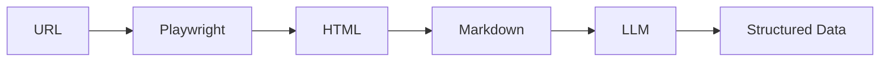

# Web Extraction Guide

Extract structured data from web pages using Playwright for rendering and LLM for intelligent data extraction.

---

## Overview



`WebExtractor` combines:
- **Playwright** - Renders JavaScript-heavy pages like a real browser
- **HTML to Markdown** - Converts to clean text for LLM processing
- **LLM** - Extracts structured data using your schema

---

## Prerequisites

Add Playwright dependency to your project:

```xml
<dependency>
    <groupId>com.microsoft.playwright</groupId>
    <artifactId>playwright</artifactId>
    <version>1.41.0</version>
</dependency>
```

Install browsers:

```bash
mvn exec:java -e -D exec.mainClass=com.microsoft.playwright.CLI -D exec.args="install chromium"
```

---

## Quick Start

```java
import com.paragon.web.WebExtractor;
import com.paragon.web.ExtractPayload;
import com.paragon.web.ExtractionResult;
import com.microsoft.playwright.*;

// Create browser and extractor
try (Playwright playwright = Playwright.create();
     Browser browser = playwright.chromium().launch()) {
    
    WebExtractor extractor = WebExtractor.create(responder, "openai/gpt-4o");
    
    // Extract content
    ExtractionResult result = extractor.extract(
        ExtractPayload.builder()
            .browser(browser)
            .url("https://example.com/article")
            .prompt("Extract the main article content")
            .build()
    ).join();
    
    System.out.println(result.combinedMarkdown());
}
```

---

## Unstructured Extraction

Extract raw HTML and Markdown content without LLM processing:

```java
ExtractionResult result = extractor.extract(
    ExtractPayload.builder()
        .browser(browser)
        .url("https://example.com")
        .prompt("Extract all relevant information")
        .withPreferences(p -> p
            .onlyMainContent(true)
            .removeBase64Images(true)
            .timeoutMs(15000))
        .build()
).join();

// Access extracted content
List<String> htmlPages = result.html();           // Raw HTML for each URL
List<String> markdownPages = result.markdown();   // Markdown for each URL
String combined = result.combinedMarkdown();      // All pages merged
```

### Multiple URLs

```java
ExtractionResult result = extractor.extract(
    ExtractPayload.builder()
        .browser(browser)
        .urls("https://example.com/page1", "https://example.com/page2")
        .prompt("Extract content")
        .ignoreInvalidUrls(true)  // Continue if some URLs fail
        .build()
).join();

// Check for errors
for (ExtractionResult.ExtractionError error : result.errors()) {
    System.err.println(error.url() + ": " + error.message());
}
```

---

## Structured Extraction

Define a Java record and let the LLM extract typed data:

```java
// Define output schema
record Article(
    String title,
    String author,
    String publishDate,
    String summary,
    List<String> tags
) {}

// Extract with structured output
ExtractionResult.Structured<Article> result = extractor.extract(
    ExtractPayload.structuredBuilder(Article.class)
        .browser(browser)
        .url("https://example.com/article")
        .prompt("Extract the article metadata")
        .build()
).join();

// Get typed result
Article article = result.requireOutput();  // Throws if extraction failed
System.out.println("Title: " + article.title());
System.out.println("Author: " + article.author());

// Or check if extraction succeeded
if (result.output() != null) {
    Article article = result.output();
}
```

### Complex Schemas

```java
record Product(
    String name,
    double price,
    String currency,
    List<String> features,
    Availability availability
) {}

record Availability(
    boolean inStock,
    int quantity,
    String deliveryEstimate
) {}

ExtractionResult.Structured<Product> result = extractor.extract(
    ExtractPayload.structuredBuilder(Product.class)
        .browser(browser)
        .url("https://store.example.com/product/123")
        .prompt("Extract product details including price and availability")
        .withPreferences(p -> p.onlyMainContent(true))
        .build()
).join();
```

---

## Extraction Preferences

Configure how content is extracted:

```java
ExtractPayload.builder()
    .browser(browser)
    .url(url)
    .prompt(prompt)
    .withPreferences(p -> p
        // Content filtering
        .onlyMainContent(true)       // Extract only <main>, <article>, etc.
        .removeBase64Images(true)    // Remove embedded images from output
        .includeTags(List.of("article", "main"))  // Only include these tags
        .excludeTags(List.of("nav", "footer"))    // Remove these tags
        
        // Timing
        .timeoutMs(30_000)           // Navigation timeout (default: 30s)
        .waitForMs(2000)             // Wait after page load for JS
        
        // Browser emulation
        .mobile(true)                // Emulate mobile device
        .blockAds(true)              // Block common ad domains
        
        // Network
        .headers(Map.of("Accept-Language", "en-US"))
        .skipTlsVerification(true)   // Ignore SSL errors
        
        // Geolocation
        .location(37.7749, -122.4194)  // San Francisco
    )
    .build();
```

### Preference Reference

| Option | Default | Description |
|--------|---------|-------------|
| `onlyMainContent` | `false` | Extract only main content areas |
| `removeBase64Images` | `false` | Remove embedded base64 images |
| `includeTags` | `null` | Only include specific HTML tags |
| `excludeTags` | `null` | Remove specific HTML tags |
| `timeoutMs` | `30000` | Page navigation timeout |
| `waitForMs` | `0` | Wait time after page load |
| `mobile` | `false` | Emulate mobile viewport |
| `blockAds` | `false` | Block ad/tracking domains |
| `headers` | `null` | Custom HTTP headers |
| `skipTlsVerification` | `false` | Ignore SSL errors |
| `location` | `null` | Geolocation coordinates |

---

## Error Handling

```java
ExtractionResult result = extractor.extract(payload).join();

// Check for errors
if (!result.errors().isEmpty()) {
    for (ExtractionResult.ExtractionError error : result.errors()) {
        System.err.println("URL: " + error.url());
        System.err.println("Type: " + error.type());  // TIMEOUT, NAVIGATION, LLM, UNKNOWN
        System.err.println("Message: " + error.message());
        
        if (error.cause() != null) {
            error.cause().printStackTrace();
        }
    }
}
```

### Error Types

| Type | Cause |
|------|-------|
| `TIMEOUT` | Page took too long to load |
| `NAVIGATION` | Failed to reach the URL |
| `LLM` | LLM processing failed |
| `UNKNOWN` | Unexpected error |

### Ignoring Invalid URLs

Continue extraction even if some URLs fail:

```java
ExtractPayload.builder()
    .browser(browser)
    .urls(url1, url2, url3)
    .ignoreInvalidUrls(true)  // Default: true
    .build();
```

---

## Factory Methods

```java
// With default settings
WebExtractor extractor = WebExtractor.create(responder);

// With specific model
WebExtractor extractor = WebExtractor.create(responder, "openai/gpt-4o-mini");

// With custom executor
WebExtractor extractor = WebExtractor.create(
    responder, 
    "openai/gpt-4o", 
    Executors.newVirtualThreadPerTaskExecutor()
);
```

---

## Best Practices

### ✅ Do

```java
// Use onlyMainContent for cleaner extraction
.withPreferences(p -> p.onlyMainContent(true))

// Add wait time for JS-heavy pages
.withPreferences(p -> p.waitForMs(2000))

// Use specific prompts
.prompt("Extract the product name, price, and description")

// Handle errors gracefully
if (!result.errors().isEmpty()) {
    // Log and handle errors
}
```

### ❌ Don't

```java
// Don't use vague prompts
.prompt("Extract stuff")  // Too vague!

// Don't skip error handling
result.requireOutput();  // May throw if extraction failed

// Don't forget to close browser
browser.close();
```

---

## Complete Example

```java
import com.paragon.web.*;
import com.paragon.responses.Responder;
import com.microsoft.playwright.*;

public class ProductScraper {
    
    record Product(String name, double price, String description) {}
    
    public static void main(String[] args) {
        Responder responder = Responder.builder()
            .openRouter()
            .apiKey(System.getenv("OPENROUTER_API_KEY"))
            .build();
        
        try (Playwright playwright = Playwright.create();
             Browser browser = playwright.chromium().launch()) {
            
            WebExtractor extractor = WebExtractor.create(responder, "openai/gpt-4o-mini");
            
            ExtractionResult.Structured<Product> result = extractor.extract(
                ExtractPayload.structuredBuilder(Product.class)
                    .browser(browser)
                    .url("https://example-store.com/product/123")
                    .prompt("Extract the product name, price, and description")
                    .withPreferences(p -> p
                        .onlyMainContent(true)
                        .timeoutMs(15000)
                        .blockAds(true))
                    .build()
            ).join();
            
            if (result.output() != null) {
                Product product = result.output();
                System.out.println("Name: " + product.name());
                System.out.println("Price: $" + product.price());
                System.out.println("Description: " + product.description());
            } else {
                System.err.println("Extraction failed");
                result.errors().forEach(e -> System.err.println(e.message()));
            }
        }
    }
}
```

---

## Next Steps

- [Structured Outputs](../getting-started.md#structured-outputs) - More on type-safe extraction
- [Responder Guide](responder.md) - Configure the underlying API client
